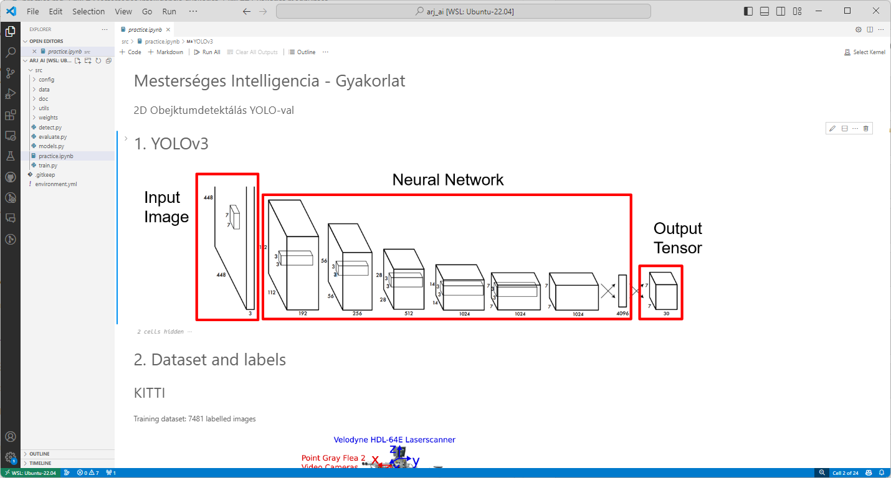
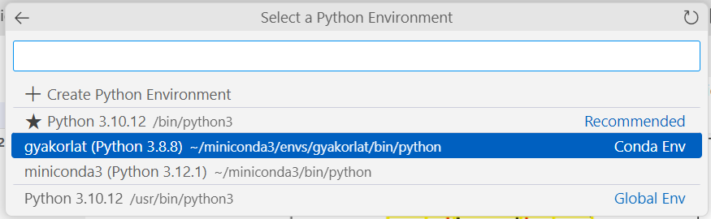

# Artificial Intelligence Practice

## Downloading Practical Material
To update the practical material, issue the following commands:

```bash
cd ~/ros2_ws/src/arj_packages
``` 
```bash
git checkout -- .
``` 
```bash
git pull
```

## Installing Conda Environment
Anaconda (miniconda) provides an isolated virtual environment where we can install the required version of Python packages for the current work.

```bash
mkdir -p ~/miniconda3
``` 
```bash
wget https://repo.anaconda.com/miniconda/Miniconda3-latest-Linux-x86_64.sh -O ~/miniconda3/miniconda.sh
``` 
```bash
bash ~/miniconda3/miniconda.sh -b -u -p ~/miniconda3
``` 
```bash
rm -rf ~/miniconda3/miniconda.sh
``` 
```bash
~/miniconda3/bin/conda init bash
```

The solver coordinates the versions among the packages required for the predefined environment (`environment.yml`). The `libmamba-solver` allows for faster coordination compared to the default solver.
```bash
source ~/.bashrc
```
```bash
conda config --set auto_activate_base false
``` 
```bash
conda update -n base conda
``` 
```bash
conda install -n base conda-libmamba-solver
``` 
```bash
conda config --set solver libmamba
```

Once Conda is installed, we create our own virtual environment:
```bash
cd ~/ros2_ws/src/arj_packages/arj_ai
``` 
```bash
conda env create -f environment.yml
```

## Opening the Practice

The material can be opened as follows:
```bash
conda activate practice
``` 
```bash
cd ~/ros2_ws/src/arj_packages/arj_ai 
``` 
```bash
code .
```



Select the environment:



# Troubleshooting

TODO

```python
ImportError                               Traceback (most recent call last)
Cell In[1], line 10
    8 import matplotlib.patches as patches
    9 import matplotlib.pyplot as plt
---> 10 import torch
     11 import torchvision.transforms as transforms
     12 from PIL import Image

File ~/miniconda3/envs/practice/lib/python3.8/site-packages/torch/__init__.py:189
    187     if USE_GLOBAL_DEPS:
    188         _load_global_deps()
--> 189     from torch._C import *
    191 # Appease the type checker; ordinarily this binding is inserted by the
    192 # torch._C module initialization code in C
    193 if False:

ImportError: /home/he/miniconda3/envs/practice/lib/python3.8/site-packages/torch/lib/libtorch_cpu.so: undefined symbol: iJIT_IsProfilingActive
```

# Deactivating Conda

```bash
conda deactivate
```
