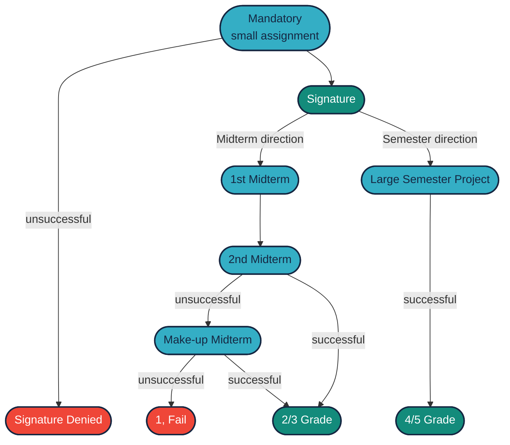
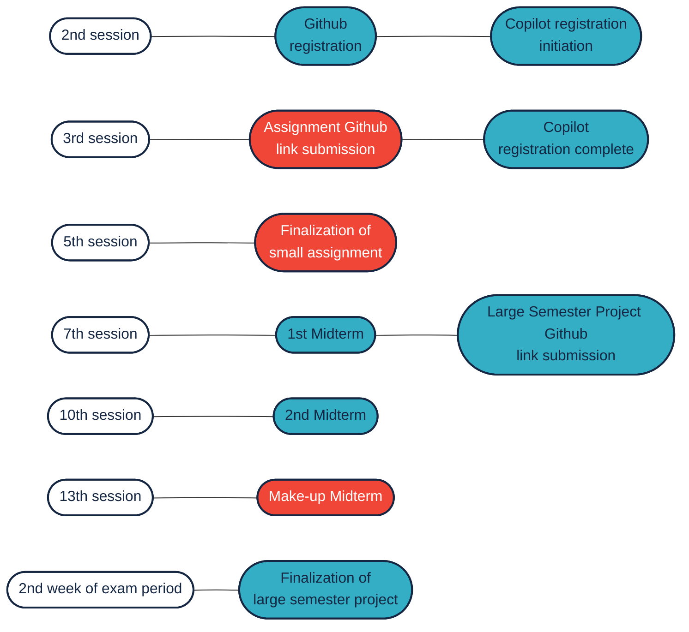

# Small Assignment and Large Semester Project

The purpose of the small assignment is for students to gain practical experience with ROS 2 and GitHub alongside the basic theoretical knowledge acquired in class. The small assignment can be completed in a relatively **short time**: an instructor can finish it in a few hours, and an average student can complete it in a few afternoons. Its length can be short, around 30-100 lines of code per node.

In contrast, the large semester project takes a bit more time but allows for much more interesting tasks and time. Moreover, good and excellent grades can only be achieved this way.

Another way to earn grades is through midterms (ZH), but only modest grades can be obtained this way.

## Deadlines and Semester Schedule

It is important to know that the small assignment is a requirement for the signature. Missing the GitHub registration or the submission of the assignment link can result in an unsuccessful semester relatively early in the semester. These are small tasks, but their completion is strictly monitored.

