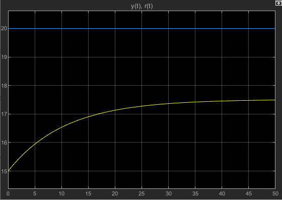
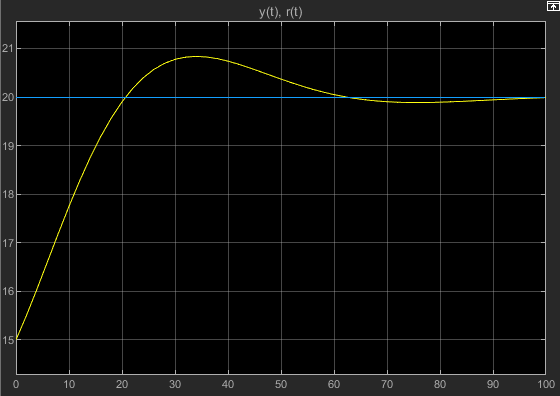
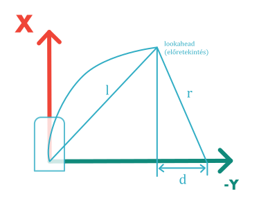
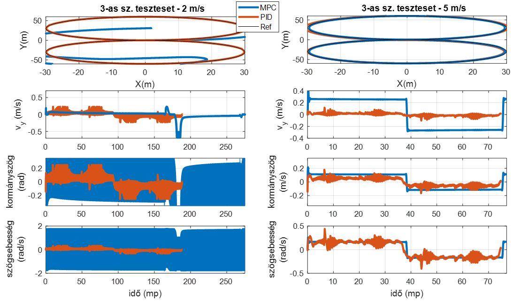
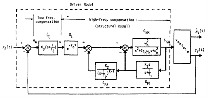

# Control

The goal of control is to execute the planned trajectory.

## 1. Motivation behind closed-loop control - introduction

We can achieve the planned target state of a system by intervening in the system considering the target value. For example, in the case of a vehicle, the target speed can be achieved by manipulating the gas and brake pedals, indirectly changing the engine torque and braking force. As an initial example, let's consider a driver: the driver is usually aware of the maximum allowed speed and applies a tolerance range that is suitable for them. Within this range, they determine a safe and comfortable speed they want to maintain. The driver accelerates until they reach the desired speed, then slightly releases the gas pedal to maintain the speed.

Is it correct to say that once we have reached the desired speed, we can release the pedal and have nothing more to do? Of course not. Why not? Because the vehicle will slow down due to losses, and it may even accelerate when going downhill. To maintain the speed, the driver must continuously monitor the vehicle's movement and the environment and intervene through the pedals accordingly.

This simple example covers most of the design and control components. In terms of control, we can make the following observations:
- the driver senses the current state of the vehicle (with some accuracy)
- the driver knows what effect will be achieved by intervening with the gas or brake pedal, i.e., how much the car will slow down or speed up (with some accuracy)
- the driver can roughly (!) determine the desired gas pedal position without any special sensing (i.e., without knowing, for example, what force is acting on the car)

The last point is often referred to as the **feedforward branch** (see subsection 3), or **open-loop control** (if we have no information from sensing).
A very rough comparison is shown in Figure 1. Imagine a situation where we have no information about how fast the vehicle is going, we can only control the pedal. The task is to accelerate from a standstill to 90 km/h and then maintain that speed. If we don't know how fast we are going, how do we know whether to press the pedal more or not? In this case, we can rely on knowing the road conditions (e.g., flat terrain, asphalt road), knowing our car (what kind of engine, what torque characteristics, etc.). Thus, we can *roughly* determine how long to press the gas pedal, and when we have *roughly* reached the speed, how much to keep our foot on the pedal to avoid slowing down or speeding up. The result will likely resemble the desired speed curve, but it will be far from accurate. We know the road and our car inaccurately, and acceleration is influenced by temperature, slope, headwind, etc. Therefore, we generally do not use this **open-loop** approach alone, but rather correct the predetermined pedal positions with the help of more accurate sensors, thus handling any **disturbance**. This latter approach is called **closed-loop control**, and the information obtained from sensing is called **feedback**.

!!! note 
    In Hungarian terminology, *open-loop control* is often referred to as **control**, and *closed-loop control* is simply called **regulation**. Together, they are referred to as **control**. In English terminology, both are called **control**, specifically **closed-loop control** and **open-loop control**. Feedback is called **feedback**, and feedforward is called **feed-forward**.

*Figure 1: Motivation behind closed-loop control. Source: Autonomous Driving Software Engineering - Lecture 08: Control*

## 2. Architectural Overview and Retrospective

As we have seen in previous chapters, the entire vehicle control chain is modular. The main tasks are:
- sensing
- perception
- planning
- control

This chapter focuses on control. The basics of control are covered in subsection 3. The planning provides the input for the control layer. So, let's take a look at the architecture with some additions! This is shown in Figure 2.

*Figure 2: The main planning and control layers in the architecture.*

The control layer is usually divided into multiple levels. We distinguish at least two such levels:
- vehicle-level control
- actuator control

Each layer has its own tasks. The task of vehicle-level control is to guide the vehicle along the planned trajectory at the appropriate speed. It determines target values at the vehicle level. As a rule of thumb, quantities at the vehicle level are those that are not yet associated with a specific actuator. For example, every car has an acceleration or angular velocity, regardless of its propulsion (electric, hybrid, internal combustion) or steering (electric servo, hydraulic servo, tracked, etc.). This control layer is generally the "slowest," with a cycle time of 10-50ms in an embedded environment.

The task of actuator control is to decompose vehicle-level quantities and implement them through the actuators. For example, longitudinal acceleration can be influenced through the engine and brakes. In the case of the engine, acceleration is achieved by controlling the engine torque, which is controlled by the throttle position. The throttle position is controlled by the position of the servo motor that moves it, which is controlled by the voltage applied to the servo motor. In the case of the braking system, we can influence the braking force, which means controlling the brake pressure (e.g., through the ESP valves), which is achieved by the pressure of the hydraulic brake system's motor pump. This is influenced by the pump motor's speed, which is controlled by the voltage applied to the motor, and so on. We see that depending on the actuators, we are talking about multiple (even 4-6) nested control loops.

It is advisable to approach the problem from the inside out, as the innermost control cycle time can be as low as 1 ms (or less), while as we move outward, it increases to the range of 5-10-20ms. It is important that in the case of automated driving systems' motion control, actuator control layers are often not considered, assuming that their performance, accuracy, and speed are adequate, "nearly ideal." Of course, in practice, it is often difficult to separate these, but we strive to design only the vehicle-level control.

The task of the highest-level control is to follow the trajectory. Generally, we distinguish two dimensions:
- longitudinal motion: determining the vehicle's longitudinal acceleration, and finally the braking and engine forces.
- lateral motion: determining the vehicle's target angular velocity, and finally the steering angle.

The trajectory is usually a speed trajectory described over time or a set of target points given in space, i.e., a curve (or its representation). The goal is to follow the curve with minimal position error and maintain the speed as accurately as possible, without exceeding any limits (e.g., excessive acceleration, leaving the path, etc.).

Before we move on to existing vehicle control solutions, we will provide an overview of the basics of control in subsection 3.
## 3. Basics of Control

In this chapter, we introduce the basic concepts related to control engineering and provide examples from the field of vehicle control.

### 3.1. Definitions

**Real physical system**: A physical object that changes measurably under measurable external constraints.

**Inputs**: Physical constraints acting on the real physical system that can change over time. 
**Outputs**: Any change in the real physical system due to physical constraints can be considered a physical output. We consider it a physical output if it is directly or indirectly measured in the given study. 
*Example: This is always defined according to the control task. For example, vehicle-level control: the system is the vehicle itself, with inputs such as longitudinal and lateral acceleration. Outputs can be position, speed, etc.* 
*Example: In low-level control, this can be, for example, brake control, where the input is the position of the master cylinder, and the output is the force between the brake disc and the brake pad, or the torque acting on the wheel, etc.*

**Abstract system**: An abstract model of a real physical system with a certain accuracy and valid for a specific operating range, creating a mathematical relationship between input and output signals. This is essentially the result of a modeling process, where the model is the mathematical description of the real physical system, typically in the form of differential equations. 
*Example: The kinematic bicycle model of a vehicle*.

**System parameters**: The coefficients of the equations describing the real physical system. 
**Time invariance**: A system is time-invariant if the response to an excitation U(t) is Q(t), and the response to a time-shifted excitation U(t-tau) is Y(t-tau). This also means that the system model does not change over time, i.e., the system parameters are constant. 
*Example: The parameters of the kinematic bicycle model of a vehicle, such as the wheelbase, which (hopefully) does not change over time, making this parameter time-invariant. If all parameters of the system model are time-invariant, the abstract system itself is invariant.* 
*Example: A parameter of the dynamic bicycle model of a vehicle is the vehicle's mass. This can change "on the go," as more people get in the car, luggage is loaded, the fuel level changes, etc., making this parameter not time-invariant, and thus the physical system is not time-invariant. However, under certain conditions, we can consider it time-invariant, increasing the model's inaccuracy.*

**State**: In dynamic systems with memory, the state is the cumulative effect of the past. The state of the system must have the following two properties:
- At any time T, the output can be uniquely determined by knowing the state and input at that moment. The relationship that determines the output from the state and input is called the output equation.
- The state at a given time T can be uniquely determined by knowing the input over the time range t≤T. The equation describing the state change is called the state equation.

**State variable**: State variables are used to uniquely describe the state. A state variable can be a time function to describe quantitative changes in the state or a logical variable to describe qualitative changes in the state.

**System dimension**: The number of state variables minimally required to uniquely describe the state of a system is called the system dimension.

**Canonical state variables**: Canonical state variables are the smallest set of state variables that can uniquely describe the state. Non-canonical state variables are called derived state variables.

**Lyapunov stability**: A nonlinear autonomous system is said to be Lyapunov stable if, for any neighborhood of the equilibrium state, there exists a maximum deviation greater than zero, within which the system is guaranteed to return to the originally defined neighborhood.

**BIBO stability**: A system is BIBO (Bounded Input Bounded Output) stable if a bounded input always results in a bounded output. A system meeting this condition is called a BIBO stable system.

These concepts are sufficient to understand the basics of vehicle control. The control task is often divided into two parts:
- modeling, creating the abstract mathematical model
- control, designing the controller.

### 3.2. Formulating the Control Task

**The goal is always to control the real physical system so that it behaves according to the prescribed target value.** It is important to define measurable quantities for each goal to determine the "goodness" of the control. The most commonly (but not exclusively) used quantities are:
- settling time (speed)
- overshoot
- steady-state error
- control energy.

The control chain can be described as shown in Figure 3. The following notations are used:

- $r(t)$: the target value or reference signal
- $y(t)$: the feedback value
- $m(t)$: the measured value of the real system. Note: sensors are often considered ideal, so $y(t)=m(t)$, making the feedback value also the output of the abstract system.
- $e(t)$: error signal, the input to the controller.
- $i(t)$: the control signal determined by the controller.
- $f(t)$: feedforward branch.
- $u(t)$: the system input
- $d(t)$: external disturbances.

  
*Figure 3: Block diagram of the control chain.*

The controller's task is to minimize the error at its input. The entire control chain's task is to ensure that the output of the real physical system follows the reference signal as accurately as possible.
In the following, we illustrate the modeling of a system, the effect of disturbances, and provide an example of a controller and the possibility of feedforward. The example is created in MATLAB/Simulink.
### 3.3. Example of Control Basics

In this example, we will build a simple model to illustrate closed-loop control. The task is to control the speed of a vehicle. We will create a simple model of the vehicle.
1. Task: Determine the inputs and outputs of the system!
We want to influence the system with the accelerating force acting on the vehicle, so this is the input. The output is the vehicle's speed, as we want to control it to a given target value. Since this system has 1 input and 1 output, it is often called a SISO (Single Input Single Output) system. By analogy, there are also MIMO (Multiple Inputs Multiple Outputs) systems.
*Note: In reality, we influence the vehicle with the gas pedal and the brake pedal, but these actually affect the vehicle's acceleration, so for simplicity, we do not model this part of the section. This, of course, introduces an error into the model but increases its generality.*

2. Task: Create the mathematical model / abstract model of the vehicle!
We are looking for a system of equations that connects the input and output. Here we need to determine how accurate we want the model to be. For simplicity, let's use the following constraints:
- we disregard the longitudinal wheel slip
- we disregard the dynamic behavior of the actuators, i.e., the requested acceleration is realized immediately
- we disregard the errors affecting the measured quantities, i.e., the inaccuracies of the sensors.
- we disregard the dynamic properties of the chassis and suspension.

Thus, our equation simplifies to the linear motion of a concentrated mass point. Include the following quantities in the model:
- the mass of the vehicle
- the aerodynamic drag of the vehicle
- the speed-dependent friction of the vehicle.

According to Newton's second law, write the following dynamic equilibrium equation:  
$$
\ddot I = \sum F
$$

That is:

$$
m*\ddot v(t) = F_{prop}(t) - F_{aero}(t) - F_{fric}(t)
$$

We see that both the input and output appear in our equation, so we have indeed found the model of the system. Further transform it so that *only* the input and output appear in it:

$$
m*\ddot v(t) = F_{prop}(t) - \frac{1}{2}*v(t)^2*\rho*c*A - v(t)*b
$$ 

In this form, the time-varying signals are the input and output (the speed and the driving force), and there are time-invariant parameters:

- $\rho$: air density
- $A$: frontal area
- $c$: vehicle drag coefficient
- $b$: Coulomb friction coefficient

  
*Figure 4: Modeled force balance of the vehicle.*

To obtain the speed as the chosen output, we need to solve the differential equation. This is done numerically in Simulink. The solution is shown in Figure 5.

  
*Figure 5: Numerical solution of the differential equation.*

The block diagram of the entire control chain is shown in Figure 6. In this figure, we do not use the feedback branch. The initial speed is set to 20 m/s. The driving force is zero in this case, so the vehicle rolls due to its inertia and continuously slows down proportionally to the load.

  
*Figure 6: Block diagram of the entire control chain.*

The following parameter values were chosen for the simulation:

- $A = 1.2m^2$
- $b = 10 Ns/m$
- $c = 0.4$
- $\rho = 1 kg/m^3$
- $m = 1250 kg$

The result of the run is shown in Figure 7. The simulation ran for 100s, during which the vehicle slowed down from 20 m/s to about 7 m/s.

  
*Figure 7: Block diagram of the entire control chain.*

In Figure 8, we choose a proportional controller (P controller) for the feedback controller, which determines the control signal proportional to the error. The gain is chosen to be 100, i.e., a 1 m/s speed error results in 100N driving force. The initial speed is 15 m/s, the target speed is 20 m/s, so initially, we will have 500N driving force.

  
*Figure 8: Proportional controller with a gain of 100.*

Figure 9 shows the characteristics of the controller with a P controller and a gain of 100. The steady-state error is relatively large (more than 10%). The reason is that the proportional controller produces an input signal proportional to the error, and since there is an opposing force acting on the vehicle, the controller will balance with it. If we increase the gain, the steady-state error decreases. In theory, infinite gain reduces this error to zero, but infinite gain means infinite control signal, which is not feasible. In practice, we reach the limits much sooner, as the actuators can only exert finite force. This must be taken into account when designing the controller.

  
*Figure 9: Characteristics of the proportional controller.*

We can eliminate the steady-state error by adding a controller term that "notices" if a given error persists for a long time and increases the control signal accordingly. The longer the error persists, the more we increase the control signal. This practically means a control term proportional to the time integral of the error. This is called the I term. The resulting controller is called a PI controller. The arrangement of the controller is shown in Figure 10, and the output characteristics in Figure 11. We see that the error has indeed disappeared, but the initial transient phase has also changed. Overshoot and oscillation around the target value have appeared, and the settling time has also increased.

  
*Figure 10: Proportional controller with a gain of 100 and integrator with a gain of 10.*

  
*Figure 11: Proportional controller with a gain of 100 and integrator with a gain of 10.*

We can improve the above settling oscillation and overshoot by changing the parameters or adding a controller term that reacts to the change in error. This speeds up the settling and compensates for the overshoot more quickly. This practically means a term proportional to the change in error, equivalent to considering the derivative of the error. This term is called the D term, and the resulting controller is called a PID controller. However, the gain of the D term must be chosen carefully, as it can easily make the system unstable. The structure of the controller is shown in Figure 12, and its characteristics in Figure 13.

  
*Figure 12: Proportional controller with a gain of 100, integrator with a gain of 10, and D term with a gain of 10.*

  
*Figure 13: Proportional controller with a gain of 100, integrator with a gain of 10, and D term with a gain of 10.*

Empirically, considering the amount of overshoot, settling time, and steady-state error, choose the following parameter values:

$$
P=175, 
I=10, 
D=50
$$

With this, the settling is very nice, as shown in Figure 14. 
  
*Figure 14: Proportional controller with a gain of 170, integrator with a gain of 10, and D term with a gain of 50.*

Figure 15 shows the effect of adding an extra accelerating force caused by a 3° slope. The overshoot is larger because the controller was tuned with a model assuming a vehicle moving on flat terrain.

  
*Figure 15: Effect of slope on the closed-loop controller.*

We can compensate for this by creating a feedforward branch proportional to the slope. However, estimating the slope is difficult; we can generally infer it from the vehicle's motion, which only indicates the slope magnitude with a delay. Add a slope compensation with a 1s delay and a 5% error. The block diagram is shown in Figure 16, and the result in Figure 17.

  
*Figure 16: Control system with added feedforward branch.*

  
*Figure 17: Effect of feedforward branch on the controller.*

### 3.4 Interactive PID Tuning

Next, you can interactively tune a PID controller in another control example (temperature control):

<iframe width="700" height="600" src="https://thomasfermi.github.io/PID-Playground-Temperature/" frameborder="0" allowfullscreen> </iframe>

This interactive visualization is a solution by [Mario Theers](https://thomasfermi.github.io/Algorithms-for-Automated-Driving/Control/PID.html) - [CC BY 4.0 License](https://github.com/thomasfermi/Algorithms-for-Automated-Driving/blob/master/LICENSE).

A similar interactive visualization is available on Viktor.ai, where you can also tune the parameters: [cloud.viktor.ai/public/control-application](https://cloud.viktor.ai/public/control-application)

### Summary

In this chapter, we reviewed the basic concepts of control engineering and provided examples from the field of vehicle control. Additionally, we created a simple mathematical model that describes the longitudinal motion of a vehicle as a mass point. Through this, we conducted a speed control simulation using MATLAB/Simulink. We introduced one of the most common controllers, the PID controller.
Key points to remember:
- A closed-loop control system typically consists of the controlled section (which is the abstract mathematical model of the real physical system) and the controller.
- The real physical system is described by a mathematical model, which also serves as the basis for designing the controller. The accuracy of the model affects the quality of the designed controller.
- The mathematical model is usually presented in the form of differential equations.
- PID controllers aim to minimize the error. The P term speeds up the system, the I term eliminates the steady-state error, and the D term also speeds up the controller's response but can cause instability.
- In reality, vehicle control is complex due to varying parameters (e.g., vehicle mass), road conditions, and nested control loops.

## 4. Vehicle Control Solutions

In the field of vehicle control, as seen in subsection 2, multiple nested control loops are used. Each typically contains a feedforward and a feedback branch. In automated driving systems, the highest-level, vehicle-level control is usually considered first. We will not delve into lower-level controllers here, but we will summarize them in a list. It should be noted that these low-level controllers depend heavily on the available actuators in the vehicle, as various braking systems, drives, and steering systems may be available. This division greatly supports modular design, allowing vehicle-level control to be developed independently of low-level controls. This, for example, greatly facilitates reusability in mass-produced software. The low-level, actuator control loops can include (without being exhaustive):
- Steering servo motor angle control
- Steering servo motor torque control
- Engine torque control
- Brake force control (brake pressure control).

From this point on, all statements apply to the vehicle level. It is important to note that we always think in two dimensions: longitudinal and lateral control. We saw an example of longitudinal control in subsection 3. This generally means speed control or possibly acceleration control. Although longitudinal control also poses significant challenges (engine inertia, separation of braking and driving forces, etc.), most vehicle control solutions primarily focus on lateral control.
Since the task of automatic vehicle control is very similar to human driving (i.e., influencing the vehicle's movement using the steering wheel and pedals), these control solutions are often referred to as driver models. Short summaries of each model can be found under the recommended literature. According to [1], driver models can be divided into three groups:
- Inverse models
- Predictive models
- Closed-loop models.

*Figure 18: Illustration of vehicle control solutions.*

### Inverse Models
Inverse models are also known as pursuit models in English terminology, which can be best translated as forward-looking or forward-pushing. The essence is that the target value for steering is determined based on two pieces of information:
- What is the target state of the vehicle at a look-ahead point?
- The pre-established model of the vehicle.
This can be considered as a feedforward control branch or open-loop control, i.e., control. If the latter is the case (i.e., there is no feedback branch), it is called pure pursuit control.

!!! warning

    Pure-pursuit control is one of the oldest control solutions in the field of vehicles. It was developed by the Robotics Institute of Pittsburgh in the 1980s [4]. The essence is that at a given look-ahead distance (which is the most important parameter of the control), we determine the desired position of the vehicle (e.g., based on the previously planned trajectory).

Based on the coordinates of this point, we can determine the curvature of the circular arc we need to follow to reach the target point from the current point. It is important to note that pure-pursuit control always uses circular arcs. The geometric relationships are illustrated in Figure 19.
Based on simple trigonometric considerations, the following relationship can be established between the look-ahead point and the target curvature:

$$
\kappa_{target}=\frac{2x}{l^2}
$$

As we can see, we have formulated a quantity (curvature) at the vehicle level based on the input trajectory, thus theoretically fulfilling the main task of vehicle control. However, during implementation, we usually produce a quantity that is already interpretable at the actuator level. For this, we use the vehicle model: we provide a relationship between the target curvature and the steering angle. The most commonly used model is the kinematic bicycle model of the vehicle, but it becomes very inaccurate at higher speeds (>10 km/h). Using the relationships of the kinematic bicycle model, we can obtain the steering angle:

$$
\delta_f=atan(L_w*\kappa)
$$

Where $L_w$ is the wheelbase of the vehicle.

We assume in the model that the vehicle is front-wheel steering. The obtained angle is the road-wheel angle, which can be converted to, for example, servo motor angle based on the geometry of the steering mechanism, and thus can be directly implemented.

*Figure 19: Geometric relationships of the pure pursuit controller.*

Figure 20 shows the effect of the look-ahead distance on the vehicle's behavior. If we choose a point that is too close, the vehicle tends to oscillate (similar to the effect of a PID controller with too high a P gain). If the look-ahead distance is too large, the reaction slows down, but in sharp turns, the vehicle tends to cut corners.
It is common to adaptively set the look-ahead distance, for example, as a function of speed. In this case, we are practically talking about look-ahead time.

*Figure 20: Effect of look-ahead distance on vehicle behavior in pure pursuit control*

Further developed versions of pure-pursuit models can be found in articles [2] and [3].

### Predictive Models
Predictive models, similar to inverse models, are based on the vehicle model. However, they also look ahead over a specified horizon: using the model, we estimate the vehicle's behavior in advance and then choose the best solution in the present based on this. Thus, in this case, we make decisions using future information with a certain accuracy. Here we distinguish between two cases:
- Receding horizon: the future horizon continuously shifts ahead of us, as we always execute only the first element of the planned future behavior, then replan.
- Proceeding horizon: the horizon approaches us, meaning we fully execute the planned future behavior and only then replan.

Since control here also involves motion planning, we must use the tools of planning. These controllers are also called **Optimal Controllers**. In this case, we plan the motion over the look-ahead horizon using the model to achieve the lowest cost according to the given criteria. Here we refer back to the criteria introduced at the beginning of subsection 3.2:
- Settling time (speed)
- Overshoot
- Steady-state error
- Control energy.

Since we want to plan the optimal motion over a finite-length time horizon, we combine the settling time, overshoot, and steady-state error into a vector and aim to minimize the sum of the elements of this vector (1st criterion).
Control energy is related to the amplitude of the control signal vector. That is, we want to achieve the best result with the lowest possible signal (e.g., we want to accelerate or apply torque to the steering wheel as little as possible). This is the 2nd criterion, which imposes an opposing requirement on control compared to the 1st criterion.

These controllers are also called **Model Predictive Controllers (MPC)**. The following equation is an example of how to formulate the cost function to be solved:

$$
J(k)=\sum_{i=1}^{N_p}\|y(k+i)-y_{ref}(k+i)\|^2_M + \sum_{i=1}^{N_c-1}\|\Delta U(k+i)\|^2_N
$$

Where:

- $N_p$: prediction horizon, expressed in computation cycles (considering the model)
- $k$: the current computation cycle
- $y(k+i)$: the vehicle's lateral position estimated by the model in the $i$th cycle
- $y_{ref}(k+i)$: the reference position (target position) in the $i$th cycle
- $N_c$: control horizon (considering the input)
- $\Delta U$: the increment of the input vector over the control horizon
- $M$ and $N$: weight matrices for the error and input energy.

Examples of such controllers can be found in literature [1], [5-7].
The advantage of MPCs is that they provide very high accuracy and stable control if the applied model is highly accurate. However, this is also their disadvantage, as if the model is not appropriate, the error can grow exponentially.
We see an example of this in Figures 21-23. In each simulation, we used a kinematic bicycle model to design the MPC. The PID controller minimizes the position error. In the simulation, we applied the vehicle's dynamic model as the real physical system. It can be seen that at 5 m/s, the MPC clearly outperforms the PID controller, being much more accurate and stable. However, at 2 m/s, the MPC falls apart, as the model relationships are not valid at low speeds. A similar observation can be made in Figure 23.
In Figure 22, we see that up to 10 m/s, both the MPC and PID perform well, with the MPC still being better than the PID. However, above 10 m/s, dynamic effects become more pronounced, and the kinematic model is not suitable. Thus, the MPC becomes unstable, while the PID, although with significant error, continues to operate stably.

  
*Figure 21: Comparison of MPC and PID controllers using a kinematic model, turning at low speeds*

  
*Figure 22: Comparison of MPC and PID controllers using a kinematic model, turning at higher speeds*

  
*Figure 23: Comparison of MPC and PID controllers using a kinematic model, circular path at low speeds*

### Closed-Loop Models

As the name suggests, these models are based on the logic of PID controllers. They typically minimize the error of one or more feedback quantities. Examples of such models can be found in literature [3] and [8]. Figure 24 illustrates an example presented in [3]. According to this, two look-ahead points are designated: a near one (in front of the vehicle) and a far one (on the horizon). Similar to pure-pursuit solutions, here we also examine how to get from the current position to the distant one. However, this is achieved not by simple curvature calculation but by minimizing the error according to the following equation:

$$
\phi=k_f\dot\Theta_f + k_n\dot\Theta_n + k_i\Theta_n 
$$

Where:

- $\dot\Theta_f$ and $\dot\Theta_n$ are the angular velocities of the far and near points relative to us
- $\Theta_n$ is the angle of the near point relative to us
- $k$ terms: weights
- $\phi$: the steering wheel angle.

This equation essentially minimizes the angular errors, as the goal is to always be "on course." The feedback comes from environmental sensing. The output is the steering wheel angle.

*Figure 24: Illustration of the dual-point control solution*

Figure 25 shows the solution described in [8]. The essence is to minimize the position error using multiple nested PID controllers. To do this, the control task is divided into low-frequency control (position error) and high-frequency control (steering angle error). The transfer functions represent individual controllers, sequentially meaning:

- $G_c$: position control with a PI controller
- $G_L$: human control delay (reaction time)
- $G_NM$: neuromotor control, representing how humans move the steering wheel. Its dynamics depend heavily on human muscle structure.
- $G_{P1}$ and $G_{P2}$: sensor models in the feedback loop. These represent human sensory dynamics, respectively for torque on the steering wheel and steering angle.

*Figure 25: A complete closed-loop controller, integrating steering angle control*

### Summary

As we have seen, driver models always require a pre-planned trajectory. Controllers are used to follow this trajectory, which can be categorized into three groups:

- Inverse models
- Predictive models
- Closed-loop models.

The oldest inverse models are the simplest and most robust, but their performance is generally low. Predictive models are very accurate but highly sensitive to model accuracy. Closed-loop models are stable over a wide range but generally have low accuracy. They consist of multiple nested loops, typically calibrated from the inside out. These are the most common in today's mass-produced systems.

## Recommended Literature

1. [Introduction: System Modeling, University of Michigan](https://ctms.engin.umich.edu/CTMS/?example=Introduction&section=ControlPID)
2. [Interactive Live Script Control Tutorials for MATLAB and Simulink](https://www.mathworks.com/campaigns/products/control-tutorials.html)
3. [Mario Theers - PID](https://thomasfermi.github.io/Algorithms-for-Automated-Driving/Control/PID.html) - [CC BY 4.0 License](https://github.com/thomasfermi/Algorithms-for-Automated-Driving/blob/master/LICENSE)
4. [Mario Theers - Pure pursuit](https://thomasfermi.github.io/Algorithms-for-Automated-Driving/Control/PurePursuit.html) - [CC BY 4.0 License](https://github.com/thomasfermi/Algorithms-for-Automated-Driving/blob/master/LICENSE)
5. [Youtube ControlLectures](https://www.youtube.com/@ControlLectures/videos)
6. [Bokor József & Gáspár Péter. Irányítástechnika](https://dtk.tankonyvtar.hu/bitstream/handle/123456789/3269/Bokor_Gaspar_Soumelidis_Iranyitastechnika_II.pdf)

## Driver Models

1. A. Y. Ungoren and H. Peng, "An Adaptive Lateral Preview Driver Model," Vehicle System Dynamics, vol. 43, pp. 245-259, 2005.
2. W. Rui, L. Ying, F. Jiahao, W. Tan and C. Xuetao, "A Novel Pure Pursuit Algorithm for Autonomous Vehicles Based on Salp Swarm Algorithm and Velocity Controller," IEEE Access, vol. 8, pp. 166525-166540, 2020.
3. D. Salvucci and R. Gray, "A Two-Point Visual Control Model of Steering," Perception, vol. 33, pp. 1233-1248, 2004.
4. C. R. Coulter, "Implementation of the Pure Pursuit Path Tracking Algorithm," Vols. CMU-RI-TR-92-01, pp. 1-15, 1992.
5. H. Jiang, H. Tian and Y. Hua, "Model predictive driver model considering the steering characteristics of the skilled drivers," Advances in Mechanical Engineering, vol. 11, pp. 1-14, 2019.
6. U. Kiencke, R. Majjad and S. Kramer, "Modeling and performance analysis of a hybrid driver model," Control Engineering Practice, vol. 7, pp. 985-991, 1999.
7. C. MacAdam, "An Optimal Preview Control for Linear Systems," Journal of Dynamic Systems, Measurement and Control, vol. 102, pp. 188-190, 1980.
8. R. Hess and A. Modjtahedzadeh, "A Control Theoretic Model of Driver Steering Behavior," IEEE Control Systems Magazine, vol. 5, no. 8, pp. 3-8, 1990.