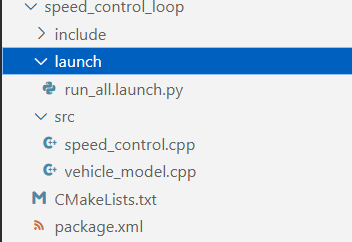
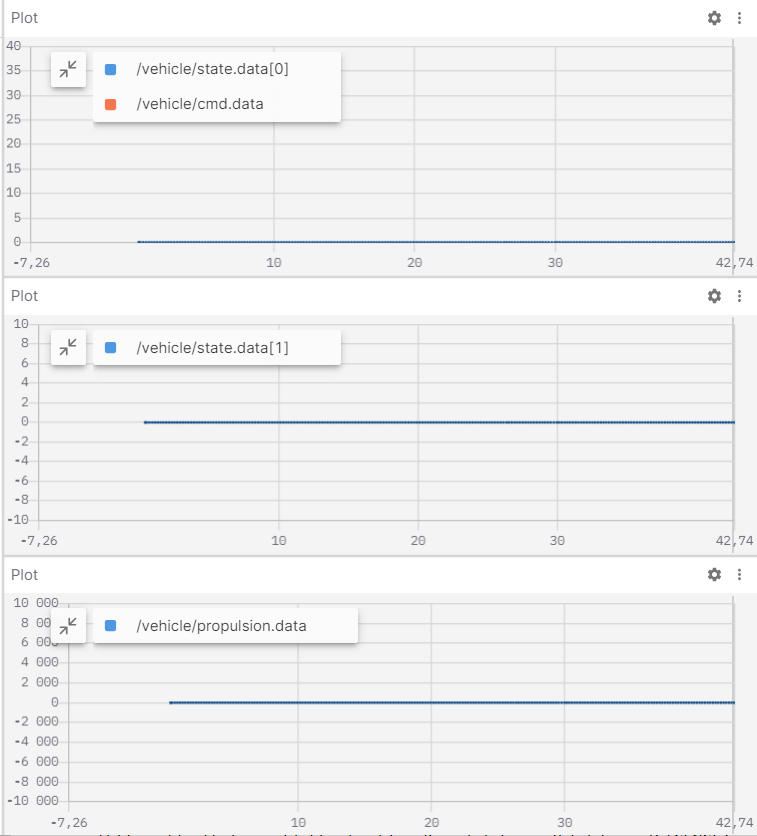
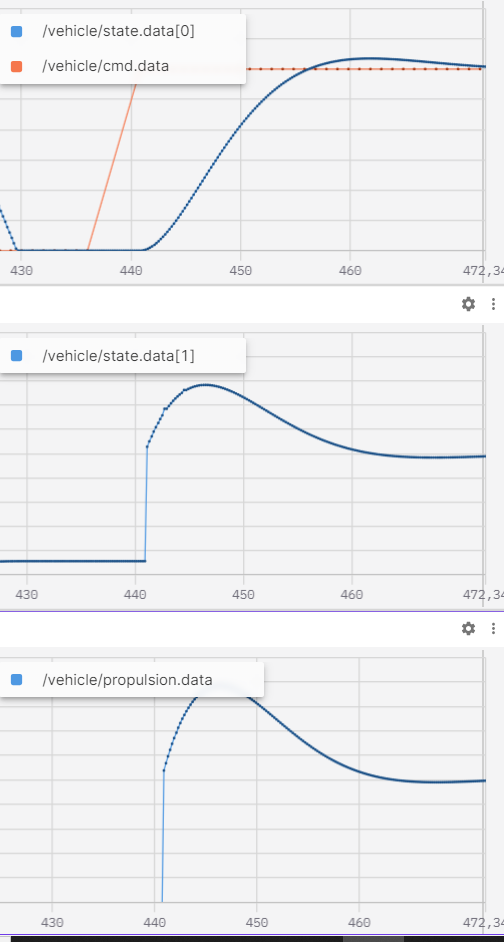
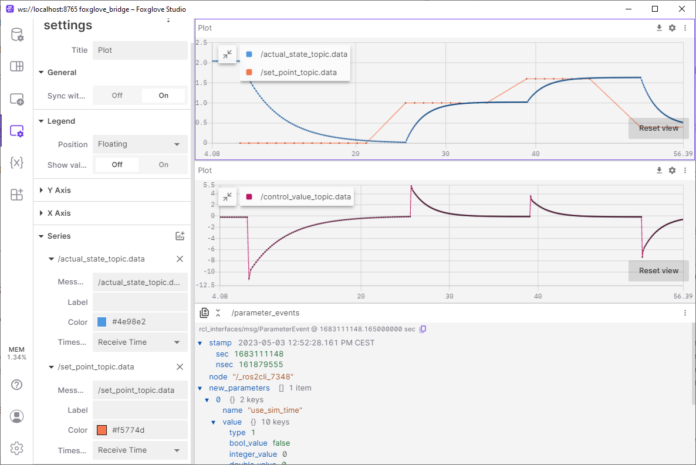

# Practice

In the first part of the practice, we will use a first and second-order system example, apply a PID controller, and then tune it. In the second part of the practice, we will review and tune the operation of a simulated trajectory-following robot/vehicle.

[](https://docs.ros.org/en/humble/)

- [`Task 1`: Trajectory following with simulation](#task-1-trajectory-following-with-simulation)
- [`Task 2`: Custom controller and vehicle model](#task-2-custom-controller-and-vehicle-model)
- [`Task 3`: PID tuning](#task-3-pid-tuning)

## `Task 1`: Trajectory following with simulation


[github.com/jkk-research/sim_wayp_plan_tools](https://github.com/jkk-research/sim_wayp_plan_tools)

### Requirements
For the practice to run smoothly, the following programs need to be installed:
- ROS 2 Humble: [docs.ros.org/en/humble/Installation.html](https://docs.ros.org/en/humble/Installation.html)
- Gazebo Fortress: [gazebosim.org/docs/fortress/install_ubuntu](https://gazebosim.org/docs/fortress/install_ubuntu), More information on integration: [gazebosim.org/docs/fortress/ros2_integration](https://gazebosim.org/docs/fortress/ros2_integration)
- `ros-gz-bridge` can be installed with one command: `sudo apt install ros-humble-ros-gz-bridge`
- Ensure that [`colcon_cd`](https://docs.ros.org/en/humble/Tutorials/Beginner-Client-Libraries/Colcon-Tutorial.html#setup-colcon-cd) is properly installed. CSV files are loaded with `colcon_cd`.

### Packages and build

The default workspace should be: `~/ros2_ws/`.

### Clone the packages

```bash
cd ~/ros2_ws/src
```

```bash
git clone https://github.com/jkk-research/wayp_plan_tools
```

```bash
git clone https://github.com/jkk-research/sim_wayp_plan_tools
```

### Building ROS 2 packages

```bash
cd ~/ros2_ws
```

```bash
colcon build --packages-select wayp_plan_tools sim_wayp_plan_tools
```

### Using `wayp_plan_tools` as a simulator

#### 1.1. Starting gazebo
```bash
ign gazebo -v 4 -r ackermann_steering.sdf
```

#### 1.2. Starting the Gazebo bridge

If the bridge is not installed, the following commands will help:
```bash
sudo apt update
```

```bash
sudo apt install ros-humble-ros-gz -y
```

In the classroom:

```bash
cd /mnt/kozos/script
```

```bash
./gz_bridge.sh
```

Don't forget to `source` before running ROS commands.

```bash
source ~/ros2_ws/install/local_setup.bash
```

```bash
ros2 launch sim_wayp_plan_tools gazebo_bridge.launch.py
```

This `launch` file starts the following nodes together:

```bash
ros2 run ros_gz_bridge parameter_bridge /world/ackermann_steering/pose/info@geometry_msgs/msg/PoseArray[ignition.msgs.Pose_V
```

```bash
ros2 run ros_gz_bridge parameter_bridge /model/vehicle_blue/cmd_vel@geometry_msgs/msg/Twist]ignition.msgs.Twist
```

```bash
ros2 run ros_gz_bridge parameter_bridge /model/vehicle_blue/odometry@nav_msgs/msg/Odometry[ignition.msgs.Odometry --ros-args -r /model/vehicle_blue/odometry:=/odom
```

More information about the bridge: [github.com/gazebosim/ros_gz/blob/ros2/ros_gz_bridge/README.md](https://github.com/gazebosim/ros_gz/blob/ros2/ros_gz_bridge/README.md)

This `launch` also creates a `/tf` from the `PoseArray` with `pose_arr_to_tf`.

#### *Optional*: Controlling the robot in Gazebo with the keyboard:

```bash
ros2 run teleop_twist_keyboard teleop_twist_keyboard --ros-args -r /cmd_vel:=/model/vehicle_blue/cmd_vel
```

#### 1.3. Loading waypoints

**Note:** Waypoints are a set of points that contain the position, orientation, and speed data of the route at discrete points. These data are typically extracted by recording the x, y, and possibly z coordinates, the orientation pointing to the next point relative to the current one, and the current speed data during our journey in ROS. Finally, the aforementioned data are recorded in CSV files.

Use the ROS 2 workspace as `file_dir`:
```bash
ros2 run wayp_plan_tools waypoint_loader --ros-args -p file_name:=sim_waypoints1.csv -p file_dir:=$HOME/ros2_ws/src/sim_wayp_plan_tools/csv -r __ns:=/sim1
```

Or with default parameters:

```bash
ros2 launch sim_wayp_plan_tools waypoint_loader.launch.py
```

#### 1.4. Waypoint as goal pose
As shown in the diagrams in Chapter 4 of the theoretical part, each control algorithm has one or more goal poses that the current controller regulates.

```bash
ros2 run wayp_plan_tools waypoint_to_target --ros-args -p lookahead_min:=2.5 -p lookahead_max:=4.5 -p mps_alpha:=1.5 -p mps_beta:=3.5 -p waypoint_topic:=waypointarray -p tf_frame_id:=base_link -p tf_child_frame_id:=map -r __ns:=/sim1
```

Or with default parameters:

```bash
ros2 launch sim_wayp_plan_tools waypoint_to_target.launch.py
```

#### 1.5. Starting the control:

Several options:
- `single_goal_pursuit`: Pure pursuit (for vehicles/robots), a simple cross-track error method
- `multiple_goal_pursuit`: Multiple goal pursuit for vehicles/robots, an implementation of our [paper](https://hjic.mk.uni-pannon.hu/index.php/hjic/article/view/914)
- `stanley_control`: Stanley controller, a heading error + cross-track error method
- `follow_the_carrot`: Follow-the-carrot, the simplest controller

An example for pure pursuit:

```bash
ros2 run wayp_plan_tools single_goal_pursuit --ros-args -p cmd_topic:=/model/vehicle_blue/cmd_vel -p wheelbase:=1.0 -p waypoint_topic:=targetpoints -r __ns:=/sim1
```

Or with default parameters:

```bash
ros2 launch sim_wayp_plan_tools single_goal_pursuit.launch.py
```

#### 1.6. Visualizing the results in `RViz2`:
```bash
ros2 launch sim_wayp_plan_tools rviz1.launch.py
```

**Or run everything together with a single command:**

After `ign gazebo -v 4 -r ackermann_steering.sdf` (terminal 1) and `source ~/ros2_ws/install/local_setup.bash` (terminal 2), run this command (also in terminal 2):
```bash
ros2 launch sim_wayp_plan_tools all_in_once.launch.py
```

### Troubleshooting

Stopping the `ign gazebo server`:

```bash
ps aux | grep ign
```

```bash
ab  12345 49.9  1.2 2412624 101608 ?      Sl   08:26  27:20 ign gazebo server
ab  12346  518  6.6 10583664 528352 ?     Sl   08:26 283:45 ign gazebo gui
ab  12347  0.0  0.0   9396  2400 pts/2    S+   09:21   0:00 grep --color=auto ign
```

If the PID is identified, use the kill command to stop the process. For example, to stop the gazebo server:

```bash
kill 12345
```

## `Task 2`: Custom controller and vehicle model
In this task, we will create the speed controller presented in the theory and the associated simple vehicle model.

If not done already, update the arj_packages repository:

```bash
git pull
```

Navigate to the repo's root directory in the workspace src folder:

```bash
cd ~ros2_ws/src/arj_packages
```

Examine the repository content:
``` r
dir
```
We see that a subfolder named `speed_control_loop` has appeared. This folder contains the vehicle model and the controller used for regulation. Let's open the source code using VS Code.



The folder contains the usual package.xml and CMakeLists.txt, as well as two cpp source files. The `vehicle_model.cpp` naturally contains the vehicle model, and the `speed_controller.cpp` contains the controller. Let's first examine the vehicle model source code!

### Vehicle Model

```cpp
class VehicleModel : public rclcpp::Node
{
public:
    VehicleModel() : Node("vehicle_model")
    {
        timer_ = this->create_wall_timer(std::chrono::milliseconds(200), std::bind(&VehicleModel::loop, this));  
        state_pub_ = this->create_publisher<std_msgs::msg::Float32MultiArray>("/vehicle/state", 10);
        cmd_sub_ = this->create_subscription<std_msgs::msg::Float32>("/vehicle/propulsion", 10,  std::bind(&VehicleModel::propulsion_callback, this, std::placeholders::_1));
        RCLCPP_INFO(this->get_logger(), "vehicle_model has been started");
    }
```

After the usual #includes and namespace definitions, we see the constructor of the vehicle model class. The node's name is "vehicle_model". We subscribe to a topic named `/vehicle/propulsion`, which, as the name suggests, provides the propulsion force acting on the vehicle. Additionally, we advertise the `/vehicle/state` topic, which provides the vehicle's motion state.

Next, we define some variables.
1. First, a local variable to store the input force.
2. Then, an array to contain the vehicle's speed and acceleration, the two state variables that describe the vehicle's state.
3. We define a variable named `Fload` to specify any extra loads acting on the vehicle.
4. Finally, we define some immutable parameters, such as the vehicle's weight, frontal area, etc.

```cpp
private:
    // input command
    float Fprop {0.0f};

    // vehicle state array
    std::vector<float> state; //speed, acceleration
    float vx{0.0f};
    float ax{0.0f};

    // load
    float Fload{0.0f};

    // params
    float m {1350.0}; // kg
    float A {1.5f}; // m^2
    float rho {1.0f}; // kg/m^3
    float c {0.33f}; // aerodynamic factor
    float b {0.1f}; // rolling friction, viscosous
```

The topic callback function simply copies the incoming data to our local variable.

```cpp
void propulsion_callback(const std_msgs::msg::Float32 input_msg)
{
    Fprop = input_msg.data;
}
```

Finally, the `loop()` function, where we first calculate the resistance forces (aerodynamic drag and viscous friction), then compute the resultant force and the vehicle's acceleration. By integrating the vehicle's acceleration, we obtain the vehicle's speed.

```cpp
void loop()
{
    // calculate new state based on load, prop force, mass and aerodynamic drag
    float Faero = 0.5*A*rho*c*pow(vx,2);
    float Ffric = b*vx;
    ax = (Fprop - Ffric - Fload - Faero)/m;
    vx = std::max(0.0f, vx + ax*0.1f); // 0.1s is the time step of the model

    // Publish state
    state.clear();
    std_msgs::msg::Float32MultiArray state_msg;
    state.push_back(vx); // m/s
    state.push_back(ax); // m/s^2

    state_msg.data = state;
    state_pub_->publish(state_msg);
}
```

### Controller

In `speed_control.cpp`, we see the PID control of the vehicle's speed. The node's name is "speed_control", and it subscribes to the `/vehicle/state` topic advertised by the vehicle model. Additionally, we advertise the `/vehicle/propulsion` command topic and subscribe to the `/vehicle/cmd` topic that provides the target speed. The controller's essence is to regulate the user-specified speed by generating the target force for the vehicle propulsion. Depending on the model's state, we increase or decrease the target force.

```cpp
class SpeedControl : public rclcpp::Node
{
public:
    SpeedControl() : Node("speed_control")
    {
        timer_ = this->create_wall_timer(std::chrono::milliseconds(200), std::bind(&SpeedControl::loop, this));  

        cmd_pub_ = this->create_publisher<std_msgs::msg::Float32>("/vehicle/propulsion", 10);
        state_sub_ = this->create_subscription<std_msgs::msg::Float32MultiArray>("/vehicle/state", 10, std::bind(&SpeedControl::state_callback, this, std::placeholders::_1));
        cmd_sub_ = this->create_subscription<std_msgs::msg::Float32>("/vehicle/cmd", 10, std::bind(&SpeedControl::cmd_callback, this, std::placeholders::_1));

        this->declare_parameter("/control/P", 100.0f);
        this->declare_parameter("/control/I", 5.0f);
        this->declare_parameter("/control/D", 10.0f);

        RCLCPP_INFO(this->get_logger(), "speed_control has been started");
    }
```

The control logic is in the `loop()` function. The P, I, and D parameters can be set as ROS parameters. The propulsion force consists of three components: the derivative term (Fprop_D), the proportional term (Fprop_P), and the integral term (Fprop_I). This is a parallel PID structure, so the sum of the three terms gives the target force.

```cpp
void loop()
{
    P = (float)this->get_parameter("/control/P").as_double();
    I = (float)this->get_parameter("/control/I").as_double();
    D = (float)this->get_parameter("/control/D").as_double();
    // calculate new state based on load, prop force, mass and aerodynamic drag
    float Fprop_D = D*((vSet-vx)-error)/0.1;

    float error = vSet-vx;
    float Fprop_P = P*error;
    float Fprop_I = I*integrated_error;

    Fprop = Fprop_P+Fprop_I+Fprop_D;

    Fprop = std::min(std::max(-Fprop_max, Fprop), Fprop_max);

    // Publish cmd
    std_msgs::msg::Float32 cmd_msg;
    cmd_msg.data = Fprop;

    cmd_pub_->publish(cmd_msg);

    integrated_error+= error*0.1f;
}
```

### Test

To test, first build the `speed_control_loop` package!

```bash
colcon build --packages-select speed_control_loop
```

In another terminal, after sourcing, start the `vehicle_model` node, then the `speed_control` node! You can also do this easily using the pre-prepared `run_all.launch.py` launch file!

```bash
cd ~/ros2_ws/src/arj_packages/speed_control_loop
```

```bash
ros2 launch launch/run_all.launch.py
```

Open Foxglove Studio and connect to the local host. To establish the connection, start the appropriate bridge! Do this from another terminal!

```bash
cd ~/ros2_ws/
```
```bash
ros2 launch foxglove_bridge foxglove_bridge_launch.xml
```

Add 3 plot panels and select the topics shown in the image. Since we haven't set the target speed yet, it defaults to zero. The vehicle is practically stationary, and the controller output is also zero.



Manually advertise a topic that specifies the desired speed (e.g., the target speed set on the steering wheel in cruise control)!

```bash
ros2 topic pub /vehicle/cmd std_msgs/msg/Float32 "data: 30.0"
```

What do we see? The controller accelerates the vehicle with the maximum allowed acceleration (about 9 m/s^2) until it reaches the desired speed of 30 m/s. We can experiment with different speeds and parameter settings.


For example,

```bash
rosparam set /speed_control /control/I 200.0
```

results in less smooth speed ramp-up and noticeable overshoot.


## `Task 3`: PID Tuning

### Video

We aim to illustrate the control topic similarly to the video, but we will use Foxglove Studio instead of Plotjuggler.

<iframe width="560" height="315" src="https://www.youtube.com/embed/G-f2eyPifbc?rel=0" title="YouTube video player" frameborder="0" allow="accelerometer; autoplay; clipboard-write; encrypted-media; gyroscope; picture-in-picture; web-share" allowfullscreen></iframe>

The following description assumes that the ROS 2 workspace is located at `~/ros2_ws/`.

### `Terminal 1` clone

Clone the repository:

```bash
cd ~/ros2_ws/src
```

```bash
git clone https://github.com/dottantgal/ros2_pid_library
```

### `Terminal 1` build

Navigate back to the workspace root and build:

```bash
cd ~/ros2_ws
```

```bash
colcon build --packages-select use_library pid_library example_system
```

### `Terminal 2` run

Open a new terminal and run the following commands:

```bash
source ~/ros2_ws/install/local_setup.bash && source ~/ros2_ws/install/setup.bash
```

```bash
ros2 launch example_system example_sys_launch.py
```

### `Terminal 3` set point

```bash
ros2 topic pub -r 1 /set_point_topic std_msgs/msg/Float32 "data: 0.0"
```

```bash
ros2 topic pub -r 1 /set_point_topic std_msgs/msg/Float32 "data: 1.0"
```

```bash
ros2 topic pub -r 1 /set_point_topic std_msgs/msg/Float32 "data: 1.4"
```

```bash
ros2 topic pub -r 1 /set_point_topic std_msgs/msg/Float32 "data: 0.6"
```

### `Terminal 4` foxglove

If not installed yet:

```bash
sudo apt install ros-humble-foxglove-bridge
```

Start the bridge:

```bash
source ~/ros2_ws/install/local_setup.bash && source ~/ros2_ws/install/setup.bash
```

```bash
ros2 launch foxglove_bridge foxglove_bridge_launch.xml
```

Then, using Foxglove Studio, all data is accessible at `ws://localhost:8765`.



### VS code

Edit the `example_sys_launch.py` file, then `colcon build` (terminal 1), `source`, and run.

```bash
code ~/ros2_ws/src/ros2_pid_library/
```


Run and observe the results; the control signal (`control_value`) shows a slightly different characteristic:


### Sources
- [github.com/dottantgal/ros2_pid_library](https://github.com/dottantgal/ros2_pid_library/) - [MIT license](https://github.com/dottantgal/ros2_pid_library/blob/main/LICENSE)