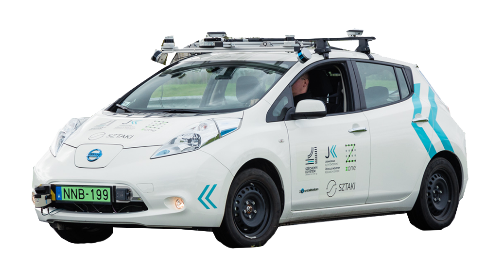
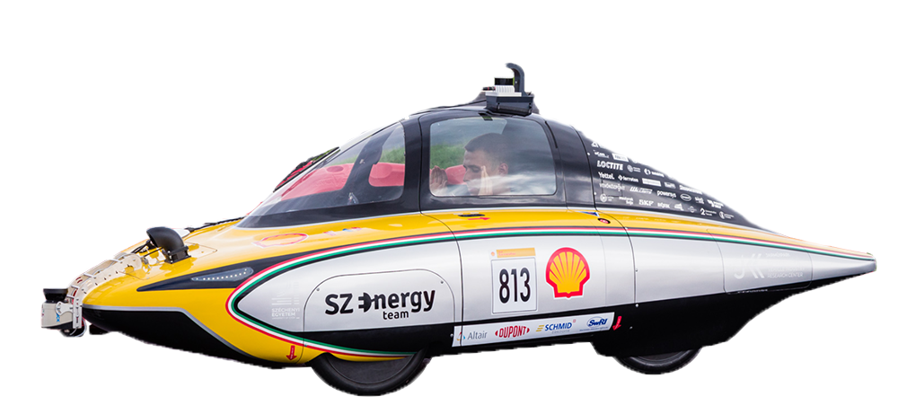

# Introduction

Systemically, autonomous driving can be described as the sum of the following sub-functions:


[](https://raw.githubusercontent.com/sze-info/arj/main/docs/_images/overview02.svg)
Literature: [[TU München](https://github.com/TUMFTM/Lecture_ADSE)], [[Autoware](https://github.com/autowarefoundation/autoware)], [[University of Texas at Dallas](https://nova-utd.github.io/navigator/system-overview.html)], [[ApolloAuto](https://github.com/ApolloAuto/apollo/blob/master/docs/02_Quick%20Start/demo_guide/images/Apollo_3_5_software_architecture.png)]

1. **Sensing**: deals with the production of raw data at the driver-program level, for example, producing an image from a camera sensor for the system.
2. **Perception**: a more complex process that extracts important information for the system from the input data, such as recognizing a pedestrian from a camera image.
3. **Planning**: plans the vehicle's path or trajectory at a global level (beyond the sensor's detection range) and at a local level (within the sensor's detection range).
4. **Control**: follows the path or trajectory produced by the planner, using controllers like Pure-Pursuit, Model Predictive Control (MPC), etc.
5. **Actuation**: issues the reference signals (steering angle, gas, and brake pedal) produced by the system (e.g., via [CAN bus](https://en.wikipedia.org/wiki/CAN_bus) system).

The above classification can also be observed in larger systems, such as the [Autoware summary system diagram](https://app.diagrams.net/?lightbox=1#Uhttps://autowarefoundation.github.io/autoware-documentation/main/design/autoware-architecture/node-diagram/overall-node-diagram-autoware-universe.drawio.svg). The sense-think-act paradigm is also known in robotics. Here, thinking (think) encompasses perception, planning, and somewhat control.

Let's look at an illustration for each sub-task on one of our university's vehicles with autonomous functions at the Zalaegerszeg test track:

<iframe width="560" height="315" src="https://www.youtube.com/embed/9eFqsei1J70?rel=0" title="YouTube video player" frameborder="0" allow="accelerometer; autoplay; clipboard-write; encrypted-media; gyroscope; picture-in-picture; web-share" allowfullscreen></iframe>


# Autonomous Driving vs. Driver Assistance
## SAE Levels

The SAE J3016 standard defines the division of labor between the driver and the vehicle system.

- **Level 0**: L0 - No Driving Automation, i.e., the complete absence of driving automation.
- **Level 1**: L1 - Driver Assistance, where certain driver assistance functions can already influence the vehicle's movement.
- **Level 2**: L2 - Partial Driving Automation, where the car performs maneuvers in both directions, but supervision is the driver's responsibility.
- **Level 3**: L3 - Conditional Driving Automation, where the driver must take over control if the vehicle requests it.
- **Level 4**: L4 - High Driving Automation, where the vehicle takes full responsibility, but it can still be used in traditional mode.
- **Level 5**: L5 - Full Driving Automation, Autonomous, where the vehicle takes full responsibility, and it cannot be used with a traditional steering wheel.

However, the standard does not describe the "scope" or area limitations of the vehicle. For example, an autonomous airport bus cannot leave the airport area. Similarly, Waymo, Cruise, or Zoox robotaxis typically operate in smaller regions, roughly equivalent to 1-2 counties in Hungary. This is also known as "geofencing."

## Examples

As we have seen, technologies similar to those in autonomous (L5) vehicles can also be found at driver assistance (L2/L3) levels. However, the complexity of the task is entirely different.

| Level: | L2/L3 | L5 |
|---:|:---:|:---:|
| Name: | Automated, driver assistance | Autonomous, self-driving |
| Typical sensors:| Camera, radar | Camera, radar, LIDAR, GPS |
| Examples: | Tesla, Audi, BMW | Waymo, Zoox, Cruise |


# Autonomous Vehicles and Robots

| Robots | Robotaxis |
|---|---|
|  |  |
| Nuro, Segway, Turtlebot, Clearpath, Starship  | Zoox, Cruise, Waymo, Navya, Sensible4 |

Let's look at an example that showcases the Zoox autonomous robotaxi in action:

<iframe width="560" height="315" src="https://www.youtube.com/embed/2sGf_3cAwjA?rel=0" title="YouTube video player" frameborder="0" allow="accelerometer; autoplay; clipboard-write; encrypted-media; gyroscope; picture-in-picture; web-share" allowfullscreen></iframe>

# Lines of Code

The following diagram shows that a modern average (driver-assisted) passenger car is a result of highly complex software engineering work, and it is clear that future autonomous vehicles will require even more complex solutions.

```mermaid
---
config:
    themeVariables:
        xyChart:
            backgroundColor: transparent
            titleColor: "#AAAAAA"
            xAxisLabelColor: "#43AEC5"
            yAxisLabelColor: "#43AEC5"
            xAxisLineColor: "#AAAAAA"
            yAxisLineColor: "#AAAAAA"
            plotColorPalette: "#43AEC5"
---
xychart-beta

    title "Millions of Lines of code (LOC) in 2024"
    x-axis ["Avg. iPhone app","World of warcraft", "Linux kernel", Facebook, "Avg. new vehicle"]
    y-axis "Average number of lines of codes (million)" 0 --> 210
    bar [0.04, 5.5, 30, 62, 200]
Source: [statista](https://www.statista.com/statistics/1370978/automotive-software-average-lines-of-codes-per-vehicle-globally/#:~:text=Between%202015%20and%202020%2C%20the,production%20in%20the%20following%20years.), [informationisbeautiful](https://informationisbeautiful.net/visualizations/million-lines-of-code/)
# University Vehicles

Széchenyi István University fortunately has a relatively large number of modified passenger cars and robots. These are the following:

## Lexus RX450h MY2016+ (car)
Sensors: Ouster OS2-64 LIDAR, 2x OS1-32 LIDAR, Stereolabs Zed2i depth camera.
More information [here](https://github.com/szenergy/szenergy-public-resources/wiki/H-sensorset2021.L).

<figure markdown="span">
  { width="80%" }
  <figcaption>Lexus</figcaption>
</figure>

## Nissan Leaf (car)
Sensors: 2x Ouster OS1-64 LIDAR, 2x Velodyne VLP16 LIDAR, SICK LMS111 LIDAR, Stereolabs Zed / Zed2 depth camera.
More information [here](https://github.com/szenergy/szenergy-public-resources/wiki/H-sensorset2020.A).

<figure markdown="span">
  { width="80%" }
  <figcaption>Nissan Leaf</figcaption>
</figure>

## Szenergy (car)
Sensors: Ouster OS1-128 LIDAR, SICK LMS111 LIDAR, Stereolabs Zed2i depth camera.
More information [here](https://www.youtube.com/szenergyteam).

<figure markdown="span">
  { width="80%" }
  <figcaption>Szenergy</figcaption>
</figure>

The Szenergy team achieved first place in 2023 and second place before that at Europe's largest autonomous driving competition, the Shell Eco-marathon Autonomous Urban Concept (AUC) competition. The podium finishes in these years were as follows:

| 🏆 | 2022 | 2023 | 2024 |
|:---:|---|---|---|
| 1. | DTU Road Runners, Technical University of Denmark (`Denmark`)  | SZEnergy Team, Széchenyi István University (`Hungary`) | SZEnergy Team, Széchenyi István University (`Hungary`) |
| 2. | SZEnergy Team, Széchenyi István University (`Hungary`)  | Team EVA,  Hogeschool Van Amsterdam University (`Netherlands`) | H2politO,Molecole Urbane Politecnico Di Torino University (`Italy`) |
| 3. | DNV Fuel Fighter, Norwegian University of Science And Technology (`Norway`) | H2politO,Molecole Urbane Politecnico Di Torino University (`Italy`) | Team EVA,  Hogeschool Van Amsterdam University (`Netherlands`) |

Source: [shellecomarathon.com](https://www.shellecomarathon.com/about/previous-seasons.html)

<iframe width="560" height="315" src="https://www.youtube.com/embed/8yfCvTJF5I0?si=HkQV_ftpOQNymNPG&amp;start=50" title="YouTube video player" frameborder="0" allow="accelerometer; autoplay; clipboard-write; encrypted-media; gyroscope; picture-in-picture; web-share" referrerpolicy="strict-origin-when-cross-origin" allowfullscreen></iframe>

## F1/10 (Ackermann robot) / Roboworks Rosbot mini Ackermann

The F1/10 competition is an autonomous vehicle competition where participants build and program 1/10 scale Formula 1 car models to autonomously navigate a race track. The goal is for the vehicles to complete the track as quickly and safely as possible while avoiding obstacles and other cars. During the competition, participants can test their knowledge of robotics, artificial intelligence, and machine learning. The Roboworks robot is very similar in size and sensor setup to the F1/10 vehicle. F1tenth vehicle [description here](https://f1tenth.org/build.html).

<figure markdown="span">
  { width="80%" }
</figure>

<figure markdown="span">
  { width="80%" }
</figure>

<iframe width="560" height="315" src="https://www.youtube.com/embed/k1tdeXjaJpk?si=_N7tOW_OVQDV6fZY" title="YouTube video player" frameborder="0" allow="accelerometer; autoplay; clipboard-write; encrypted-media; gyroscope; picture-in-picture; web-share" referrerpolicy="strict-origin-when-cross-origin" allowfullscreen></iframe>

## Segway Loomo (robot)
Description [here](https://github.com/jkk-research/loomo_base).

<figure markdown="span">
  { width="40%" }
  <!-- <figcaption></figcaption> -->
</figure>

## Husarion ROSbot 2 Pro (robot)
Description [here](https://husarion.com/manuals/rosbot/).

<figure markdown="span">
  { width="40%" }
  <!-- <figcaption></figcaption> -->
</figure>

## Robotis ROS TurtleBot 3 (robot)
Description [here](https://emanual.robotis.com/docs/en/platform/turtlebot3/overview/).

<figure markdown="span">
  { width="80%" }
  <!-- <figcaption></figcaption> -->
</figure>

## DJI Matrice 600 Pro drone (robot)
Sensors: Ouster OS1-64 LIDAR.
More information [here](https://www.youtube.com/watch?v=In_6XPS6JAw).

<figure markdown="span">
  { width="50%" }
  <!-- <figcaption></figcaption> -->
</figure>

<center></center>