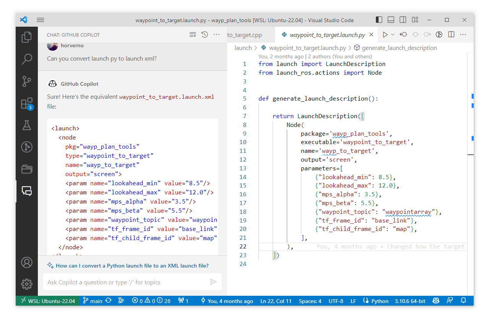
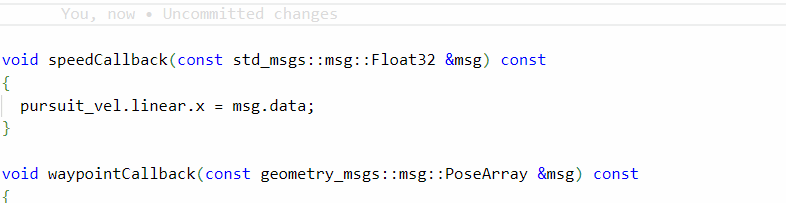

# Copilot

GitHub Copilot is a programming assistant tool: [github.com/features/copilot](https://github.com/features/copilot). It is based on AI technologies, similar to ChatGPT. It is particularly useful for beginner programmers but can also be a great help for experienced developers. GitHub Copilot assists developers in writing, completing, and correcting code, suggests coding patterns and structures, and helps developers solve problems faster.

GitHub Copilot supports multiple programming languages, making it useful for various development tasks, such as robotics development, database management, mobile application development, and many other areas.

The tool integrates into development environments like Visual Studio Code and can be used directly within the application.

By default, it is a paid service, but it is free with student access: [education.github.com/benefits](https://education.github.com/benefits?type=student).

Let's see Copilot in action:

<iframe width="560" height="315" src="https://www.youtube.com/embed/ZfT2CXY5-Dc?si=g3PHKWyJ63N_18xB" title="YouTube video player" frameborder="0" allow="accelerometer; autoplay; clipboard-write; encrypted-media; gyroscope; picture-in-picture; web-share" referrerpolicy="strict-origin-when-cross-origin" allowfullscreen></iframe>

## Getting GitHub Copilot for SZE Students

Using GitHub Copilot is almost essential for completing the course. Through the GitHub Student Developer Pack, students can access GitHub Copilot for free. Details of the Developer Pack and registration can be found here: [education.github.com/pack](https://education.github.com/pack). As a student, the simplest way to get GitHub Copilot is by following these steps:

- Register for Student Office 365, **@hallgato.sze.hu** email, 5GB OneDrive storage, Office Online, and Office 365 ProPlus desktop applications: [office365.sze.hu](https://office365.sze.hu/)
- Register on GitHub *or*, once the **@hallgato.sze.hu** email is active, set it as a secondary or primary email address in your GitHub account.
- Register for the GitHub Student Developer Pack: [education.github.com/pack](https://education.github.com/pack)
- After a few days, GitHub Copilot will be available in Visual Studio Code. Search for Copilot and Copilot chat among the extensions, and simply log in to the VS Code GitHub account.