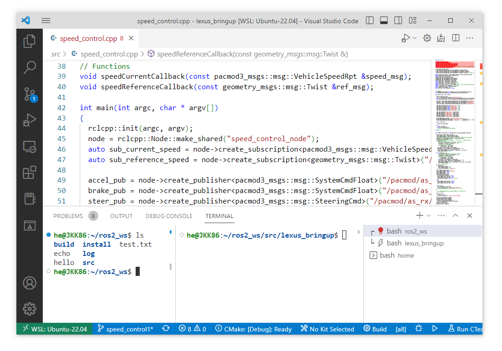

# Linux, Git

The description contains basic Linux knowledge.


In Linux (in this description, understand Ubuntu, Raspbian), most sessions can or should be executed from the terminal.
This tutorial helps to get acquainted with the basics of the Linux terminal.

!!! danger 
    It is important that instead of the usual `ctrl`+`v`, `ctrl`+`c`, here `ctrl`+`shift`+`v`, `ctrl`+`shift`+`c` works. The `ctrl`+`c` (interrupt from the keyboard) can be used here to terminate a ROS node (program).

## Recommended Terminal Programs

Several programs can be chosen to access the text command line. For ROS/ROS2, the following might be the best choices.

### Windows Terminal

As the name suggests, this solution is relevant on Windows with WSL. The advantage is that we can use multiple Linux distributions in one place, even with the Windows command line. With `Ctrl-Shift-P` key combinations, then the Split down, Split left commands, we can split the terminal similarly:


The [Windows Terminal release](https://github.com/microsoft/terminal/releases) page offers a downloadable installer or a portable version in zip format. For portable use, after extraction, an empty `.portable` file must be placed. This way, we can use it with our usual settings even on a USB pendrive. Such a portable version can be found in the computer labs on the `K:\` drive (`\\fs-kab.eik.sze.hu\C100\kozos\GKNB_AUTM078_Autonomous_robots_and_vehicles_programming`).

### Terminator

A terminal understood on Linux, but it needs to be installed.

```bash
sudo apt update
sudo apt install terminator
```

Terminator allows you to split the current window with the `Ctrl-Shift-O` and `Ctrl-Shift-E` key combinations. `Ctrl-Shift-W` closes the active window.


### VS Code Terminal

The integrated terminal of the development environment works on both Windows and Linux.




## Important Terminal Commands
### Previous Commands

- `Up Arrow 🔼` or `Down Arrow 🔽` - Access the most recent commands.
- `Ctrl+R` key combination allows you to search for previous commands in reverse chronological order.
- `Ctrl+Shift+R` key combination allows you to search for previous commands in chronological order.

Instead of the usual `ctrl`+`v`, `ctrl`+`c`, here `ctrl`+`shift`+`v`, `ctrl`+`shift`+`c` works. The `ctrl`+`c` can be used to terminate a ROS node (program).


### Auto-completion

- `Tab` key can be used to complete the started commands.
- `Tab Tab` key combination will list all possible commands.


### Screen Clearing

- `Ctrl+L` key can be used to clear the previous texts, making the terminal more readable.

### Navigating Between Directories

- `cd`: enter a specific directory/folder
  - e.g., `cd ~/ros2_ws/src`, `cd ../..`
- `ls`: list directories, files
- `mkdir`: create a directory
- `pwd`: print working directory
- `cp`: copy files (`cp /path/to/file /path/to/destination/`, `cp -r /path/to/directory /path/to/destination/`)
- `mv`: move (relocate) or rename a file or directory (`mv /path/to/file new_file_name`, `mv /path/to/file /new/path/to/file`)
- `rm`: delete files (`rm /path/to/file`, `rm -r /path/to/files/and/directories`) The `rm -r` command will delete everything at the specified location.
- `rmdir`: delete an empty directory
- `chmod`: (change mode) used to change the access permissions of files/directories. This can be done using character switches (r, w, etc.) or octally (numbers).
  - e.g., `chmod +x my_python_node.py`: add execute permission
  - e.g., `chmod 777 everything.py`: add all permissions

  #### `chmod`

|N|Sum|`rwx`|Permission|
|-|---|-----|----------|
|`7`	|4(r)+ 2(w) + 1(x)|	`rwx`	|read, write and execute|
|`6`	|4(r)+ 2(w)|	`rw-`	|read and write|
|`5`	|4(r)+ 1(x)|	`r-x`	|read and execute|
|`4`	|4(r)|`r--`	|read only|
|`3`	|2(w)+ 1(x)|`-wx`	|write and execute|
|`2`	|2(w)|`-w-`	|write only|
|`1`	|1(x)|`--x`	|execute only|
|`0`	|0   |`---`	|none|

#### Directories

| Location  |  Explanation |
|-----------|---------------|
|`/`        | The starting point of the directory tree, root  |
|`/boot`    | System boot, bootloader |
|`/bin`     | Executable commands, binaries |
|`/sbin`    | Administrator commands, superuser/system bin   |
|`/lib`     | Shared system libraries needed for startup, modules, drivers  |
|`/dev`     | Devices, such as USB (`ttyUSB0`)  |
|`/etc`     | Configuration files, local startup commands, passwords, network settings, etc.  |
|`/home`    | Contains each user's personal directory. For example, if logged in as `sanyi`, `/home/sanyi` contains our files. `/home/sanyi/Desktop`, or simply `~/Desktop`, is the content of our desktop. |
|`/mnt`     | Mount point for mounted peripherals, filesystems  |
|`/proc`    | Process information |
|`/root`    | The root user's directory  |
|`/tmp`     | Temporary files |
|`/usr`     | Universal system resources, applications, system tools |
|`/var`     | Variable data, such as print jobs, emails |

### Version Control
- `git clone`: clone a git repository
- `git config --global user.name "Sanyika"`: set username
- `git config --global user.email "sanyika@gggmail.com"`: set email
- `git init`: initialize a local repository
- `git add <file>`: add a file
- `git status`: check current status
- `git commit -m "My beautiful commit"`: commit with a message
- `git push`: push changes
- `git pull`: pull changes
- `git branch <new_branch_name>`: create a new branch
- `git checkout <branch_name>`: switch to a branch
- `git checkout -- .`: Discard all unstaged changes locally. In VS Code, this is similar to the "discard all changes" command. (In newer git versions, `git restore .` works similarly.)
- `git merge <branch_name>`: merge a branch into the current branch

!!! tip
    Most operations can be performed in VS Code without using the terminal. [Read more about it here](https://sze-info.github.io/ajr/bevezetes/vscodegit).

<center></center>

*Source*: [link](https://www.linkedin.com/posts/chaima-haj-taher-1093881ba_git-softwaredevelopment-workflow-activity-7177685446787751936-atW_)

### Text Files
- `wget`: download web content from the terminal
- `cat`: display the content of a file
- `touch`: create a text file
  - e.g., `touch hello.txt`
- `echo`: print or write to a file (`>>` operator). If the file does not exist, it creates it (`touch`).
  - e.g., `echo "hello" >> hello.txt`  
  - e.g., `echo "n = 5; print('\n'.join(':D ' * i for i in range(1, n + 1)))" >> hello.py` 
  - e.g., `ros2 topic list >> hello.txt` 
  - e.g., `ros2 topic echo --once /scan >> hello.txt` 
- `find`: search for files, e.g., `find ~/ros2_ws/src/ -name *.txt` searches for all `txt` files in the `~/ros2_ws/src` directory.
- `nano`: text editor: simple, terminal-based
- `code`: text editor: GUI, VS Code
  - e.g., `code .` opens the current folder
  - e.g., `code ~/.bashrc` opens the `~/.bashrc` file for editing
- `colcon`: wrapper for `cmake` and `make` commands for easier use, more on this later

### Installation
- `sudo apt install` or `sudo apt-get install`: install software using the package manager, Advanced Packaging Tool (APT). 
  - e.g., `sudo apt install tree mc` - install tree and mc programs 
- `sudo`: (Superuser do) Allows executing commands as an administrator or another user.
- `sudo apt update`: update package index, recommended before installing (`apt install`) new software.
- `sudo apt upgrade`: upgrade installed packages
- `apt list`: list all installed packages
  - e.g., `apt list | grep ros`: filter only ROS-related packages

### Additional Useful Tools

#### Navigation
- `Ctrl + a` or `home`: Move to the beginning of the line
- `Ctrl + e` or `end`: Move to the end of the line
- `Ctrl + ◀` / `Ctrl + ▶`: Move to the previous/next word

#### `grep`
- `grep`: (Global \ Regular Expression \ Print) search within files or command outputs
  - e.g., `grep 'ROS' ~/.bashrc`: list lines containing `ROS` in the `bashrc` file
  - e.g., `ros2 topic list | grep pose`: list all topics containing the string `pose`

#### `ssh`
- `ssh`: (Secure Shell Protocol) allows remote terminal login to Linux machines
  - e.g., `ssh nvidia@192.168.1.5`: login to the machine with the specified user and IP address
  - e.g., `ssh user01@computer4 -X`: login with `-X` to use X window, so windows appear on our machine but are hosted on the remote machine
  - e.g., `ssh laptop@192.168.0.2 touch hello.txt`: create a file on the specified machine, works with other commands as well

#### Frequently Used Commands
- `ps` provides information about running processes, e.g., `ps -A | grep ros` or `ps -eo pid,cmd | grep ros2`
- `df -h` (disk filesystem, human readable) provides information about the filesystem status


`ssh` typically requires a password, but if you trust a machine, you can save the private-public key pair to avoid this, [for example like this](https://github.com/szenergy/szenergy-public-resources/wiki/H-SSH-no-password).
#### `rsync` Network Copy

Copying between networked machines (remote sync), for example, copying from an Nvidia Jetson embedded computer to our own machine's `/mnt/c/bag/` folder with a progress bar looks like this:

```sh
rsync -avzh --progress /mnt/kozos/measurement_files/lexus-2023-07-18-campus.mcap  /mnt/c/temp/
```
```sh
rsync -avzh --progress nvidia@192.168.1.5:/mnt/storage_1tb/2023-07-02/ /mnt/c/bag/2023-07-02/
```
#### scp Network Copy

Copying between networked machines (an alternative to rsync). Unfortunately, the progress bar does not appear on all systems:

```r
scp /mnt/kozos/measurement_files/lexus3sample02.mcap  /mnt/c/temp/
```

#### `screen`

Manages virtual terminals, for example:

``` r
screen -m -d -S roscore bash -c roscore
screen -m -d -S campfly bash -c 'roslaunch drone_bringup campus_fly.launch'
screen -m -d -S rviz1 bash -c 'rosrun rviz rviz'
```

- list screen: `screen -ls`
- restore screen:  `screen -r roscore` / `screen -r campfly` /  `screen -r rviz1`
- detach: `Ctrl-a` + `Ctrl-d`
- kill: `killall -9 screen` and `screen -wipe`

#### `mc` File Manager

GNU Midnight Commander (`mc`), a file manager inspired by Norton Commander:


#### `nmtui`

The `nmtui` (Network Manager Text User Interface) is a terminal-based Wifi / Ethernet / Network configurator.


#### `nano` Text Editor

Terminal-based text editor. After editing, `Ctrl+X` to exit, then press `Y` to save the file.


#### `htop` / `top`

`htop` is an interactive process viewer command (similar to the functionality of the Windows task manager), which displays and monitors running processes on the system. Memory and CPU usage can be read in detail per process, and there is also the possibility to use `kill`.


#### `~/.bashrc` File

The `bashrc` file (the `~` means it is located in the `/home/user1/` folder for user `user1`, and the `.` means it is a hidden file) is a file that runs every time a terminal is started. So, for example, if we write a command like `echo "hello"` in it, it will print a hello message every time the terminal starts. It can be edited using `nano`/`VS Code` text editors:

```sh
nano ~/.bashrc
code ~/.bashrc
```
Important environment variables for us, for example:
```c
export ROS_DOMAIN_ID=4
export ROS_LOCALHOST_ONLY=1
export GAZEBO_MODEL_PATH=$GAZEBO_MODEL_PATH:/opt/ros/humble/share/turtlebot3_gazebo/models
export TURTLEBOT3_MODEL=waffle
source /opt/ros/humble/setup.bash
source ~/ros2_ws/install/setup.bash
```
After modifying the `bashrc` file, there is no need to open a new terminal if we issue the following command:

```
source ~/.bashrc
```

#### ROS1 
!!! tip This chapter discusses the old ROS 1 environment variables, the new ROS 2 environment variables are covered in the next chapter.

We can print the environment variables using `echo` or `printenv`, for example:
``` php
echo $ROS_MASTER_URI
printenv ROS_MASTER_URI

http://192.168.1.5:11311
```
``` php
echo $ROS_IP
printenv ROS_IP

192.168.1.10
```

##### ROS 2 

!!! important "ROS 2 Chapter" This is the new chapter containing ROS 2.

We can print the environment variables using `echo` or `printenv`, for example:

``` php
echo $ROS_DISTRO
printenv ROS_DISTRO

humble
```
``` php
echo $AMENT_PREFIX_PATH
printenv AMENT_PREFIX_PATH

/opt/ros/humble
```
```php
printenv | grep -i ROS

ROS_VERSION=2
ROS_PYTHON_VERSION=3
ROS_DISTRO=humble
```
##### Gazebo and WSL 

When using the Gazebo simulator and WSL, an [issue](https://github.com/gazebosim/gz-sim/issues/1841) may occur, which can be fixed by setting a simple environment variable. In the `~/.bashrc` file, set the following:

``` php
export LIBGL_ALWAYS_SOFTWARE=1 ### GAZEBO IGNITION 
```

After opening a new terminal or running `source`, the command `echo $LIBGL_ALWAYS_SOFTWARE` will print `1`.

#### Displaying Branch in Linux Bash

*Optional but useful: Find and modify the following part in the `~/.bashrc` file.

*(Using VS Code, the command is: `code ~/.bashrc`)*

``` bash
if [ "$color_prompt" = yes ]; then
    PS1='${debian_chroot:+($debian_chroot)}\[\033[01;32m\]\u@\h\[\033[00m\]:\[\033[01;34m\]\w\[\033[00m\]\$ '
else
    PS1='${debian_chroot:+($debian_chroot)}\u@\h:\w\$ '
fi
unset color_prompt force_color_prompt
```

Once found, replace it with the following:

``` bash
parse_git_branch() {
 git branch 2> /dev/null | sed -e '/^[^*]/d' -e 's/* \(.*\)/(\1)/'
}
if [ "$color_prompt" = yes ]; then
 PS1='${debian_chroot:+($debian_chroot)}\[\033[01;32m\]\u@\h\[\033[00m\]:\[\033[01;34m\]\w\[\033[01;31m\]$(parse_git_branch)\[\033[00m\]\n\$ '
else
 PS1='${debian_chroot:+($debian_chroot)}\u@\h:\w$(parse_git_branch)\\n$ '
fi
``` 
or without starting a new line:

``` bash
parse_git_branch() {
 git branch 2> /dev/null | sed -e '/^[^*]/d' -e 's/* \(.*\)/(\1)/'
}
if [ "$color_prompt" = yes ]; then
 PS1='${debian_chroot:+($debian_chroot)}\[\033[01;32m\]\u@\h\[\033[00m\]:\[\033[01;34m\]\w\[\033[01;31m\]$(parse_git_branch)\[\033[00m\]\$ '
else
 PS1='${debian_chroot:+($debian_chroot)}\u@\h:\w$(parse_git_branch)\$ '
fi
``` 

Save, then after `source ~/.bashrc`, or opening a new terminal, a bash similar to the following will greet us in a directory containing a git repository:


Source: 
[Ubuntu magyar dokumentációs projekt `CC by-sa 2.5`](http://sugo.ubuntu.hu/community-doc/hardy/universe/basic/terminal_hasznalata.html), [Óbuda University `CC BY-NC-SA 4.0`](https://github.com/ABC-iRobotics/ros_course_materials_hu/blob/main/LICENSE.md)