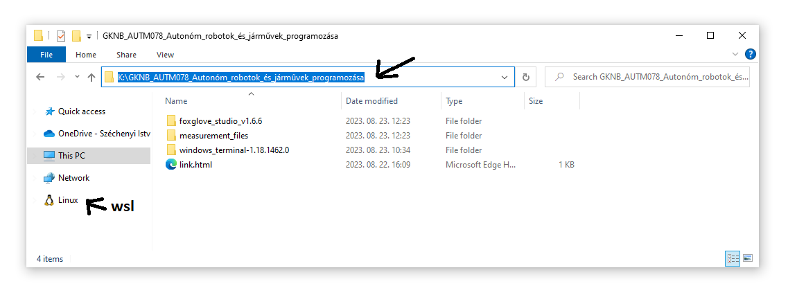
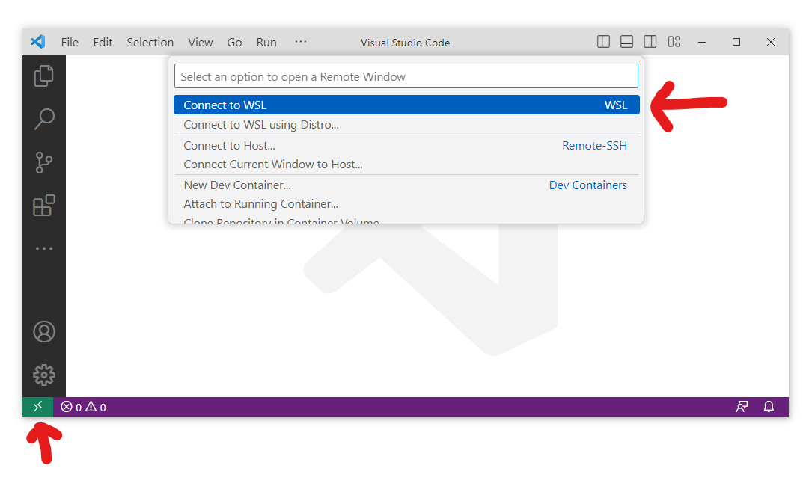
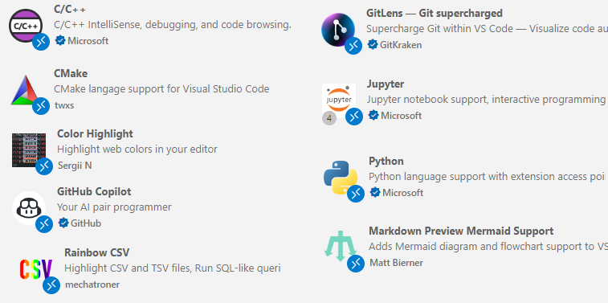
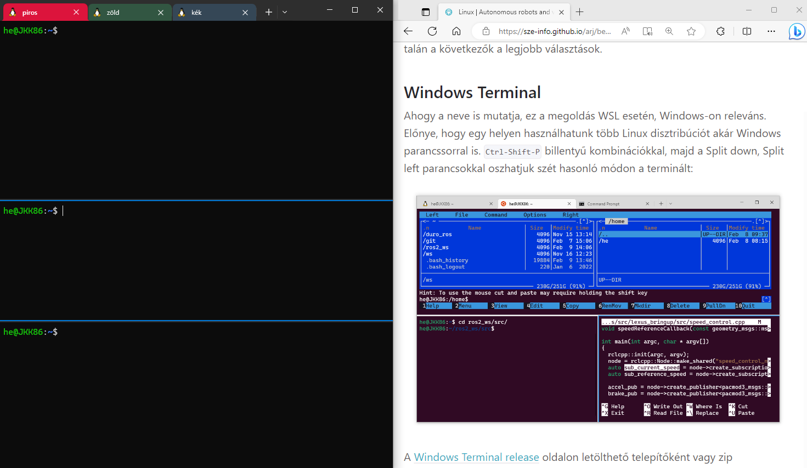
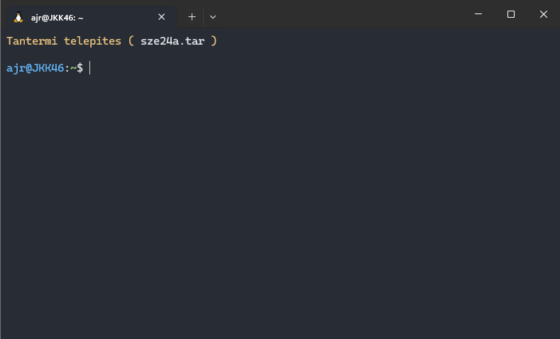
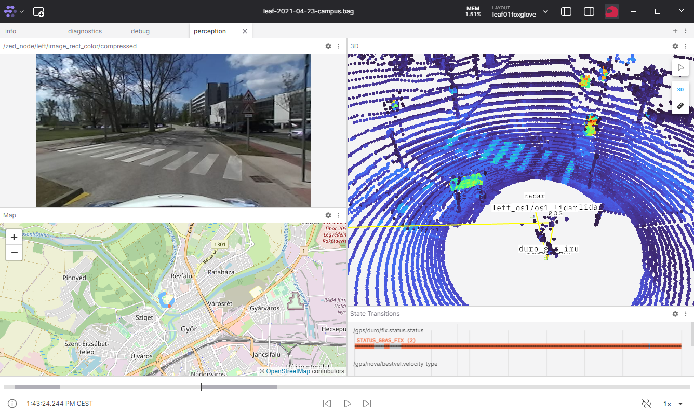

# Windows Installation (`C100`)

## Shared Drive (`K:\`)

The shared drive can be found as the `K:\` drive in Windows File Explorer. If it is not visible, it can also be accessed in File Explorer:

```powershell
\\fs-kab.eik.sze.hu\C100\kozos
```



Files related to the course can be accessed at the following address: [`\\fs-kab.eik.sze.hu\C100\kozos\GKNB_AUTM078_Autonóm_robotok_és_járművek_programozása`](file://fs-kab.eik.sze.hu/C100/kozos/GKNB_AUTM078_Auton%C3%B3m_robotok_%C3%A9s_j%C3%A1rm%C5%B1vek_programoz%C3%A1sa/) címen érhetőek el.

### WSL and Shared Drive

The shared drive should also be accessible from WSL at the /mnt/kozos mount point. Test the access with the cd /mnt/kozos command. If you receive the -bash: cd: /mnt/kozos: No such file or directory message, create it using mkdir. If ls /mnt/kozos does not list files, it is not mounted.

If the shared drive does not work, these commands might help:

``` r
sudo mkdir /mnt/kozos
echo "\\\\\\\\fs-kab.eik.sze.hu\C100\kozos\GKNB_AUTM078_Autonomous_robots_and_vehicles_software_engineering    /mnt/kozos    drvfs defaults,uid=1000,gid=1000    0    0" | sudo tee -a /etc/fstab
```
Then run wsl --shutdown from Windows cmd.


## WSL in File Explorer

The files of Ubuntu 22.04 are also accessible from Windows File Explorer. On the left side, you will see a WSL or Linux label. The ~ is accessible within the /home/<computer_name> folder, including the ros2_ws. 


## VS code

## VS Code WSL Access



## Useful VS Code Extensions



## Windows terminal

A portable version is available on the shared drive. Copy it to C:\temp to use the program.


The following figure shows a recommended (not mandatory) computer lab layout, with the terminal on the left and the browser on the right:






## Foxglove

It is installed and can be launched with the icon on the desktop. If it is not installed, copy the portable version from the shared drive to C:\temp.



## Quick Check of Computer Lab Settings

!!! success "Check" Run the following commands in the computer lab terminal: sh cd /mnt/kozos/script/ ./check_all.sh ```