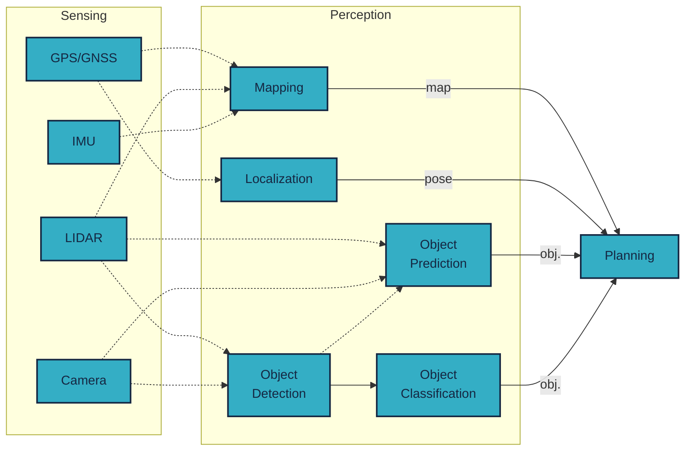

# Perception

Perception is the extraction of information from raw sensory data.

The goals of perception can include:

- Object recognition (detection), e.g.:
    - Pedestrian, cyclist, vehicle recognition
    - Traffic sign recognition, traffic light recognition
    - Drivable surface and lane recognition (also for localization and planning)
- Object classification:
    - Classifying already recognized objects. For example, determining the color of a traffic light, or distinguishing between a van and a horse-drawn carriage.
- Object tracking and prediction:
    - Determining the past paths of vehicles and pedestrians and predicting their future paths. This can be related to classification, as a horse-drawn carriage, despite being similar in size to a trailer, has different acceleration capabilities. This information can be used to plan routes and trajectories.
- Localization and mapping:
    - [SLAM](https://en.wikipedia.org/wiki/Simultaneous_localization_and_mapping): non-GNSS-based localization supplemented with local map creation. LOAM: LIDAR-based odometry.

Based on the sensors used, perception can involve:
- LIDAR
- Camera
- Radar
- IMU
- GNSS/GPS
- Microphone
- Any combination of the above sensors

!!! danger

    In Hungarian, it is easy to confuse the terms sensing (sensing) and perception (perception). Perception is a complex function that deals with producing processed, interpreted output from raw data.

This material is based on the Autonomous Driving Software Engineering course at TU Munich, compiled by the staff of the Institute of Automotive Technology. The lecture video is available in German:

<iframe width="560" height="315" src="https://www.youtube.com/embed/mffK5EbNLos?si=g1BJhjlVpJe3mrG8?rel=0" title="YouTube video player" frameborder="0" allow="accelerometer; autoplay; clipboard-write; encrypted-media; gyroscope; picture-in-picture; web-share" allowfullscreen></iframe>

## Challenges and Difficulties

Several challenges can hinder recognition and its accuracy:
- Weather (rain, snow, fog, ...)
- Time of day (night, sunset, sunrise ...)
- Occlusion (objects are only partially visible)
- Computation time (exponentially more critical at higher speeds)
- Different environments (urban, highway, forested areas ...)

# Use Cases

Since it would be difficult to demonstrate every aspect of perception, we will instead showcase a few use cases.

## Camera-based Traffic Light Classification

Processing camera images using artificial intelligence (neural network: YOLOv7).

<iframe width="560" height="315" src="https://www.youtube.com/embed/2AQy0-QckMk?si=FHxRsQ5S4m-T5rK-?rel=0" title="YouTube video player" frameborder="0" allow="accelerometer; autoplay; clipboard-write; encrypted-media; gyroscope; picture-in-picture; web-share" allowfullscreen></iframe>

## LIDAR-based Simple Height Filtering

A task often encountered in practice is simple LIDAR filtering based on X, Y, and Z coordinates. Since LIDAR provides a simple representation of the 3D environment, it can be easier to work with than a camera. A common technique is to filter out the road level from LIDAR data (ground segmentation), with the remaining points (non-ground) representing all objects. Here we demonstrate a much simpler technology:

## Clustering

After filtering out the road level from LIDAR data (ground segmentation), ground points and non-ground points are generated. The non-ground points need to be clustered to form points describing objects. The essence of clustering is that the points of a given object (e.g., a car) are close to each other.

Source: [codeahoy.com](https://codeahoy.com/img/kmeans/kmeans-animated.gif)

<iframe width="560" height="315" src="https://www.youtube.com/embed/Y0bmX5s6ojk?si=waCecpMidjLI19_N?rel=0" title="YouTube video player" frameborder="0" allow="accelerometer; autoplay; clipboard-write; encrypted-media; gyroscope; picture-in-picture; web-share" allowfullscreen></iframe>

## Sensor Fusion

The following video demonstrates perception through a real-life example.

<iframe width="560" height="315" src="https://www.youtube.com/embed/5E2NYmgvo3E?si=n7lpvnjh2LGBzEC_?rel=0" title="YouTube video player" frameborder="0" allow="accelerometer; autoplay; clipboard-write; encrypted-media; gyroscope; picture-in-picture; web-share" allowfullscreen></iframe>

## LIDAR-based Road Surface / Curb Detection

An algorithm developed by our university.

<iframe width="560" height="315" src="https://www.youtube.com/embed/T2qi4pldR-E?si=9p4mxITiHcwxk4HL?rel=0" title="YouTube video player" frameborder="0" allow="accelerometer; autoplay; clipboard-write; encrypted-media; gyroscope; picture-in-picture; web-share" allowfullscreen></iframe>

## LIDAR-based Object Tracking and Prediction

<iframe width="560" height="315" src="https://www.youtube.com/embed/si9gamz07LA?si=uG4gJHcaTnfOMpfv?rel=0" title="YouTube video player" frameborder="0" allow="accelerometer; autoplay; clipboard-write; encrypted-media; gyroscope; picture-in-picture; web-share" allowfullscreen></iframe>

## SLAM LIDAR and Camera Fusion

Simultaneous Localization and Mapping (SLAM) involves mapping the position and environment of a moving system (robot or vehicle) while navigating.

<iframe width="560" height="315" src="https://www.youtube.com/embed/oRzH-grBsKY?si=UPFX2vd85StR6MLY?rel=0" title="YouTube video player" frameborder="0" allow="accelerometer; autoplay; clipboard-write; encrypted-media; gyroscope; picture-in-picture; web-share" allowfullscreen></iframe>

# Sources
- [github.com/TUMFTM/Lecture_ADSE](https://github.com/TUMFTM/Lecture_ADSE)
- [Kim and Kum (2019) – Deep Learning based Vehicle Position and Orientation Estimation via Inverse Perspective Mapping Image](https://ieeexplore.ieee.org/document/8814050)
- [Object Perception: LIDAR youtube APEX AI](https://www.youtube.com/watch?v=xSGCpb24dhI&amp;list=PLL57Sz4fhxLpCXgN0lvCF7aHAlRA5FoFr&amp;index=7&amp;ab_channel=ApexAI)
- [Object Perception: CAMERA youtube APEX AI](https://www.youtube.com/watch?v=OtjTa-meJ-E&amp;list=PLL57Sz4fhxLpCXgN0lvCF7aHAlRA5FoFr&amp;index=8&amp;ab_channel=ApexAI)
- [Object Perception: Radar youtube APEX AI](https://www.youtube.com/watch?v=PcVIO-xoNv8&amp;list=PLL57Sz4fhxLpCXgN0lvCF7aHAlRA5FoFr&amp;index=9&amp;ab_channel=ApexAI)