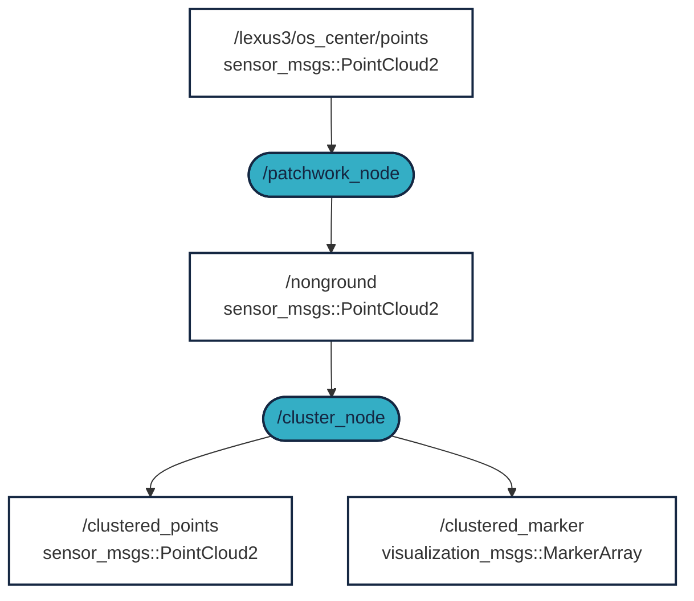

 

# Practice - Perception


This short workshop will guide you through filtering LIDAR data into objects. Objects could be pedestrians, cars, buildings, and so on. This workshop is ROS 2 compatible. [](https://docs.ros.org/en/humble/)

## Requirements (high-level overview)
1. ROS 2 Humble: 🟠 see previous workshops or [docs.ros.org/en/humble/Installation.html](https://docs.ros.org/en/humble/Installation.html) 
2. A log file with raw LIDAR data (MCAP format) ✅ 
3. The `patchworkpp` package to filter out the ground plane ✅ 
4. The `lidar_cluster` package to perform the clustering ✅ 


## Video overview

The following screen recording demonstrates the steps involved:

<iframe width="560" height="315" src="https://www.youtube.com/embed/YJyczb53vrg?si=rqnKHgE7y70-5B3a" title="YouTube video player" frameborder="0" allow="accelerometer; autoplay; clipboard-write; encrypted-media; gyroscope; picture-in-picture; web-share" referrerpolicy="strict-origin-when-cross-origin" allowfullscreen></iframe>


## `Step 1.` - Download the raw data

In order to cluster LIDAR data, first you need - no surprise - LIDAR data. Use any of the following 3 options.

### `Option A.` - Download our MCAP from the link below 

[Download MCAP [~540MB] :material-download: ](https://laesze-my.sharepoint.com/:u:/g/personal/herno_o365_sze_hu/Eclwzn42FS9GunGay5LPq-EBA6U1dZseBFNDrr6P0MwB2w?download=1){ .md-button }

In our examples the `.mcap` file is going to be saved in `/mnt/c/bag/`. If you want to use another directory, please change it accordingly.

### `Option B.` - Download our MCAP through your terminal

<details>
<summary> Don't forget to change directory first.</summary>

In our case `/mnt/c/bag/` is used as a final destination:

``` bash
cd /mnt/c/bag/
```
</details>

```
wget https://laesze-my.sharepoint.com/:u:/g/personal/herno_o365_sze_hu/Eclwzn42FS9GunGay5LPq-EBA6U1dZseBFNDrr6P0MwB2w?download=1  -O lexus3-2024-04-05-gyor.mcap
```


### `Option C.` - Use your own MCAP
You can use your own MCAP, but in that case, you may need to change following:

- The LIDAR topic 
    - In our examples it's `/lexus3/os_center/points`
- LIDAR frame 
    - In our examples it's `lexus3/os_center_a_laser_data_frame`

Never forget to update these in later steps if you use your own MCAP.

### Check your raw data

Play your bag using the following command (or however you wish):
``` bash
ros2 bag play /mnt/c/bag/lexus3-2024-04-05-gyor.mcap -l
```

!!! info 
    The `-l` option in the `play` command loops the mcap file.

!!! success
    If everything works as expected you should see a bunch of topics in another terminal
    <details>
    <summary> Topics</summary>
    In another terminal issue the command:

    ``` bash
    ros2 topic list
    ```
    You should see a similar list of topics:

    ``` bash
    /clock
    /events/read_split
    /lexus3/gps/duro/current_pose
    /lexus3/gps/duro/imu
    /lexus3/gps/duro/mag
    /lexus3/gps/duro/navsatfix
    /lexus3/gps/duro/status_flag
    /lexus3/gps/duro/status_string
    /lexus3/gps/duro/time_diff
    /lexus3/gps/duro/time_ref
    /lexus3/os_center/points
    /lexus3/os_left/points
    /lexus3/os_right/points
    /lexus3/zed2i/zed_node/left/image_rect_color/compressed
    /parameter_events
    /rosout
    /tf
    /tf_static   
    ```
    </details>

    Also there must be at least one `sensor_msgs/msg/PointCloud2`, check with:
    ``` bash
     ros2 topic type /lexus3/os_center/points
    ```
    Result:
    ``` bash
    sensor_msgs/msg/PointCloud2
    ```

## `Step 2.` - Install `ROS 2` packages

!!! info 
    If you don't have the `~/ros2_ws/` directory already, create it with the following command:
    ```bash
    mkdir -p ~/ros2_ws/src
    ```
    If you have your own workspace, make sure to update the paths accordingly in the following steps.

### Clone `patchworkpp` package
`patchwork-plusplus-ros` is ROS 2 package of Patchwork++ (@ IROS'22), which provides fast and robust LIDAR ground segmentation. We recommend the [JKK research](https://github.com/jkk-research/) fork which contains some improvements, alternatively you can use the original [KAIST](https://github.com/url-kaist/) version. 

```bash
cd ~/ros2_ws/src
```
```bash
git clone https://github.com/jkk-research/patchwork-plusplus-ros
```
or
```bash
git clone https://github.com/url-kaist/patchwork-plusplus-ros -b ROS2
```

### Clone `lidar_cluster` package

```bash
cd ~/ros2_ws/src
```

``` bash
git clone https://github.com/jkk-research/lidar_cluster_ros2
```


### Build the packages

```bash
cd ~/ros2_ws
```

```bash
colcon build --packages-select patchworkpp lidar_cluster --symlink-install
```


## `Step 3.` - Run


### What to expect



<details>
<summary> Don't forget to source before ROS commands.</summary>

``` bash
source ~/ros2_ws/install/setup.bash
```
</details>

```bash
ros2 bag play /mnt/c/bag/lexus3-2024-04-05-gyor.mcap -l
```

```bash
ros2 launch patchworkpp demo.launch.py  cloud_topic:=/lexus3/os_center/points cloud_frame:=lexus3/os_center_a_laser_data_frame
```
Use one of the following clustering algorithms:

```bash
ros2 launch lidar_cluster dbscan_spatial.launch.py
```
DBSCAN (Density-Based Spatial Clustering of Applications with Noise) is a non-grid based clustering algorithm.
On a modern 6-core CPU or better, you can expect a performance of at least 10 Hz. 

```bash
ros2 launch lidar_cluster euclidean_spatial.launch.py
```
Non-grid clustering based on euclidean distance. 
On a modern 6-core CPU or better, you can expect a performance of at least 5 Hz. 

```bash
ros2 launch lidar_cluster euclidean_grid.launch.py
```
Voxel grid based clustering based on euclidean distance.
On a modern 6-core CPU or better, you can expect a performance of at least 100 Hz. 

```bash
ros2 launch lidar_cluster rviz02.launch.py
```

!!! success
    If everything works as expected you should see a similar rviz window. 
    