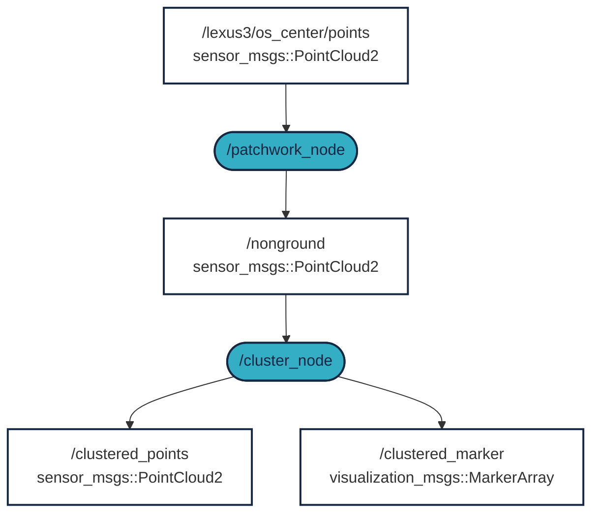

# ROS 2 LIDAR Clustering

The goal of this short practice/workshop is to demonstrate the filtering of LIDAR data into objects. Thus, we create larger objects/clusters from individual LIDAR points. These objects can be pedestrians, cars, buildings, etc. The practice is compatible with ROS 2. [](https://docs.ros.org/en/humble/)

## Requirements (high-level overview)
1. ROS 2 Humble: 🟠 see previous materials or [docs.ros.org/en/humble/Installation.html](https://docs.ros.org/en/humble/Installation.html)
2. Log file with raw LIDAR data (MCAP format, bag) ✅
3. The `patchworkpp` package for ground plane filtering ✅
4. The `lidar_cluster` package for clustering execution ✅

## Video Overview

The following screen recording demonstrates the necessary steps:

<iframe width="560" height="315" src="https://www.youtube.com/embed/YJyczb53vrg?si=rqnKHgE7y70-5B3a" title="YouTube video player" frameborder="0" allow="accelerometer; autoplay; clipboard-write; encrypted-media; gyroscope; picture-in-picture; web-share" referrerpolicy="strict-origin-when-cross-origin" allowfullscreen></iframe>

## `Step 1.` - Download the raw data

To cluster LIDAR data, we first need LIDAR data. Use one of the following 3 options.

### `Option A`: Download MCAP from the link below

[Download MCAP [~540MB] :material-download: ](https://laesze-my.sharepoint.com/:u:/g/personal/herno_o365_sze_hu/Eclwzn42FS9GunGay5LPq-EBA6U1dZseBFNDrr6P0MwB2w?download=1){ .md-button }

In our examples, the `.mcap` file is saved to the `/mnt/c/bag/` folder. If you want to use another directory, please modify accordingly.

### `Option B`: Download MCAP via your terminal

<details>
<summary> Don't forget to change the directory first.</summary>

In our case, `/mnt/c/bag/` is the place where we will put it:

``` bash
cd /mnt/c/bag/
```
</details>

```
wget https://laesze-my.sharepoint.com/:u:/g/personal/herno_o365_sze_hu/Eclwzn42FS9GunGay5LPq-EBA6U1dZseBFNDrr6P0MwB2w?download=1  -O lexus3-2024-04-05-gyor.mcap
```

### `Option C`: Use your own MCAP
You can use your own MCAP file, but in this case, you need to modify the following:

- The LIDAR topic
 - In our example, this is `/lexus3/os_center/points`
- LIDAR frame
 - In our example, this is `lexus3/os_center_a_laser_data_frame`

Later, don't forget to update these in the subsequent steps.

### Verify the raw data

Play the bag with a command similar to the following:
``` bash
ros2 bag play /mnt/c/bag/lexus3-2024-04-05-gyor.mcap -l
```

!!! info 
    The `-l` switch in the `play` command means loop playback.

!!! success
    If everything works as expected, you should see multiple topics in another terminal
    <details>
    <summary> Topics</summary>
    In another terminal, issue the following command:

    ``` bash
    ros2 topic list
    ```
    You should see a similar topic list:


    ``` bash
    /clock
    /events/read_split
    /lexus3/gps/duro/current_pose
    /lexus3/gps/duro/imu
    /lexus3/gps/duro/mag
    /lexus3/gps/duro/navsatfix
    /lexus3/gps/duro/status_flag
    /lexus3/gps/duro/status_string
    /lexus3/gps/duro/time_diff
    /lexus3/gps/duro/time_ref
    /lexus3/os_center/points
    /lexus3/os_left/points
    /lexus3/os_right/points
    /lexus3/zed2i/zed_node/left/image_rect_color/compressed
    /parameter_events
    /rosout
    /tf
    /tf_static   
    ```
    </details>

    Also, there must be at least one `sensor_msgs/msg/PointCloud2`, check with:
    ``` bash
     ros2 topic type /lexus3/os_center/points
    ```
    Result:
    ``` bash
    sensor_msgs/msg/PointCloud2
    ```

## `Step 2` - Install `ROS 2` packages

!!! info 
    If you don't have a `~/ros2_ws/` workspace, you will need the following command:
    ```bash
    mkdir -p ~/ros2_ws/src
    ```
    If you have a different workspace name, modify the following commands accordingly.

### Clone `patchworkpp` package
The `patchwork-plusplus-ros` is the ROS 2 package of Patchwork++ (@ IROS'22), providing fast and robust LIDAR ground segmentation. We recommend the [JKK-research](https://github.com/jkk-research/) fork, which includes some improvements, or you can use the original [KAIST](https://github.com/url-kaist/) version.

```bash
cd ~/ros2_ws/src
```
```bash
git clone https://github.com/jkk-research/patchwork-plusplus-ros
```
or
```bash
git clone https://github.com/url-kaist/patchwork-plusplus-ros -b ROS2
```

### Clone `lidar_cluster` package

```bash
cd ~/ros2_ws/src
```

``` bash
git clone https://github.com/jkk-research/lidar_cluster_ros2
```

### Build the packages

```bash
cd ~/ros2_ws
```

```bash
colcon build --packages-select patchworkpp lidar_cluster --symlink-install
```

## `Step 3` - Execution

### What is the expected operation?



<details>
<summary> Don't forget to source</summary>

``` bash
source ~/ros2_ws/install/setup.bash
```
</details>

```bash
ros2 bag play /mnt/c/bag/lexus3-2024-04-05-gyor.mcap -l
```

```bash
ros2 launch patchworkpp demo.launch.py  cloud_topic:=/lexus3/os_center/points cloud_frame:=lexus3/os_center_a_laser_data_frame
```
Use one of the following clustering algorithms:

```bash
ros2 launch lidar_cluster dbscan_spatial.launch.py
```
DBSCAN (Density-Based Spatial Clustering of Applications with Noise) is a non-grid-based clustering algorithm.
On a modern 6-core or better CPU, you can expect at least 10 Hz performance.

```bash
ros2 launch lidar_cluster euclidean_spatial.launch.py
```
Non-grid clustering based on Euclidean distance.
On a modern 6-core or better CPU, you can expect at least 5 Hz performance. 

```bash
ros2 launch lidar_cluster euclidean_grid.launch.py
```
Voxel grid-based clustering based on Euclidean distance.
On a modern 6-core or better CPU, you can expect at least 100 Hz performance.

```bash
ros2 launch lidar_cluster rviz02.launch.py
```

!!! success
    If everything works as expected, you should see a similar rviz window.
    

## Links
- English version of clustering [jkk-research.github.io/workshops/clustering_a](https://jkk-research.github.io/workshops/clustering_a/) 