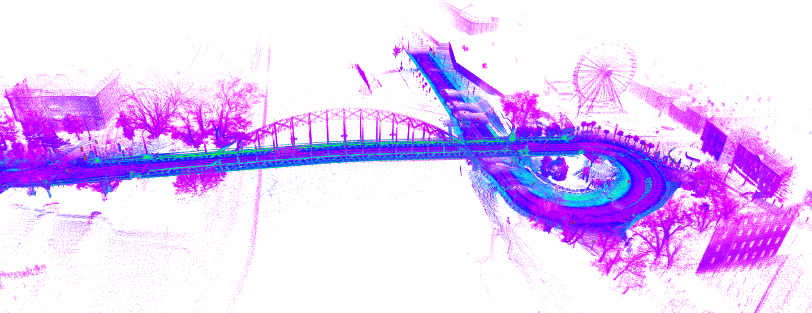

# SLAM and LOAM

Simultaneous localization and mapping (SLAM) and LIDAR-based odometry and mapping (LOAM).

A global point cloud compiled from a measurement in Győr:



## Direct LIDAR-Inertial Odometry

DLIO is a lightweight LIDAR-inertial odometry algorithm that generates a continuous trajectory using a novel coarse-to-fine approach.


<iframe width="560" height="315" src="https://www.youtube.com/embed/APot6QP_wvg?rel=0?rel=0" title="YouTube video player" frameborder="0" allow="accelerometer; autoplay; clipboard-write; encrypted-media; gyroscope; picture-in-picture; web-share" allowfullscreen></iframe>

### Installation

Available:

- [github.com/vectr-ucla/direct_lidar_inertial_odometry/tree/feature/ros2](https://github.com/vectr-ucla/direct_lidar_inertial_odometry/tree/feature/ros2) ROS 2 branch
- [github.com/jkk-research/direct_lidar_inertial_odometry](https://github.com/jkk-research/direct_lidar_inertial_odometry) fork containing only the ROS 2 branch

Let's check if `pcl-ros`
```bash
sudo apt install ros-humble-pcl-ros
```

```bash
cd ~/ros2_ws/src/
```

```bash
git clone https://github.com/jkk-research/direct_lidar_inertial_odometry
```

```bash
cd ~/ros2_ws/
```

```bash
colcon build --packages-select direct_lidar_inertial_odometry
```
### Building the package 

``` bash
cd ~/ros2_ws/src/
```

``` bash
git clone https://github.com/PRBonn/kiss-icp
```

``` bash
cd ~/ros2_ws/
```

``` bash
colcon build --packages-select kiss_icp
```

### Launch  

``` bash
ros2 launch kiss_icp odometry.launch.py topic:=/lexus3/os_left/points
```

## Linkes
- fastcampus_slam_codes tutorial: [github.com/changh95/fastcampus_slam_codes](https://github.com/changh95/fastcampus_slam_codes/)
- learn opencv: [learnopencv.com/lidar-slam-with-ros2](https://learnopencv.com/lidar-slam-with-ros2/)