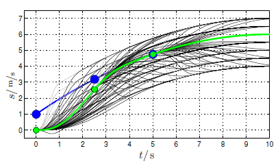

# Planning

We can distinguish between global planning and local planning.

Planning as a concept answers the question of how to get from point A to point B under the appropriate criteria. Planning has two sub-parts: **path** or **route planning**, which tells you where to go on a given segment, and **trajectory planning**, which tells you at what speed the vehicle should travel on the given segment.

Depending on the nature of the planning task, we distinguish between global and local planning. The differences between the two planning methods are summarized in the table below:

Global Planning | Local Planning
-----|-----
Map-based | Sensor-based
Known terrain/work area | Unknown area
Path planning occurs before movement | Path planning and movement occur simultaneously
No strict requirement on computation time | Requirement to operate in real-time

The result of planning, in both local and global cases, is a segment divided into discrete points, each containing position, orientation, and speed information, which we call a **trajectory**:
.

## Global Planning

### Introduction

The following German-language video with English PPT and subtitles is part of the [TU Munich](https://github.com/TUMFTM/Lecture_ADSE) curriculum and provides a good summary of the topic:

<iframe width="560" height="315" src="https://www.youtube.com/embed/5OVplZVy544?si=-de0bR_VUOSeXso3" title="YouTube video player" frameborder="0" allow="accelerometer; autoplay; clipboard-write; encrypted-media; gyroscope; picture-in-picture; web-share" referrerpolicy="strict-origin-when-cross-origin" allowfullscreen></iframe>

The PDF file associated with the video is available [here](https://www.researchgate.net/profile/Phillip-Karle-2/publication/352350798_Autonomous_Driving_Software_Engineering_-_Lecture_06_Planning_I_-_Global_Planning/links/60c48a9f4585157774cd45d0/Autonomous-Driving-Software-Engineering-Lecture-06-Planning-I-Global-Planning.pdf)

Well-known global planning algorithms:
- **RRT (Rapidly exploring random tree)**: RRT is a sampling-based method for exploring and planning paths in a global space. *Note*: In some cases, it is also used as a local planner. The algorithm randomly selects points and extends the tree by connecting new points to the nearest existing points. More information: [en.wikipedia.org/wiki/Rapidly_exploring_random_tree](https://en.wikipedia.org/wiki/Rapidly_exploring_random_tree).
- **Informed-RRT**: Informed-RRT is an extension of the basic RRT that uses heuristics for more efficient exploration towards the goal. The algorithm plans paths by first exploring closer areas and then moving towards more distant areas in later phases.
- **A-star**: The A* algorithm (pronounced "A star") is a graph traversal and pathfinding algorithm known for its completeness and efficiency. One of its main practical drawbacks is its $$ O(b^{d}) $$ space complexity, as it stores all generated nodes in memory. Therefore, in practical pathfinding systems, algorithms that can preprocess the graph for better performance often outperform it. More information: [hu.wikipedia.org/wiki/A*_algoritmus](https://hu.wikipedia.org/wiki/A%2A_algoritmus).
- **D-star**: The D* algorithm (pronounced "D star") stands for "Dynamic A-star". This algorithm is a modified version of the A* algorithm that can be used in dynamic environments. The Dynamic A-star algorithm continuously updates the path as the robot moves along it to adapt to changing conditions or obstacles. More information: [en.wikipedia.org/wiki/D*](https://en.wikipedia.org/wiki/D%2A).
- **Dijkstra**: The Dijkstra algorithm is one of the most well-known and widely used algorithms for finding the shortest path in a graph. It is a breadth-first search algorithm that iteratively expands the tree from the starting point and selects the nearest unvisited vertex. More information: [en.wikipedia.org/wiki/Dijkstra's_algorithm](https://en.wikipedia.org/wiki/Dijkstra%27s_algorithm).

It is worth noting that there are many variations and improvements of the above algorithms.

### Traveling Salesman Problem

The traveling salesman problem (TSP) is a well-known combinatorial optimization problem that emerged in the fields of computer science and mathematics. The essence of the problem is that the traveling salesman must visit a set of given cities and return to the starting city by the shortest possible route, visiting each city exactly once. More information: [hu.wikipedia.org/wiki/Az_utazó_ügynök_problémája](https://hu.wikipedia.org/wiki/Az_utaz%C3%B3_%C3%BCgyn%C3%B6k_probl%C3%A9m%C3%A1ja).

Formally, let there be a directed weighted **graph**, where the nodes represent the cities, the edges represent the roads between the cities, and the weights represent the lengths of the edges. The goal is to find a Hamiltonian circuit (a circuit that touches each node exactly once) with minimal total weight. The problem belongs to the NP-hard class, which means that there is no known efficient algorithm that always guarantees finding the optimal solution in polynomial time proportional to the number of cities.

In the context of autonomous vehicles and robotics, it is often **not the classic TSP** problem that arises, but its derivative, since, for example, in the case of an autonomous vehicle, we know exactly where we are starting from and where we are going. This condition is not known in the classic traveling salesman problem.

## Local Planning

### Introduction

The following German-language video with English PPT and subtitles is part of the [TU Munich](https://github.com/TUMFTM/Lecture_ADSE) curriculum and provides a good summary of the topic:

<iframe width="560" height="315" src="https://www.youtube.com/embed/B3WuUnivDMg?si=p-YMEGUkhzb0wKGL" title="YouTube video player" frameborder="0" allow="accelerometer; autoplay; clipboard-write; encrypted-media; gyroscope; picture-in-picture; web-share" referrerpolicy="strict-origin-when-cross-origin" allowfullscreen></iframe>

The PDF file associated with the video is available [here](https://www.researchgate.net/profile/Phillip-Karle-2/publication/352322244_Autonomous_Driving_Software_Engineering_-_Lecture_07_Planning_II_-_Local_Planning/links/60c36805299bf1949f4aaefb/Autonomous-Driving-Software-Engineering-Lecture-07-Planning-II-Local-Planning.pdf).

### Motivation

Local planning is essentially the planning response to dynamically changing conditions measured in real-time. What do we mean by this? The simplest example is if we compare global planning to planning a route (e.g., how to get from A to B), local planning is similar to the task of navigating in a given lane under given traffic conditions. However, we can see that a planning level's "local" and "global" nature does not always separate 100% from each other. For example, we plan to travel on the M1 motorway. Within this, there are several lanes, so which one should we choose? By default, we choose the outer lane, which we can consider the global trajectory. However, during the journey, we need to change lanes and follow the inner lane. We do this several times during a trip. Thus, the lane we want to follow will sometimes be the inner lane and sometimes the outer lane. We cannot predict this in advance, so we do not satisfy the initial global trajectory definition. We can consider it a local planning problem, but the decision to follow the inner or outer lane does not depend on external factors, only on the decision itself (e.g., we change lanes because of a car in front of us), but once we have changed lanes, the new lane's path does not depend on dynamic factors again.
We can resolve these contradictions in several ways:
- We consider a pre-planned route as global (in this case, this is the outer lane), and any modification is local, or
- We consider traveling on the motorway as a global route, which does not depend on the lanes, introduce an intermediate level, call it a global trajectory, which in this case means two alternative routes (outer or inner lane), and a local trajectory, which is a modification of this based on real-time information, or
- The global trajectory is not fixed but can change over time, but only rarely, if an external trigger signal is given (e.g., lane change).

In this chapter, we will cover the basics necessary for planning a local trajectory, so in the following, we will focus exclusively on this level. The local planning task in the above example can be described as follows:
- There is a global route (e.g., lane) that we take as a basis,
- Real-time variables (e.g., other vehicles) must be considered,
- The path must always be drivable by the vehicle, i.e., stable from the perspective of the following control and comfortable for the passengers; we can briefly call this a "kinematically well-conditioned" path,
- The path must be safe, i.e., it should not violate boundaries and should maintain a safe distance from other objects.

To achieve these goals, we need to know the exact global route, measure the dynamic variables, know the vehicle, and understand what "comfort" means for the passengers.
It is also important to note that the local path is often not just a set of points. We use some model to represent the trajectory, i.e., we describe it in a geometrically compact form. In practice, this can mean polynomial form, Euler curves, splines, etc. These curve descriptions all describe a curve with a finite number of parameters. To get a point on the curve, we evaluate the function describing the curve at a given X distance. This approach is useful because it allows us to describe long curves with few parameters, saving memory and runtime during implementation. Furthermore, the derivatives of the equation provide additional quantities (e.g., orientation, curvature), which can be easily generated for control.

## Local Planning Algorithms

As we saw in the introductory video, it is difficult to categorize and systematize local solutions, as the solutions often do not purely use one methodology. An example is the State Lattice planner, which works on a grid-like structure but uses graph-like search. Here we list some well-known local planning algorithms and algorithm families that have open-source implementations:

- **DWA (Dynamic Window Approach)**: In robotics/autonomous motion planning, the DWA approach is an online collision avoidance strategy for path planning and navigation in dynamic environments. As the name suggests, the robot/vehicle pushes a dynamic window in front of it during progress. It considers several possible directions (more precisely, trajectories) and then selects the state with the lowest cost. More information: [en.wikipedia.org/wiki/Dynamic_window_approach](https://en.wikipedia.org/wiki/Dynamic_window_approach).

- **TEB (Timed Elastic Band)**: The TEB algorithm is also used for online trajectory planning and tracking of moving robots in dynamic environments. It is particularly useful for non-holonomic robots (such as cars) with limited degrees of freedom. The method locally optimizes the robot's path concerning travel time, separation from obstacles, and adherence to kinodynamic constraints during execution. The name refers to an elastic band that can be easily bent in the desired direction. More information: [github.com/rst-tu-dortmund/teb_local_planner](https://github.com/rst-tu-dortmund/teb_local_planner/tree/foxy-devel).
- **State Lattice**: The kinodynamic constraints of the robot/vehicle are encoded in the state lattice graph, and any path in this graph is feasible. After constructing the graph, any graph search algorithm can be used for planning. More information: [navigation.ros.org/configuration/packages/smac/configuring-smac-lattice.html](https://navigation.ros.org/configuration/packages/smac/configuring-smac-lattice.html)
- **RRT (Rapidly exploring random tree)**: RRT was already mentioned in global planning but is also used in local methods.

Algorithm families:

- **Graph-based solutions**: These include solutions that use a graph to search in continuous space. Often, some local map model is used as an aid, such as [Lanelet2](https://github.com/fzi-forschungszentrum-informatik/Lanelet2). Examples include the Autoware [obstacle_avoidance_planner](https://autowarefoundation.github.io/autoware.universe/main/planning/behavior_path_dynamic_avoidance_module/).
- **Grid-based solutions**: These algorithms use a grid that results from discretizing continuous space. Terms like voxel grid and occupancy grid are often used to describe the discrete space. More information: [github.com/jkk-research/pointcloud_to_grid](https://github.com/jkk-research/pointcloud_to_grid), [github.com/ANYbotics/grid_map](https://github.com/ANYbotics/grid_map/tree/ros2). Some DWA solutions belong to this family.
- **Potential field-based solutions**: In artificial potential field (APF) planning, the robot is modeled with attractive and repulsive forces from objects in the environment. Unlike grid-based methods, the field itself dictates how far to stay from an object, while in grid-based methods, the planner determines this. Another difference is that the potential field is continuous, while the grid space is discrete. More information: [en.wikipedia.org/wiki/Motion_planning#Artificial_potential_fields](https://en.wikipedia.org/wiki/Motion_planning#Artificial_potential_fields), and an APF-based solution can be found [here](https://github.com/ai-winter/ros_motion_planning).
- **Frenet frame-based solutions**: In the Frenet coordinate system, the robot's state is given in two dimensions: longitudinal and lateral positions. The longitudinal axis contains the robot's current position and speed, while the lateral axis contains the robot's position relative to the path. More information: [roboticsknowledgebase.com/wiki/planning/frenet-frame-planning/](https://roboticsknowledgebase.com/wiki/planning/frenet-frame-planning/)

*Note*: The TU Munich curriculum similarly categorizes local planning algorithms but with different emphases: Graph-Based methods, Variational methods, Incremental Methods, Hybrid Methods.

## Design Example

The example in this chapter is taken from the work of Werling et al. [1]. This example presents a general planning problem that includes most of the above aspects. Two important points to note:
- We separate the lateral and longitudinal planning problems, and
- Lateral planning is done in the so-called Frenet frame.

### Lateral Planning
Lateral planning involves designing the curve of the path. First, we introduce the concept of the Frenet frame. Its illustration is shown in Figure 1. The Frenet frame is a coordinate system that runs along an arbitrary curve (in this case, e.g., the lane center or the global trajectory) as a function of the parameter $$s(t)$$.
We call the arbitrary curve the reference line. In the Frenet frame, the coordinate of the reference curve is all zeros (its deviation from itself is zero). When interpreting the points of a planned trajectory in this coordinate system, it is easy to express if we want the trajectory to coincide with the reference curve. For example, if we want a planned trajectory to end on the reference path, its endpoint in the Frenet frame would be $$[0; 0]$$. The non-zero distance gives the deviation from the reference line. For example, if we consider the lane center as the reference, the deviation from it is the distance in the Frenet frame, which is an intuitive approach since humans often consider the lane center as a reference and the deviation from it as a significant quantity.

  
*Figure 1: Illustration of the Frenet frame along the planned trajectory, source: [1]*

We examine the lateral planning problem exclusively at high speeds (>30-40kph). For this case, Werling et al. consider it as an optimization problem. The essence is that at any given state, we determine a polynomial with the smallest cost. By choosing different costs and weights, various trajectories can be planned. The two possible outcomes of the planning in the Frenet frame are shown in Figure 2. Suppose the dashed line is the lane center, which will be the reference line or the global trajectory. The thick line is the locally planned trajectory, aiming to guide the vehicle onto the global trajectory. The starting point can be any chosen point (e.g., the vehicle's position or the last point of the previous valid local trajectory, etc.). The horizontal direction represents the independent variable. Its value ranges from 0 to a maximum value, which can be considered the domain of the curve's equation. What is important for us when designing the curve? Firstly, it should start at the starting point and end at the endpoint (surprisingly). Additionally, we can treat the initial and final orientations as given values (e.g., the initial orientation matches the vehicle's orientation, and the final orientation matches the reference line's orientation). We call the initial and final conditions boundary conditions. If necessary, we can specify additional boundary conditions.

  
*Figure 2: Possible outcomes of planning in the Frenet frame, source: [1]*

During polynomial fitting, we look for polynomials that satisfy the boundary conditions. In Figure 2, we can see that multiple polynomials can satisfy these conditions simultaneously. Figure 3 shows such possible polynomials. It is evident that not all curves reach the reference line (the horizontal axis) at the same point, so we can distinguish different shaped curves based on their length. All of these satisfy the boundary conditions, but due to their different shapes, they will result in different kinematic properties when the car follows them. To decide which curve is the best for us, we introduce the so-called cost function. The cost function is a function that determines how good a given curve is according to our freely chosen criteria. We sum the costs. However, not all criteria are equally important, so their costs are not equally relevant. Thus, we use weights to decide which are the most significant and which are the least interesting criteria. We determine the total cost for all possible curves and then select the curve with the smallest cost. This will be our final trajectory, which is the optimal solution to the problem (optimal, meaning not zero cost, but the smallest cost solution considering the circumstances). We call the process optimization, and the length of the trajectory is the optimization variable.

  
*Figure 3: Possible outcomes of planning in the Frenet frame, source: [1]*

What we consider optimal depends on the cost function. It generally includes conflicting terms: the trajectory length should be as short as possible (reach the goal as quickly as possible), but the resulting lateral vehicle acceleration should be as small as possible (comfort condition). These contradict each other, so an intermediate good, i.e., optimal trajectory will be born. We can introduce additional costs, e.g., the amount of overshoot (the extent of crossing into the other lane), initial jerk, quickness of settling, etc. By changing the weights, we can implement different preferences, e.g., aggressive maneuver or comfortable maneuver. Additionally, we exclude trajectories that do not meet safety requirements, e.g., crossing into the other lane.

Werling et al. determined a fifth-degree polynomial to describe the curve. In the Frenet frame, the equation of the curve is:

$$ x(s) = c_{0} + c_{1}s + c_{2}s^{2}+c_{3}s^{3}+c_{4}s^{4}+c_{5}s^{5} $$

We see that the curve is defined by 6 parameters, the 6 coefficients from c0 to c5. To determine all coefficients, we need 6 boundary conditions:
- The initial and final point deviation from the reference line,
- The initial and final point orientation deviation from the reference line,
- And the curvature of the planned trajectory at the initial and final points.

Arranged in vector form:
$$ [d_{0}\ d_{1}\ \theta_{0}\ \theta_{1}\ \kappa_{0}\ \kappa_{1}]$$

We can choose these arbitrarily. Based on the above explanation, let:
$$[d_{0}\ d_{1}\ \theta_{0}\ \theta_{1}\ \kappa_{0}\ \kappa_{1}]=[d_{0}\ 0\ \theta_{0}\ 0\ 0\ 0]$$
i.e., the vehicle's position at the initial point relative to the reference line, the reference line at the endpoint, and the curvatures are zero, i.e., the curvatures of the reference line at the initial and final points.
Using the boundary conditions, we can write a system of equations with 6 unknowns and 6 equations:
$$ x(s=0) = c_{0} = d_{0}$$
$$ x'(s=0) = c_{1} = \theta_{1}$$
$$ x''(s=0) = 2c_{2} = \kappa_{1}$$
$$ x(s=s_{1}) = c_{0} + c_{1}s + c_{2}s_{1}^{2}+c_{3}s_{1}^{3}+c_{4}s_{1}^{4}+c_{5}s_{1}^{5} $$
$$ x'(s=s_{1}) = c_{1}s + 2c_{2}s_{1}+3c_{3}s_{1}^{2}+4c_{4}s_{1}^{3}+5c_{5}s_{1}^{4} $$
$$ x''(s=s_{1}) = 2c_{2}+6c_{3}s_{1}+12c_{4}s_{1}^{2}+20c_{5}s_{1}^{3} $$

where $s_{1}$ is the distance to the endpoint. This will be the variable of the above optimization problem. By varying this quantity over an arbitrary range (e.g., between $s_{1,max}$ and $s_{1,min}$), we look for the set of coefficients for which the cost function $$J$$ is the smallest.
How should we choose the $J$ function? For this, Werling et al. recommend the following formula:

$$ C_{d} = k_{j}J_{t}(d(t)) + k_{t}T + k_{d}(d_{1})^{2} $$

Where $T = \dfrac{s_{1}}{v_{x}}$ is the length of the trajectory expressed in time, $J_{t}$ is the so-called jerk (the derivative of lateral acceleration), and $d_{1}$ is the final point's distance from the reference line. We chose this to be $d_{1}=0$, so this term drops out.

### Longitudinal Planning

Longitudinal planning can work similarly to lateral planning. In this case, the global trajectory can be thought of as a series of target speeds along the route. In contrast, the local trajectory involves planning the actual speed according to local conditions. We consider the movement of other objects, target vehicle kinematics, speed limits, etc. This is illustrated in Figure 4. Normally, we maintain the maximum speed. When we encounter another vehicle ahead, we brake and match its speed. During braking, we plan a speed profile to ensure a safe distance from the other vehicle, avoiding sudden or premature braking. We then follow the other vehicle, maintaining this distance within certain limits. When we see an even slower vehicle (e.g., a cyclist), we further reduce our speed. Once the obstacle is gone, we accelerate back to the allowed speed. We always consider our own acceleration and deceleration preferences.

  
*Figure 4: Illustration of local speed trajectory*

It is evident that, similar to lateral planning, we need to plan the best possible profile under given conditions. This is also an optimization problem. Werling et al. recommend a fifth-degree polynomial for the target speed function in this case as well:

$$ v(s(t)) = c_{0} + c_{1}s + c_{2}s^2+c_3s^3+c_4s^4+c_5s^5 $$

The mechanism is the same: we formulate 6 boundary conditions and use them to plan trajectories. We select the one with the lowest cost. In the case of following another vehicle, the final conditions are:

$$ [s_1\ \dot{s_1}\ \ddot{s_1}\ T] = [(s_{target}(T_j)+\delta s_i),\ \dot{s}_{target}(T_j),\ {\ddot{s}}_{target}(T_j),\ T_j] $$

The initial conditions are:

$$ [s_0\ \dot{s_0}\ \ddot{s_0}\ T] = [s_{target}(0),\ \dot{s}_{ego}(0),\ {\ddot{s}}_{ego}(0),\ 0] $$

That is, the initial conditions are given by the object's distance and our vehicle's speed and acceleration. All trajectories planned in such a cycle are shown in Figure 5. The black ones are valid trajectories, the gray ones are invalid (e.g., too high acceleration), the blue one is the object's movement, and the green one is the optimal trajectory. The cost function can be:

$$ C_t = k_jJ_t + k_tT+k_s[s_1-s_d]^2 $$

Where $J_t$ is the average jerk experienced during the trajectory, $T$ is the trajectory length in time, and $s_1-s_d$ is the distance from the object at the end of the trajectory. The $k$ factors are the weights.

  
*Figure 5: Speed trajectory planning, source: [1]*

## ROS 2 Solutions

### Nav2

[Nav2](https://navigation.ros.org/) is the supported successor of the ROS Navigation Stack, applying the same technology for mobile robotics and autonomous vehicles, optimized and reworked. The Nav2 project aims to find a safe way for a mobile robot to perform complex tasks across various environments and robot kinematic classes. It can not only move from point A to point B but also handle intermediate poses (position + orientation) and other tasks like object tracking, full coverage navigation, etc. Nav2 is a production-level, high-quality navigation framework trusted by over 50 companies worldwide.

Overview of the [Nav2](https://github.com/ros-planning/navigation2) architecture:

### Autoware Planner

The [Autoware](https://autowarefoundation.github.io/autoware-documentation/main/) framework's [planning component](https://autowarefoundation.github.io/autoware-documentation/main/design/autoware-architecture/planning/) is also ROS 2 supported. The main function of the Autoware planning component is to create the trajectory that the Control component subscribes to, based on the environmental state received from the Localization and Perception components.

## References

- `[1]` Moritz Werling, Julius Ziegler, Sören Kammel, and Sebastian Thrun: Optimal Trajectory Generation for Dynamic Street Scenarios in a Frenét Frame, 2010 IEEE International Conference on Robotics and Automation, Anchorage Convention District, May 3-8, 2010, Anchorage, Alaska, USA, pp. 987-993
- `[2]` [github.com/ai-winter/ros_motion_planning](https://github.com/ai-winter/ros_motion_planning): ROS 1, but planned for ROS 2 **Global** planners: Dijkstra, A-star, D-star, RRT, Informed-RRT, GBFS **Local** planners: LQR (Linear–quadratic regulator), DWA (Dynamic Window Approach), APF, RPP, TEB (Timed Elastic Band)

### Additional Articles

A collection of articles related to the presented algorithms and gathered from the [python_motion_planning](https://github.com/ai-winter/python_motion_planning) repository:

### Global Planners
- [A* - A-star](https://ieeexplore.ieee.org/document/4082128): A Formal Basis for the heuristic Determination of Minimum Cost Paths
- [Modified A-Star](https://www.sciencedirect.com/science/article/pii/S0019057822004050): Efficient and optimal penetration path planning for stealth unmanned aerial vehicle using minimal radar cross-section tactics and modified A-Star algorithm
- [Lifelong Planning A*](https://www.cs.cmu.edu/~maxim/files/aij04.pdf): Lifelong Planning A*
- [D* - D-star](http://web.mit.edu/16.412j/www/html/papers/original_dstar_icra94.pdf): Optimal and Efficient Path Planning for Partially-Known Environments
- [D* Lite](http://idm-lab.org/bib/abstracts/papers/aaai02b.pdf): D* Lite
- [JPS](https://ojs.aaai.org/index.php/AAAI/article/view/7994): Online Graph Pruning for Pathfinding On Grid Maps
- [Theta*](https://www.jair.org/index.php/jair/article/view/10676): Theta*: Any-Angle Path Planning on Grids
- [Lazy Theta*](https://ojs.aaai.org/index.php/AAAI/article/view/7566): Lazy Theta*: Any-Angle Path Planning and Path Length Analysis in 3D
- [S-Theta*](https://link.springer.com/chapter/10.1007/978-1-4471-4739-8_8): S-Theta*: low steering path-planning algorithm
- [RRT](http://msl.cs.uiuc.edu/~lavalle/papers/Lav98c.pdf): Rapidly-Exploring Random Trees: A New Tool for Path Planning
- [RRT-Connect](http://www-cgi.cs.cmu.edu/afs/cs/academic/class/15494-s12/readings/kuffner_icra2000.pdf): RRT-Connect: An Efficient Approach to Single-Query Path Planning
- [RRT*](https://journals.sagepub.com/doi/abs/10.1177/0278364911406761): Sampling-based algorithms for optimal motion planning
- [Informed RRT*](https://arxiv.org/abs/1404.2334): Optimal Sampling-based Path Planning Focused via Direct Sampling of an Admissible Ellipsoidal heuristic
- [ACO](http://www.cs.yale.edu/homes/lans/readings/routing/dorigo-ants-1999.pdf): Ant Colony Optimization: A New Meta-Heuristic

### Local Planners

* [DWA](https://www.ri.cmu.edu/pub_files/pub1/fox_dieter_1997_1/fox_dieter_1997_1.pdf): The Dynamic Window Approach to Collision Avoidance
* [APF](https://ieeexplore.ieee.org/document/1087247): Real-time obstacle avoidance for manipulators and mobile robots
* [RPP](https://arxiv.org/pdf/2305.20026.pdf): Regulated Pure Pursuit for Robot Path Tracking