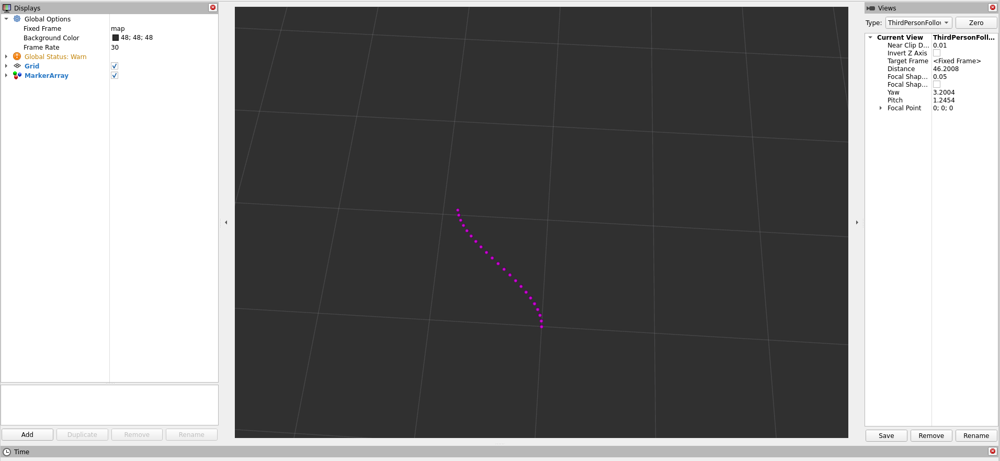
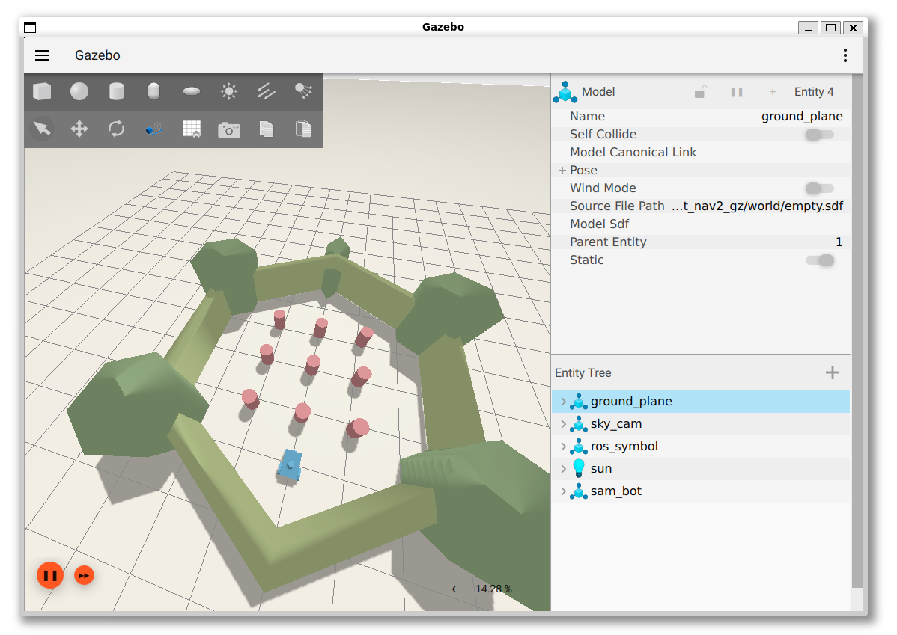

# `1.` Task

In this task, we will demonstrate the implementation of the polynomial-based local planner presented in the theoretical class. First, let's update the arj_packages repository!

## Clone and Build

```bash
cd ~/ros2_ws/src/arj_packages/
``` 
```bash
git pull
```
Then build the package named arj_local_planner!

```bash
cd ~/ros2_ws
``` 
```bash
colcon build --packages-select arj_local_planner
```

## Execution

Next, let's run the planner using the launch file after sourcing.

```bash
source ~/ros2_ws/install/setup.bash
``` 
```bash
ros2 launch arj_local_planner run_all.launch.py
```

Check which topics have been created (in a new terminal)!

```bash
ros2 topic list
```

The /goal_pose topic and the /planner/trajectory topic have been created. The goal_pose is the target position for the planner, and the planner/trajectory is the waypoint list, the planned trajectory itself. Let's start an rviz!

```bash
ros2 run rviz2 rviz2
```

Select the map frame and add the /planner/trajectory topic. Then, using the 2D Goal Pose option from the top bar, set a goal pose on the grid in the positive coordinate direction! The planner will automatically fit a polynomial to the target position.



This simple planner can be used for moving targets (another vehicle, lane center, a point on the global trajectory, etc.) or static targets (e.g., parking spot).

# `2.` Task

The second task is to set up the ROS 2 Navigation stack in a simulator on an empty track. Detailed documentation can be found on [navigation.ros.org](https://navigation.ros.org/).


<iframe width="560" height="315" src="https://www.youtube.com/embed/gjaXRG1d2Fw?si=Xf2iOuBe8ihZnKuV?rel=0" title="YouTube video player" frameborder="0" allow="accelerometer; autoplay; clipboard-write; encrypted-media; gyroscope; picture-in-picture; web-share" allowfullscreen></iframe>

## Clone and Build

```bash
cd ~/ros2_ws/src
``` 
```bash
git clone https://github.com/rosblox/nav2_outdoor_example
```

```bash
cd ~/ros2_ws
``` 
```bash
rosdep install -y --from-paths src --ignore-src --rosdistro $ROS_DISTRO
```

```bash
cd ~/ros2_ws
``` 
```bash
colcon build --packages-select nav2_outdoor_example
```

## Execution

```bash
source ~/ros2_ws/install/setup.bash
``` 
```bash
ros2 launch nav2_outdoor_example bringup.launch.py
```

# `3.` Task

The third task is to set up the ROS 2 Navigation stack in a simulator on one of the turtlebot tracks. Detailed documentation can be found on [navigation.ros.org](https://navigation.ros.org/).

<video src="https://user-images.githubusercontent.com/2298371/226628768-818a7c3f-e5e1-49c6-b819-112c2cfa668b.webm" type="video/webm" width="560" controls>
</video>

## Clone and Build

```bash
sudo apt install ros-humble-navigation2 ros-humble-nav2-bringup ros-humble-turtlebot3-gazebo
```

```bash
cd ~/ros2_ws/src
``` 
```bash
git clone https://github.com/ros-controls/gz_ros2_control
``` 
```bash
git clone https://github.com/art-e-fact/navigation2_ignition_gazebo_example
``` 
```bash
cd ~/ros2_ws/src/gz_ros2_control
``` 
```bash
git checkout humble
``` 
```bash
cd ~/ros2_ws
``` 
```bash
rosdep install -y --from-paths src --ignore-src --rosdistro humble
```

```bash
cd ~/ros2_ws
``` 
```bash
colcon build --packages-select sam_bot_nav2_gz
```

## Execution

Gazebo, RViz2, and Navigation2
```bash
source ~/ros2_ws/install/setup.bash
``` 
```bash
ros2 launch sam_bot_nav2_gz complete_navigation.launch.py
```

Setting a goal in RViz2:
```bash
source ~/ros2_ws/install/setup.bash
``` 
```bash
ros2 run sam_bot_nav2_gz follow_waypoints.py
``` 
```bash
source ~/ros2_ws/install/setup.bash
``` 
```bash
ros2 run sam_bot_nav2_gz reach_goal.py
``` 





## Navigation


   


## Sources
- [navigation.ros.org/getting_started/index.html](https://navigation.ros.org/getting_started/index.html)
- [navigation.ros.org](https://navigation.ros.org)
- [github.com/ros-controls/gz_ros2_control](https://github.com/ros-controls/gz_ros2_control)
- [github.com/art-e-fact/navigation2_ignition_gazebo_example](https://github.com/art-e-fact/navigation2_ignition_gazebo_example)