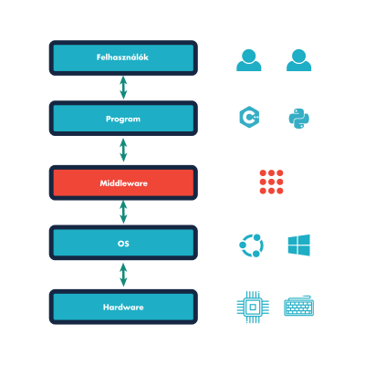
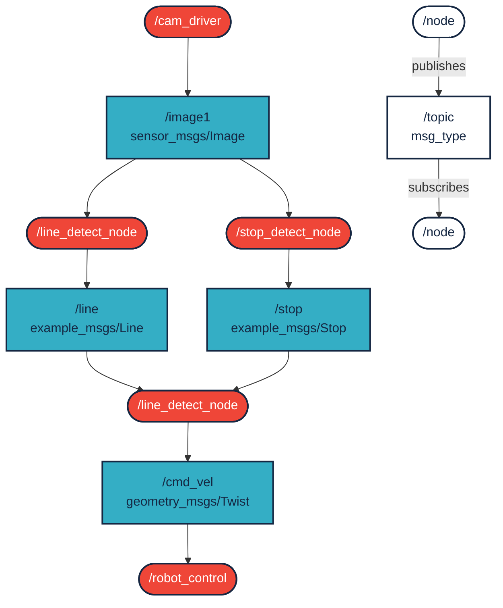
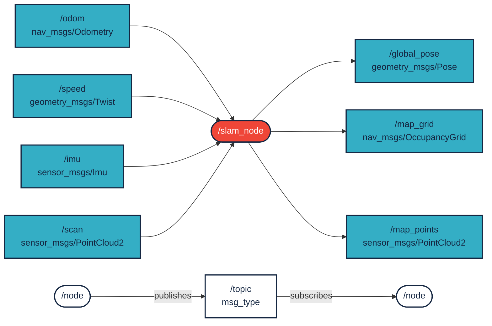
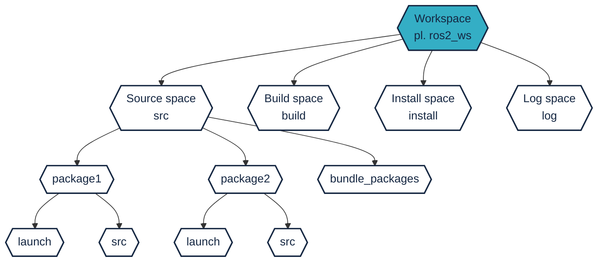
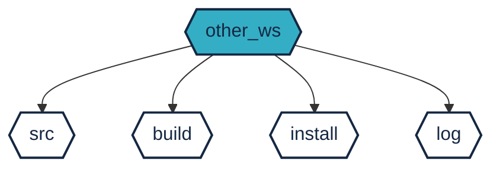
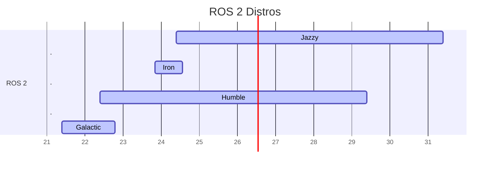
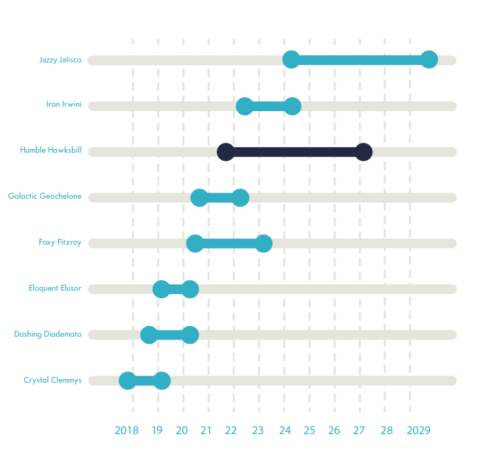
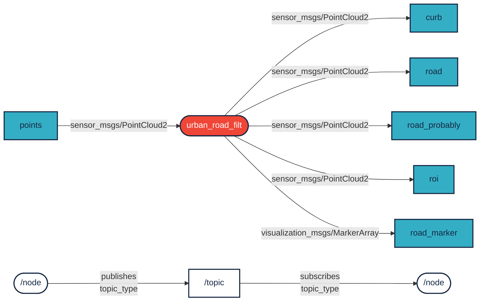

# `ROS 2` Basics

[ROS Versions and Installation](https://sze-info.github.io/ajr/telepites/)

`ROS 2`, the latest release of `ROS`, is a set of software libraries and tools (middleware) that help in the development of robotic applications. By definition, middleware is software that connects software components. It is a layer that sits between the operating system and applications on both sides of a distributed computer network. `ROS 2` uses permissive, open-source [Apache 2.0](https://choosealicense.com/licenses/apache-2.0/) licensing.

<figure markdown="span">
  { width="100%" }
  <figcaption>ROS 2 Overview</figcaption>
</figure>

Since its release in 2007, `ROS` has undergone incremental updates, meaning no fundamental changes but continuous major improvements. In 2017, the robotics community realized that the original 2007 concept had fundamental limitations that could not be fixed incrementally. Thus, Noetic Ninjemis (supported until 2025) is the last release of `ROS 1`, and `ROS 2` was developed in parallel. This also means that previous source codes are harder to port to the new version, but in return, we get many new features, improvements, and support for developing robots and vehicles.

As a result, `ROS 2` has transitioned from the world of academic research to industrial use. Interestingly, NASA's VIPER lunar rover also runs `ROS 2`. Additionally, automotive giants like Bosch, BMW, and Volvo use it. Many other robotics companies also use it. Links: [www.nasa.gov/viper/lunar-operations](https://www.nasa.gov/viper/lunar-operations), [rosindustrial.org/ric/current-members](https://rosindustrial.org/ric/current-members/), [www.bosch.com/stories/bringing-robotics-middleware-onto-tiny-microcontrollers](https://www.bosch.com/stories/bringing-robotics-middleware-onto-tiny-microcontrollers/). ROS users worldwide: [metrorobots.com/rosmap.html](http://metrorobots.com/rosmap.html).


Image source: [Robot Operating System 2: Design, Architecture, and Uses In The Wild: Steve Macenski et al.](https://arxiv.org/pdf/2211.07752.pdf)

## Why Use a Framework for My Robotics Project?

For our first robotics project, we might choose to develop entirely on our own without a framework. This has its advantages (learning, execution speed, etc.). But soon, we will need an algorithm that others have implemented, but it is not compatible with the original concept. At this point, it is worth considering using a framework (e.g., `ROS 2`). *Note* that `ROS 2` is not the only option; there are many similar, smaller frameworks: <a class="http" href="http://playerstage.sf.net">Player</a>, <a class="http" href="http://eris.liralab.it/yarp/">YARP</a>, <a class="http" href="http://www.orocos.org/">Orocos</a>, <a class="http" href="http://carmen.sourceforge.net">CARMEN</a>, <a class="http" href="http://orca-robotics.sourceforge.net">Orca</a>, <a class="http" href="http://www.robots.ox.ac.uk/~pnewman/TheMOOS/index.html">MOOS</a>, and <a class="http" href="http://msdn.microsoft.com/en-us/robotics/default.aspx">Microsoft Robotics Studio</a>. Each has its advantages, but in this course, we focus on `ROS 2` due to its support.


Image source: [ros.org/blog/ecosystem](https://www.ros.org/blog/ecosystem/)

- Plumbing: ROS primarily provides a messaging system, often referred to as "middleware" or "plumbing". Communication is one of the first needs that arise when implementing a new robotics application or any software system that connects to hardware. ROS's built-in and well-tested messaging system saves time by handling communication details between decentralized nodes, so you don't have to implement it separately. Moreover, intra-process communication allows direct memory access on a single machine.
- Tools: Effective application development requires good development tools. ROS has such tools, including debugging (`rqt_console`), visualization (`Rviz2`, `Foxglove Studio`), plotting (`rqt_plot`, `Foxglove Studio`), logging (`mcap`), and playback.
- Capabilities: Whether it's a GPS device driver, walking and balance controller for a quadruped robot, or a mapping system for a mobile robot, ROS has solutions. From drivers to algorithms to user interfaces, ROS provides the building blocks that allow you to focus on your application.
- Community: ROS is backed by a large, global, and diverse community. From students and hobbyists to multinational corporations and government agencies, people and organizations from all segments drive the `ROS 2` project. This is important because many questions will arise during development. Most of these have already been answered by the community, and they are happy to answer new questions.

The following diagram illustrates the nodes (programs) and topics (~communication) of a simple line-following robot:


Source: [Bestmann, Marc & Fakultät, Min & Zhang, Jianwei & Hendrich, N.. (2017). Towards Using ROS in the RoboCup Humanoid Soccer League. Masterthesis](https://www.researchgate.net/publication/337707327_Towards_Using_ROS_in_the_RoboCup_Humanoid_Soccer_League)

Let's look at another example that creates maps from speed data, IMU, and distance data.



## `ROS 2` Directory Structure 


``` bash
~/ros2_ws$ ls

build  install  log  src
```





``` bash
~/ros2_ws/
├──build  
├──install  
├──log
└──src/
    ├── bundle_packages 
    │   ├── cone_detection_lidar
    │   │   ├── launch
    │   │   └── src
    │   ├── my_vehicle_bringup
    │   │   └── launch
    │   ├── other bundle package1
    │   ├── other bundle package2
    │   └── img
    └── wayp_plan_tools
        ├── csv
        ├── launch
        └── src
```
## Differences between `ROS 1` and `ROS 2`

- *Changes in Middleware*  
  `ROS 1` uses a Master-Slave architecture and XML-RPC middleware. In contrast, `ROS 2` uses the Data Distribution Service (DDS), which provides greater efficiency and reliability, low latency, scalability, and configurable Quality of Service (QoS) parameters. Among other things, this means there is no need to start `roscore`. XML-RPC is better for simple remote procedure calls, while the added complexity of DDS allows it to better support real-time systems.
- *Changes in the ROS API*  
  `ROS 1` has two separate libraries: `roscpp` for C++ and `rospy` for Python. These are not entirely identical in terms of functionality. In contrast, `ROS 2` has a core library written in C - `rcl` (ROS client library) - on which other libraries are built. This ensures that core functionalities are available sooner across different APIs. This is one of the main reasons why `ROS 2` can provide support for more languages beyond the previous Python and C++: for example, [rclada](https://github.com/ada-ros/rclada) Ada, [rclcpp](https://github.com/ros2/rclcpp) C++, [rclgo](https://github.com/juaruipav/rclgo) Go, [rclpy](https://github.com/ros2/rclpy) Python, [rcljava](https://github.com/esteve/ros2_java/tree/master/rcljava) Java, [rclnodejs](https://github.com/RobotWebTools/rclnodejs) Node.js, [rclobjc](https://github.com/esteve/ros2_objc) Objective C (iOS), [rclc](https://github.com/ros2/rclc) C, [ros2_rust](https://github.com/ros2-rust/ros2_rust) Rust, [ros2_dotnet](https://github.com/esteve/ros2_dotnet) .NET, [ros2cs](https://github.com/RobotecAI/ros2cs) ros2_dotnet alternative in C#.
 
- *Changes in Data Format*  
  `ROS 2` uses the `MCAP` format, which is not specifically ROS's own format but an open-source container file format for multimodal log data. It supports timestamped, pre-ordered data and is ideal for use in pub/sub or robotics applications. More information: [mcap.dev](https://mcap.dev/)

## Some Useful Innovations
- *Real-Time Processing*  
  The summary of the above features, along with the use of DDS, makes `ROS 2` highly suitable for real-time processing, especially when deterministic, low-latency communication is required.
- *QoS: Quality of Service* 
  `ROS 2` allows the configuration of data flow, which affects how data is sent and received. This includes settings for message reliability, deadlines, and priorities, ensuring that critical messages are delivered on time.
- *Multithreaded Execution*  
  `ROS 2` supports truly parallel execution of multiple nodes, making much better use of modern multi-core processors compared to `ROS 1`.


Source: [husarnet.com/blog/ros2-docker](https://husarnet.com/blog/ros2-docker)

## Other Changes
- Catkin has been replaced by Ament (Colcon) as the build system. Overlays allow the creation of a secondary workspace that does not affect the primary workspace - this is useful when experimenting with new packages without affecting the base configuration (called "underlay").
- `ROS 2` is not backward compatible with `ROS 1`. Consequently, `ROS 1` packages are unlikely to work with `ROS 2` and would require reworking, and other software you used with `ROS 1` will no longer work.
- `ROS 1` was primarily designed for Ubuntu. `ROS 2` runs on MacOS, Windows, Ubuntu, and other (even Real-Time) operating systems.

## Versions

[ROS versions and installation](https://sze-info.github.io/ajr/telepites/)






Percentage distribution of distros over time: [metrics.ros.org/rosdistro_rosdistro.html](https://metrics.ros.org/rosdistro_rosdistro.html)

[](https://docs.ros.org/en/humble/)

The `Humble Hawksbill` or simply `Humble` is a long term support (LTS) release, supported for 5 years (from May 2022 to May 2027).

Additional releases: [docs.ros.org/en/humble/Releases.html](https://docs.ros.org/en/humble/Releases.html)

<iframe width="560" height="315" src="https://www.youtube.com/embed/0aPbWsyENA8?rel=0" title="YouTube video player" frameborder="0" allow="accelerometer; autoplay; clipboard-write; encrypted-media; gyroscope; picture-in-picture; web-share allowfullscreen></iframe>

# Concepts

## Nodes 

A node, simply put, is a ROS program (referred to as a node in English). Represented by a round 🔴 symbol in diagrams. Characteristics:

- "Executable" (c++ / py).
- Each node is a process.
- ROS handles threading.
- A node can have multiple threads internally.
- publish/subscribe to topics.
- Multiple nodes can "publish" to a topic, and a node can "subscribe" to multiple topics.

## Topics

Topics can be thought of as named "ports" where nodes can communicate. Represented by a square 🟦 symbol in diagrams. Characteristics:

- Responsible for the flow of information between nodes.
- Each topic's type is determined by the "message".
- "Many-to-many" communication is allowed between nodes.

### Message Types 
- Primitive built-in types (std_msgs)
  - `bool`, `string`, `float32`, `int32`, `…`
- Higher-level built-in types:
  - `geometry_msgs`: `Point`, `Polygon`, `Vector`, `Pose`, `PoseWithCovariance`, `…`
  - `nav_msgs`: `OccupancyGrid`, `Odometry`, `Path`, `…`
  - `sensors_msgs`: `Joy`, `Imu`, `NavSatFix`, `PointCloud`, `LaserScan`, …
- Also supported:
  - Constants
  - Enumerations
  - Embedded definitions

Example:

```sh
$ ros2 interface show geometry_msgs/msg/Point
float64 x
float64 y
float64 z
```


``` c
$ ros2 interface show std_msgs/msg/Header
uint32 seq
time stamp
string frame_id
```

The structure of the `PoseStamped` type is built from the `Header` and `Point` types

```  { .bash .annotate }
$ ros2 interface show geometry_msgs/msg/PoseStamped
std_msgs/Header header
  uint32 seq
  time stamp
  string frame_id
geometry_msgs/Pose pose
  geometry_msgs/Point position # (1) 
    float64 x
    float64 y
    float64 z
  geometry_msgs/Quaternion orientation # (2)
    float64 x
    float64 y
    float64 z
    float64 w

```
{ .annotate }

:man_raising_hand: This might look familiar: we have already discussed `geometry_msgs/msg/Point.`
:man_raising_hand: `geometry_msgs/Quaternion` is a type of 3D orientation representation, which we will discuss in detail later.

## Publishing / Subscribing

n the following example, the node named `urban_road_filt` subscribes to `points` data, which is of type `PointCloud2`, and publishes messages of types `PointCloud2` and `MarkerArray`:



## Parameters
-Not everything can be described with Publish/Subscribe
-Nodes may sometimes need parameterization
-Parameters can include:
    -Controller type
    -Color thresholds
    -Camera resolution, etc.

## Launch Files

Batch execution of multiple nodes (ROS programs). Keeping the `ROS 1` conventions, it can be an XML format file that defines almost every aspect/operation of ROS. Recently, however, these can also be `python` files, giving us much more freedom. Starting nodes, setting/loading parameters, topic remapping, passing command-line arguments.

Here is a short video about it:

<iframe width="560" height="315" src="https://www.youtube.com/embed/PqNGvmE2Pv4?rel=0" title="YouTube video player" frameborder="0" allow="accelerometer; autoplay; clipboard-write; encrypted-media; gyroscope; picture-in-picture; web-share" allowfullscreen></iframe>

# Sources
- [docs.ros.org/en/humble](https://docs.ros.org/en/humble/)
- [ros.org/blog/ecosystem](https://www.ros.org/blog/ecosystem/)
- [husarnet.com/blog/ros2-docker](https://husarnet.com/blog/ros2-docker)
- [design.ros2.org/articles/intraprocess_communications.html](https://design.ros2.org/articles/intraprocess_communications.html)
- [Towards Using ROS in the RoboCup Humanoid Soccer League - Masterthesis](https://www.researchgate.net/publication/337707327_Towards_Using_ROS_in_the_RoboCup_Humanoid_Soccer_League)