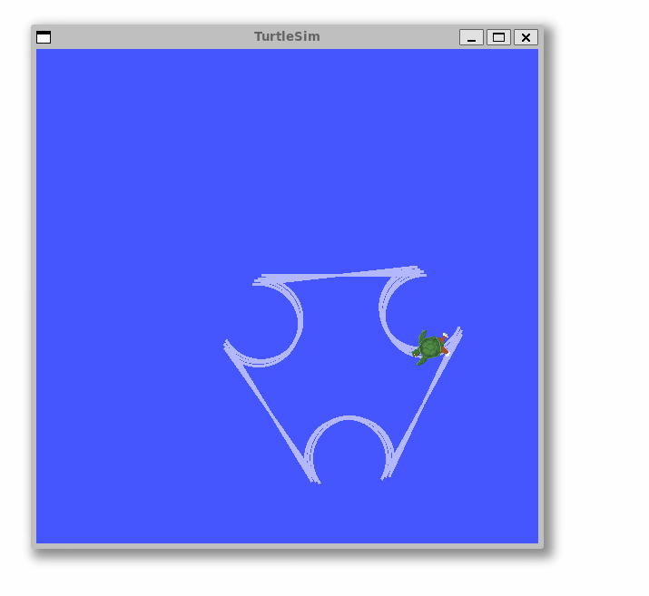

# `ROS 2` Introduction and Practice

## Reminder

A few basic concepts from the [previous](https://sze-info.github.io/ajr/bevezetes/ros2/) session:

- **Node**: Essentially means a ROS *program*. (e.g., `turtlesim_node`, `cmd_gen_node`, `foxglove_bridge`)
- **Topic**: Named communication channel. (e.g., `/turtle1/cmd_vel`, `/turtle1/pose`, `/raw_cmd`)
- **Message**: (e.g., `std_msgs/msg/Bool`, `geometry_msgs/msg/Twist`, `turtlesim/msg/Pose`)
- **Package**: Collection of ROS programs (nodes) (e.g., `turtlesim`, `arj_intro_cpp`, `arj_transforms_cpp`)
- **Launch files**: Used to start multiple nodes with parameters (e.g., `multisim.launch.py`, `foxglove_bridge.launch.xml`, `foxglove_bridge.launch.py`)
- **Publish / subscribe**: Publishing and subscribing to messages.
- **Build**: The process of creating executable files from the package source code. In ROS2, `colcon` is the default build tool.

## Task `1.` - Node and publish

Open two terminals. From the first terminal, start the built-in `turtlesim_node` simulator, which is found in the `turtlesim` package.

``` r
ros2 run turtlesim turtlesim_node
```

*Note*: If it is missing for some reason, it can be installed with the command `sudo apt install ros-humble-turtlesim`.

From the second terminal, publish a command that makes the turtle turn around:

``` r
ros2 topic pub /turtle1/cmd_vel geometry_msgs/msg/Twist '{linear: {x: 0.5, y: 0.0, z: 0.0}, angular: {x: 0.0, y: 0.0, z: 1.2}}'
```

<figure markdown="span">
  
  <figcaption>Turtlesim animation</figcaption>
</figure>

In the background, the `turtlesim_node` node (round symbol) subscribes to the `/turtle1/cmd_vel` topic (square symbol), causing the movement.


As shown in the flowchart, the type of `/turtle1/cmd_vel` is `geometry_msgs/msg/Twist`. This can be found out with the following command:

``` bash
ros2 interface show geometry_msgs/msg/Twist
```

``` r
Vector3  linear
        float64 x
        float64 y
        float64 z
Vector3  angular
        float64 x
        float64 y
        float64 z
```

All topics can be listed with:

``` bash
ros2 topic list
```

The content of a specific topic can be printed or written to a file in various formats and with filters:

``` r
ros2 topic echo /turtle1/pose
ros2 topic echo /turtle1/pose --csv
ros2 topic echo /turtle1/pose --csv > turtle_data_01.csv
ros2 topic echo /turtle1/pose --once
ros2 topic echo /turtle1/pose --once | grep velocity
ros2 topic echo /turtle1/pose --field x
ros2 topic echo /turtle1/pose --field linear_velocity
ros2 topic echo /turtle1/cmd_vel --field linear.x
```

Example output:

``` r
x: 6.2
y: 4.0
theta: 0.0
linear_velocity: 0.0
angular_velocity: 0.0
```

!!! tip By issuing the `ros2 topic echo --help` command, you get further usage instructions. The `--help` switch can of course be used with other `ros2` commands as well.

### Workspace and build information

First, check if the workspace exists in the home directory (`~`) using the `ls ~ | grep ros2` command. In this course, the workspace is named `ros2_ws`. The name doesn't really matter, but most tutorials use this name, so we follow this tradition. Multiple workspaces can be used simultaneously, sourced separately, which can be convenient for larger systems. For now, we stick to a single ros2_ws. If it doesn't exist, create the workspace and source folders with the `mkdir -p ros2_ws/src` command.

### colcon
The most important command is probably `colcon build`. Also noteworthy are `colcon list` and `colcon graph`. The former lists available packages, while the latter provides a quick view of dependencies.

The `colcon build` command comes with several useful switches:

- `--packages-select`:erhaps the most frequently used switch, followed by specifying multiple packages to build. If not specified, the default is to build the entire workspace. In practice, there will be a `colcon build --packages-select arj_intro_cpp arj_transforms_cpp` command, which builds the two arj packages.
- `--symlink-install`:Use symbolic links instead of copying files from the source. This avoids having to rebuild the package for every launch file modification.
- `--parallel-workers 2`: The maximum number of tasks that can be processed in parallel, in this case `2`. If not specified, the default value is the number of logical CPU cores. It is worth limiting if the build does not complete due to lack of resources.
- `--continue-on-error`: For larger builds, do not stop after the first faulty package. So if 1 out of 100 packages doesn't work, 99 will still build. If not specified, between 0 and 99 packages will build, depending on dependencies and other orderings.

### Source
To actually run our ROS2 executable files, we need to set up the environment (so-called sourcing), i.e., tell the bash where to look for the executable files, what their dependencies are, etc. This is simpler than it sounds, just issue a `source <path>/<name>.bash` command. As mentioned earlier, the workspace name doesn't matter, and indeed, after sourcing, it doesn't matter where the executable is physically located; it can be conveniently run from any folder with a command. Since packages within different workspaces can build on each other, ROS2 introduced the overlay/underlay concept. This means that when building one workspace, another workspace was already sourced, and some package depends on the previously built package. Thus, its functionality, code is needed for the dependent package. Accordingly, sourcing can also be of two types:

- The `local_setup.bash` script sets up the environment (sources) only in the current workspace. So it does not source the parent (dependent) workspace.

- The `local_setup.bash`script sets up the environment (sources) only in the current workspace. So it does not source the parent (dependent) workspace.
  
- The `setup.bash` script, however, adds the `local_setup.bash` script to all workspaces that were dependencies when the workspace was created.

!!! note In this course, such complex systems are not needed; most of the time, a single `ros2_ws` is sufficient.

## `2.` task - Package build and usage

<details> <summary> Reminder of the directory structure.</summary>


``` bash
~/ros2_ws/
├──build  
├──install  
├──log
└──src/
    ├── bundle_packages 
    │   ├── cone_detection_lidar
    │   │   ├── launch
    │   │   └── src
    │   ├── my_vehicle_bringup
    │   │   └── launch
    │   ├── other bundle package1
    │   ├── other bundle package2
    │   └── img
    └── wayp_plan_tools
        ├── csv
        ├── launch
        └── src
```
</details>
[docs.ros.org/en/humble/Tutorials/Beginner-Client-Libraries/Creating-A-Workspace/Creating-A-Workspace.html](https://docs.ros.org/en/humble/Tutorials/Beginner-Client-Libraries/Creating-A-Workspace/Creating-A-Workspace.html)

Let's open four terminals. In the first terminal, let's start the built-in `turtlesim_node` simulator, which is found in the `turtlesim` package.

``` r
ros2 run turtlesim turtlesim_node
```

!!! success In the second terminal, check the contents of `ros2_ws/src`, and if necessary **clone and build**the example package.


``` r
ls ~/ros2_ws/src | grep arj_
```
or

``` c
cd ~ && test -d "ros2_ws/src/arj_packages" && echo Letezik || echo Nem letezik
```
- `Option A:`If there is no package (the previous `ls` returns no result), then `git clone` and `colcon build`.
- `Option B:` If there is a package but it is not the latest, then `git pull` and `colcon build`.
- `Option C:` If there is a package and it is up-to-date, then no further action is needed.


`Option A:`
``` bash
cd ~/ros2_ws/src
```
``` bash
git clone https://github.com/sze-info/arj_packages
```
``` bash
cd ~/ros2_ws
```
``` bash
colcon build --packages-select arj_intro_cpp
```

`Option B:`
``` bash
cd ~/ros2_ws/src/arj_packages
```
``` bash
git checkout -- .
```
``` bash
git pull
```
``` bash
cd ~/ros2_ws
```

``` bash
colcon build --packages-select arj_intro_cpp
```

The `git checkout --` . command is useful for discarding any local changes.

In the third terminal, run the `cmd_gen_node` ROS node.

First, we need to `source` if we are using our own packages:


``` r
source ~/ros2_ws/install/setup.bash
```

Then the node can be run:


``` r
ros2 run arj_intro_cpp cmd_gen_node
```

The turtle now moves as follows:

<figure markdown="span">
  { width="100%" }
  <figcaption>Turtle</figcaption>
</figure>

The source code is available in the[github.com/sze-info/arj_packages](https://github.com/sze-info/arj_packages/blob/main/arj_intro_cpp/src/cmd_gen_node.cpp)repository. The key point is that the `loop` function runs at a frequency of 5 Hz (200 ms):


``` cpp
void loop()
{
  // Publish transforms
  auto cmd_msg = geometry_msgs::msg::Twist();
  if (loop_count_ < 20)
  {
    cmd_msg.linear.x = 1.0;
    cmd_msg.angular.z = 0.0;
  }
  else
  {
    cmd_msg.linear.x = -1.0;
    cmd_msg.angular.z = 1.0;
  }
  cmd_pub_->publish(cmd_msg);
  loop_count_++;
  if (loop_count_ > 40)
  {
    loop_count_ = 0;
  }
}
```

!!! important "Python equivalent" The Python version of the C++ code is also available at [github.com/sze-info/arj_packages](https://github.com/sze-info/arj_packages/blob/main/arj_intro_py/arj_intro_py/cmd_gen_node.py). It is worth comparing the C++ and Python codes.

In the last terminal, let's use Foxglove to view live data (don't forget to `source` here as well):

``` r
ros2 launch arj_intro_cpp foxglove_bridge.launch.py
```

Let's examine the data with Foxglove Studio via WebSocket (Open connection `ws://localhost:8765`):


*Note*: In the lab, `foxglove_bridge` is installed. At home, it can be installed with `sudo apt install ros-humble-foxglove-bridge` (after updating).


We can start all three nodes together as follows:

``` r
ros2 launch arj_intro_cpp turtle.launch.py
```
Let's briefly examine the contents of the package after running the `code ~/ros2_ws/src/arj_packages/arj_intro_cpp` command.

## `3. ` Task - Creating your own package

The task is based on the official ROS2 documentation:
[docs.ros.org/en/humble/Tutorials/Beginner-Client-Libraries/Creating-Your-First-ROS2-Package.html](https://docs.ros.org/en/humble/Tutorials/Beginner-Client-Libraries/Creating-Your-First-ROS2-Package.html).Let's create a ROS 2 package named my_package.

!!! important "Python Equivalent" We are currently creating a C++ package, but the [original]tutorial(https://docs.ros.org/en/humble/Tutorials/Beginner-Client-Libraries/Creating-Your-First-ROS2-Package.html) also includes Python equivalents for the CMake (C++) package.

First step is to navigate to the `src` directory of your workspace:

``` r
cd ~/ros2_ws/src
```
Let's create a package named `my_package` and a node named `my_node`.

``` r
ros2 pkg create --build-type ament_cmake --node-name my_node my_package
```
Build it as usual:


``` bash
cd ~/ros2_ws
```
``` bash
colcon build --packages-select my_package
```


Then source:

``` r
source ~/ros2_ws/install/setup.bash
```

And it can be run:

``` r
ros2 run my_package my_node
```
``` py
# output:

hello world my_package package
```

Let's examine the contents of `my_package`!


``` r
ls -R ~/ros2_ws/src/my_package
```
``` py
# output:
/home/he/ros2_ws/src/my_package:
  CMakeLists.txt  include  package.xml  src
/home/he/ros2_ws/src/my_package/include:
  my_package
/home/he/ros2_ws/src/my_package/include/my_package:
  [empty]
/home/he/ros2_ws/src/my_package/src:
  my_node.cpp
```

```
tree ~/ros2_ws/src/my_package
```
``` py
# output:
my_package
├── CMakeLists.txt
├── include
│   └── my_package
├── package.xml
└── src
    └── my_node.cpp
```

``` cpp
cat ~/ros2_ws/src/my_package/src/my_node.cpp
```
``` cpp
#include <cstdio>

int main(int argc, char ** argv)
{
  (void) argc;
  (void) argv;

  printf("hello world my_package package\n");
  return 0;
}
```
It is worth noting that the cpp file does not yet use any `ros2` headers.

To run it: 

``` bash
source ~/ros2_ws/install/setup.bash
```
```
ros2 run my_package my_node
```

Alternatively, you can open the entire folder from VS Code.
```r
code ~/ros2_ws/src/my_package
```

!!! tip If you provide a file after the `code` command, the file will open. If you provide a directory, the contents of that directory will open. It is often the case that you are in a specific package and want to open the current directory. You can do this with the `code .` command, where the `.` character represents the current directory in Linux.

## `4. ` Task C++ Publisher/Subscriber 

The exercise is based on the official ROS 2 tutorials: [docs.ros.org/en/humble/Tutorials/Beginner-Client-Libraries/Writing-A-Simple-Cpp-Publisher-And-Subscriber.html](https://docs.ros.org/en/humble/Tutorials/Beginner-Client-Libraries/Writing-A-Simple-Cpp-Publisher-And-Subscriber.html)

- [C++ publisher](https://github.com/ros2/examples/blob/humble/rclcpp/topics/minimal_publisher/member_function.cpp)
- [C++ subscriber](https://github.com/ros2/examples/blob/humble/rclcpp/topics/minimal_subscriber/member_function.cpp)

### Create the `cpp_pubsub` package

Open a new terminal and source the installation so that the `ros2` commands work.

Navigate to the already created `ros2_ws` directory.

It is important to create packages in the `src` directory, not in the root of the workspace. So navigate to the `ros2_ws/src` directory and run the package creation command:
```
ros2 pkg create --build-type ament_cmake cpp_pubsub
```

The terminal will return a message confirming the creation of the [`cpp_pubsub`](command:_github.copilot.openSymbolFromReferences?%5B%22%22%2C%5B%7B%22uri%22%3A%7B%22scheme%22%3A%22file%22%2C%22authority%22%3A%22%22%2C%22path%22%3A%22%2Fhome%2Ffarraj%2Fajr%2Fdocs%2Fbevezetes%2Fros2gyak.md%22%2C%22query%22%3A%22%22%2C%22fragment%22%3A%22%22%7D%2C%22pos%22%3A%7B%22line%22%3A435%2C%22character%22%3A41%7D%7D%5D%2C%22bef83ea5-99bb-4b0c-8e21-a5fa3e0c5a17%22%5D "Go to definition") package and all necessary files and folders.

### Write the publisher node

Navigate to the `ros2_ws/src/cpp_pubsub/src` directory.
This is the directory in every CMake package where the source files belong (e.g., with the `.cpp` extension).

Download the example talker code:
```
wget -O publisher_member_function.cpp https://raw.githubusercontent.com/ros2/examples/humble/rclcpp/topics/minimal_publisher/member_function.cpp
```

This command will create the `publisher_member_function.cpp` file. Open the folder with VS Code (`code .`) to edit the file.


``` cpp
#include <chrono>
#include <functional>
#include <memory>
#include <string>

#include "rclcpp/rclcpp.hpp"
#include "std_msgs/msg/string.hpp"

using namespace std::chrono_literals;

/* This example creates a subclass of Node and uses std::bind() to register a
* member function as a callback from the timer. */

class MinimalPublisher : public rclcpp::Node
{
    public:
    MinimalPublisher()
    : Node("minimal_publisher"), count_(0)
    {
        publisher_ = this->create_publisher<std_msgs::msg::String>("topic", 10);
        timer_ = this->create_wall_timer(
        500ms, std::bind(&MinimalPublisher::timer_callback, this));
    }

    private:
    void timer_callback()
    {
        auto message = std_msgs::msg::String();
        message.data = "Hello, world! " + std::to_string(count_++);
        RCLCPP_INFO(this->get_logger(), "Publishing: '%s'", message.data.c_str());
        publisher_->publish(message);
    }
    rclcpp::TimerBase::SharedPtr timer_;
    rclcpp::Publisher<std_msgs::msg::String>::SharedPtr publisher_;
    size_t count_;
};

int main(int argc, char * argv[])
{
    rclcpp::init(argc, argv);
    rclcpp::spin(std::make_shared<MinimalPublisher>());
    rclcpp::shutdown();
    return 0;
}
```

### Adding Dependencies 

Navigate back one level to the `ros2_ws/src/cpp_pubsub` directory, where the `CMakeLists.txt` and `package.xml` files have already been created.

Open the `package.xml` file with a text editor (e.g., `VS Code`). **Tip**: You can also open the entire directory, which simplifies some tasks later:
``` r
code ~/ros2_ws/src/cpp_pubsub/
```

It is always a good idea to fill in the `<description>`, `<maintainer>`, and `<license>` tags:

``` xml
<description>Examples of minimal publisher/subscriber using rclcpp</description>
<maintainer email="you@email.com">Your Name</maintainer>
<license>Apache License 2.0</license>
```
Add a new line after the `ament_cmake` buildtool dependency and insert the following dependencies according to the node's include directives:

``` xml
<depend>rclcpp</depend>
<depend>std_msgs</depend>
``` 

This declares that the package requires `rclcpp` and `std_msgs` at build and runtime.

### CMakeLists.txt

Let's open the `CMakeLists.txt` file.
Add the following lines under the existing `find_package(ament_cmake REQUIRED)` dependency:

```cmake
find_package(rclcpp REQUIRED)
find_package(std_msgs REQUIRED)
```

Next, add the executable file and name it ``talker`` so that it can be run using ``ros2 run``:

``` cmake
add_executable(talker src/publisher_member_function.cpp)
ament_target_dependencies(talker rclcpp std_msgs)
```

Finally, add the `install(TARGETS...)` section so that `ros2` can find the executable we compiled:

``` cmake
install(TARGETS
talker
DESTINATION lib/${PROJECT_NAME})
``` 
The ``CMakeLists.txt`` file can be cleaned up by removing some unnecessary sections and comments, resulting in the following:

``` cmake
cmake_minimum_required(VERSION 3.5)
project(cpp_pubsub)

# Default to C++14
if(NOT CMAKE_CXX_STANDARD)
set(CMAKE_CXX_STANDARD 14)
endif()

if(CMAKE_COMPILER_IS_GNUCXX OR CMAKE_CXX_COMPILER_ID MATCHES "Clang")
add_compile_options(-Wall -Wextra -Wpedantic)
endif()

find_package(ament_cmake REQUIRED)
find_package(rclcpp REQUIRED)
find_package(std_msgs REQUIRED)

add_executable(talker src/publisher_member_function.cpp)
ament_target_dependencies(talker rclcpp std_msgs)

install(TARGETS
talker
DESTINATION lib/${PROJECT_NAME})

ament_package()
```

The package can now be built. Let's also add the subscriber node to see the entire system in action.

``` bash
cd ~/ros2_ws/
```
``` bash
colcon build --packages-select cpp_pubsub
```

### Write the subscriber node
The creation of the subscriber node is also described in section 3 of the following tutorial:[docs.ros.org/en/humble/Tutorials/Beginner-Client-Libraries/Writing-A-Simple-Cpp-Publisher-And-Subscriber.html](https://docs.ros.org/en/humble/Tutorials/Beginner-Client-Libraries/Writing-A-Simple-Cpp-Publisher-And-Subscriber.html#id8)

Navigate back to the `ros2_ws/src/cpp_pubsub/src` directory and download the subscriber node:
```
wget -O subscriber_member_function.cpp https://raw.githubusercontent.com/ros2/examples/humble/rclcpp/topics/minimal_subscriber/member_function.cpp
```

If we list the files with `ls`, we should see the following:

```
publisher_member_function.cpp  subscriber_member_function.cpp
```
Add the subscriber node to the `CMakeLists.txt` file:

``` cmake
add_executable(listener src/subscriber_member_function.cpp)
ament_target_dependencies(listener rclcpp std_msgs)

install(TARGETS
  talker
  listener
  DESTINATION lib/${PROJECT_NAME})
```

### Build The Package

``` bash
cd ~/ros2_ws/
```
```
colcon build --packages-select cpp_pubsub
```

Source The code:

``` bash
source ~/ros2_ws/install/setup.bash
```
Run the Publisher
``` bash
ros2 run cpp_pubsub talker
```

``` r
[INFO] [minimal_publisher]: Publishing: "Hello World: 0"
[INFO] [minimal_publisher]: Publishing: "Hello World: 1"
[INFO] [minimal_publisher]: Publishing: "Hello World: 2"
[INFO] [minimal_publisher]: Publishing: "Hello World: 3"
[INFO] [minimal_publisher]: Publishing: "Hello World: 4"
```

In another Terminal ,Source The setup file and run the subscriber
``` bash
source ~/ros2_ws/install/setup.bash
```
``` bash
ros2 run cpp_pubsub listener
```

``` r
[INFO] [minimal_subscriber]: I heard: "Hello World: 10"
[INFO] [minimal_subscriber]: I heard: "Hello World: 11"
[INFO] [minimal_subscriber]: I heard: "Hello World: 12"
[INFO] [minimal_subscriber]: I heard: "Hello World: 13"
[INFO] [minimal_subscriber]: I heard: "Hello World: 14"
```
## `5.` Task - Python publisher / subscriber

The exercise is based on the official ROS 2 tutorials:[docs.ros.org/en/humble/Tutorials/Beginner-Client-Libraries/Writing-A-Simple-Py-Publisher-And-Subscriber.html](https://docs.ros.org/en/humble/Tutorials/Beginner-Client-Libraries/Writing-A-Simple-Py-Publisher-And-Subscriber.html)


=== "Python"

    ``` py linenums="1"
    import rclpy      ## ROS2 Python API 
    from std_msgs.msg import String ## ROS2 Standard String
    from rclpy.node import Node 


    ## MinimalPublisher osztály
    class MinimalPublisher(Node):

        def __init__(self):
            super().__init__('minimal_publisher')
            self.publisher_ = self.create_publisher(String, 'topic', 10)
            timer_period = 0.5  # seconds
            self.timer = self.create_timer(timer_period, self.timer_callback)
            self.i = 0

        def timer_callback(self):
            msg = String()
            msg.data = 'Hello World: %d' % self.i
            self.publisher_.publish(msg)
            self.get_logger().info('Publishing: "%s"' % msg.data)
            self.i += 1


    def main(args=None):
        rclpy.init(args=args)
        minimal_publisher = MinimalPublisher()
        rclpy.spin(minimal_publisher)
        minimal_publisher.destroy_node()
        rclpy.shutdown()


    if __name__ == '__main__':
        main()
    ```

=== "C++" 

    ``` c++ linenums="1"
    #include "rclcpp/rclcpp.hpp" // ROS2 C++ API 
    #include "std_msgs/msg/string.hpp" // ROS2 standard String
    #include <chrono>
    #include <functional>
    #include <memory>
    #include <string>
    using namespace std::chrono_literals;
    // MinimalPublisher osztály
    class MinimalPublisher : public rclcpp::Node
    {
        public: MinimalPublisher() : Node("minimal_publisher"), count_(0) {
            publisher_ = this->create_publisher<std_msgs::msg::String>("topic", 10);
            timer_ = this->create_wall_timer(
            500ms, std::bind(&MinimalPublisher::timer_callback, this));
        }

        private:
        void timer_callback(){
            auto message = std_msgs::msg::String();
            message.data = "Hello, world! " + std::to_string(count_++);
            RCLCPP_INFO(this->get_logger(), "Publishing: '%s'", message.data.c_str());
            publisher_->publish(message);
        }
        rclcpp::TimerBase::SharedPtr timer_;
        rclcpp::Publisher<std_msgs::msg::String>::SharedPtr publisher_;
        size_t count_;
    };

    int main(int argc, char * argv[]){
        rclcpp::init(argc, argv);
        rclcpp::spin(std::make_shared<MinimalPublisher>());
        rclcpp::shutdown();
        return 0;
    }
    ```


- [Python publisher](https://github.com/ros2/examples/blob/humble/rclpy/topics/minimal_publisher/examples_rclpy_minimal_publisher/publisher_member_function.py)
- [Python subscriber](https://github.com/ros2/examples/blob/humble/rclpy/topics/minimal_subscriber/examples_rclpy_minimal_subscriber/subscriber_member_function.py)

# Sources
- [docs.ros.org/en/humble/Tutorials/Beginner-CLI-Tools/Introducing-Turtlesim/Introducing-Turtlesim.html](https://docs.ros.org/en/humble/Tutorials/Beginner-CLI-Tools/Introducing-Turtlesim/Introducing-Turtlesim.html)
- [docs.ros.org/en/humble/Tutorials/Beginner-Client-Libraries/Creating-Your-First-ROS2-Package.html](https://docs.ros.org/en/humble/Tutorials/Beginner-Client-Libraries/Creating-Your-First-ROS2-Package.html)
- [docs.ros.org/en/humble/Tutorials/Beginner-Client-Libraries/Writing-A-Simple-Cpp-Publisher-And-Subscriber.html](https://docs.ros.org/en/humble/Tutorials/Beginner-Client-Libraries/Writing-A-Simple-Cpp-Publisher-And-Subscriber.html)
- [docs.ros.org/en/humble/Tutorials/Beginner-Client-Libraries/Writing-A-Simple-Py-Publisher-And-Subscriber.html](https://docs.ros.org/en/humble/Tutorials/Beginner-Client-Libraries/Writing-A-Simple-Py-Publisher-And-Subscriber.html)