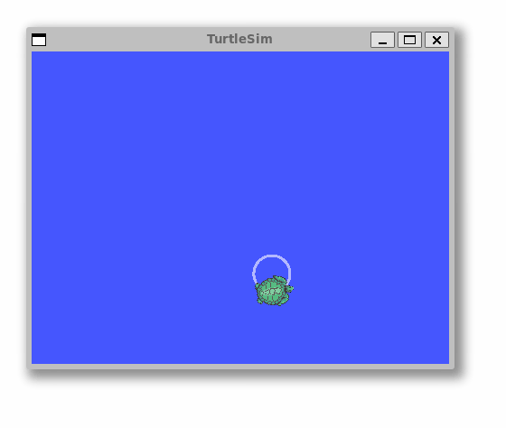

layout: default
title: Practice - ROS 2 Basics
parent: Introduction
icon: material/code-braces-box # practical material
---

# `ROS 2` Introduction and Practice

## Reminder

A few basic concepts from the [previous](https://sze-info.github.io/ajr/bevezetes/ros2/) session:

- **Node**: Essentially means a ROS *program*. (e.g., `turtlesim_node`, `cmd_gen_node`, `foxglove_bridge`)
- **Topic**: Named communication channel. (e.g., `/turtle1/cmd_vel`, `/turtle1/pose`, `/raw_cmd`)
- **Message**: (e.g., `std_msgs/msg/Bool`, `geometry_msgs/msg/Twist`, `turtlesim/msg/Pose`)
- **Package**: Collection of ROS programs (nodes) (e.g., `turtlesim`, `arj_intro_cpp`, `arj_transforms_cpp`)
- **Launch files**: Used to start multiple nodes with parameters (e.g., `multisim.launch.py`, `foxglove_bridge.launch.xml`, `foxglove_bridge.launch.py`)
- **Publish / subscribe**: Publishing and subscribing to messages.
- **Build**: The process of creating executable files from the package source code. In ROS2, `colcon` is the default build tool.

## Task `1.` - Node and publish

Open two terminals. From the first terminal, start the built-in `turtlesim_node` simulator, which is found in the `turtlesim` package.

``` r
ros2 run turtlesim turtlesim_node
```

*Note*: If it is missing for some reason, it can be installed with the command `sudo apt install ros-humble-turtlesim`.

From the second terminal, publish a command that makes the turtle turn around:

``` r
ros2 topic pub /turtle1/cmd_vel geometry_msgs/msg/Twist '{linear: {x: 0.5, y: 0.0, z: 0.0}, angular: {x: 0.0, y: 0.0, z: 1.2}}'
```

<figure markdown="span">
  
  <figcaption>Turtlesim animation</figcaption>
</figure>

In the background, the `turtlesim_node` node (round symbol) subscribes to the `/turtle1/cmd_vel` topic (square symbol), causing the movement.


As shown in the flowchart, the type of `/turtle1/cmd_vel` is `geometry_msgs/msg/Twist`. This can be found out with the following command:

``` bash
ros2 interface show geometry_msgs/msg/Twist
```

``` r
Vector3  linear
        float64 x
        float64 y
        float64 z
Vector3  angular
        float64 x
        float64 y
        float64 z
```

All topics can be listed with:

``` bash
ros2 topic list
```

The content of a specific topic can be printed or written to a file in various formats and with filters:

``` r
ros2 topic echo /turtle1/pose
ros2 topic echo /turtle1/pose --csv
ros2 topic echo /turtle1/pose --csv > turtle_data_01.csv
ros2 topic echo /turtle1/pose --once
ros2 topic echo /turtle1/pose --once | grep velocity
ros2 topic echo /turtle1/pose --field x
ros2 topic echo /turtle1/pose --field linear_velocity
ros2 topic echo /turtle1/cmd_vel --field linear.x
```

Example output:

``` r
x: 6.2
y: 4.0
theta: 0.0
linear_velocity: 0.0
angular_velocity: 0.0
```

!!! tip By issuing the `ros2 topic echo --help` command, you get further usage instructions. The `--help` switch can of course be used with other `ros2` commands as well.

### Workspace and build information

First, check if the workspace exists in the home directory (`~`) using the `ls ~ | grep ros2` command. In this course, the workspace is named `ros2_ws`. The name doesn't really matter, but most tutorials use this name, so we follow this tradition. Multiple workspaces can be used simultaneously, sourced separately, which can be convenient for larger systems. For now, we stick to a single ros2_ws. If it doesn't exist, create the workspace and source folders with the `mkdir -p ros2_ws/src` command.

### colcon
The most important command is probably `colcon build`. Also noteworthy are `colcon list` and `colcon graph`. The former lists available packages, while the latter provides a quick view of dependencies.

The `colcon build` command comes with several useful switches:

- `--packages-select`:erhaps the most frequently used switch, followed by specifying multiple packages to build. If not specified, the default is to build the entire workspace. In practice, there will be a `colcon build --packages-select arj_intro_cpp arj_transforms_cpp` command, which builds the two arj packages.
- `--symlink-install`:Use symbolic links instead of copying files from the source. This avoids having to rebuild the package for every launch file modification.
- `--parallel-workers 2`: The maximum number of tasks that can be processed in parallel, in this case `2`. If not specified, the default value is the number of logical CPU cores. It is worth limiting if the build does not complete due to lack of resources.
- `--continue-on-error`: For larger builds, do not stop after the first faulty package. So if 1 out of 100 packages doesn't work, 99 will still build. If not specified, between 0 and 99 packages will build, depending on dependencies and other orderings.

### Source
To actually run our ROS2 executable files, we need to set up the environment (so-called sourcing), i.e., tell the bash where to look for the executable files, what their dependencies are, etc. This is simpler than it sounds, just issue a `source <path>/<name>.bash` command. As mentioned earlier, the workspace name doesn't matter, and indeed, after sourcing, it doesn't matter where the executable is physically located; it can be conveniently run from any folder with a command. Since packages within different workspaces can build on each other, ROS2 introduced the overlay/underlay concept. This means that when building one workspace, another workspace was already sourced, and some package depends on the previously built package. Thus, its functionality, code is needed for the dependent package. Accordingly, sourcing can also be of two types:
-The `local_setup.bash` script sets up the environment (sources) only in the current workspace. So it does not source the parent (dependent) workspace.
- The `local_setup.bash`script sets up the environment (sources) only in the current workspace. So it does not source the parent (dependent) workspace.
- The `setup.bash` script, however, adds the `local_setup.bash` script to all workspaces that were dependencies when the workspace was created.

!!! note In this course, such complex systems are not needed; most of the time, a single `ros2_ws` is sufficient