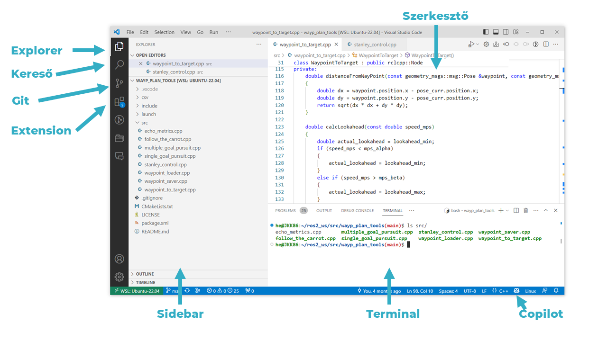

# VS Code and Git

`VS Code` is a simple code and text editor for Linux, Windows, and Mac systems, which can become a full-fledged IDE (integrated development environment) with various extensions. Its name is an abbreviation of Visual Studio Code, it is free, open-source, and developed by Microsoft. It is a popular development environment (e.g., in 2021, according to the Stack Overflow Developer Survey, 70% of 82,000 respondents used it, making it one of the most popular IDEs).

## Navigation in the Development Environment

The following sections introduce the most important interfaces.

Perhaps one of the most important keyboard shortcuts is `Ctrl-Shift-P`, which brings up the Command Palette, where you can browse settings, files, and commands.

## Overview of Source Control

Source control software, such as Git, is used in modern software development for the following reasons:

- **Change Tracking**: Allows tracking of all modifications to the source code, making it easy to revert to previous versions if a bug is found or a new feature does not work properly.
- **Collaboration**: Multiple developers can work on the same project simultaneously. Source control software helps manage different changes and resolve potential conflicts.
- **Backup**: Stores every version of the project, so if something goes wrong or is lost, it can be easily restored to a previous state.
- **Experimentation**: Allows developers to create different versions or branches and try out new features or fixes without affecting the main project code.
- **Documentation**: Source control systems allow recording commit messages related to changes, helping document the reasons and goals of modifications.
- **Integration and Continuous Development**: Supports automated testing and continuous integration processes (CI/CD), ensuring that all changes are easily manageable and traceable.

## Using Git Source Control in VS Code

Visual Studio Code has integrated source control (SCM) and includes support for [Git](https://git-scm.com/). Many other source control providers are available on the [extensions](https://code.visualstudio.com/docs/editor/extension-marketplace.md) page in the VS Code Marketplace.

<iframe width="560" height="315" src="https://www.youtube.com/embed/i_23KUAEtUM?rel=0" title="Using Git with Visual Studio Code (official beginner tutorial)" frameborder="0" allow="accelerometer; autoplay; clipboard-write; encrypted-media; gyroscope; picture-in-picture" allowfullscreen></iframe>

### Git Repository

> **Ensure Git is installed.** VS Code will use your computer's Git installation (at least version `2.0.0` is required), so you need to [install Git](https://git-scm.com/download) before using these features.

The `Source control` icon in the left activity bar always provides an **overview of how many changes** are currently in the repository. Selecting the icon displays the details of the current repository changes: **CHANGES**, **STAGED CHANGES**, and **MERGE CHANGES**.

Clicking on individual items allows you to view **text changes within each file** in detail. Note that for unstaged changes, the right editor still allows editing the file.

Indicators related to the **repo status** can also be found in the bottom left corner of VS Code: the **current branch**, **dirty indicators**, and the **number of incoming and outgoing commits** from the current branch. You can **checkout any branch** of the repository by clicking on the status indicator and selecting the Git reference from the list.

!!! tip
    You can open VS Code in a Git repository directory. The command for this in the directory is: `code .` or, for example: `code ~/ros2_ws/src/arj_packages/`, if you want to open the `arj_packages` repo for the subject. VS Code's Git features will continue to work as usual, displaying all changes within the repository, but file modifications outside the scope directory will be shaded with a tooltip indicating they are outside the current workspace.

## Commit

**Staging** (git add) and **unstaging** (git reset) can be performed with context menu actions or by dragging files.

> **Configure your Git username and email address.** When committing, ensure that the username and/or email address is set in the Git configuration. Details: [Git commit information](https://git-scm.com/docs/git-commit#_commit_information).

You can enter a commit message to indicate the changes, then press `Ctrl+Enter` (macOS: `⌘+Enter`) to finalize. If there are staged changes, only those changes will be committed. Otherwise, you will be prompted to select which changes you want to commit.

For example, in the previous screenshot, only the staged changes to "overview.png" are included in the commit. Subsequent staging and committing operations can include changes to "versioncontrol.md" and the other two ".png" images as separate commits.

More precise **Commit** operations can be found in the **Views and More Actions** `...` menu at the top of the source control view.

> **Tip:** If you commit changes on the wrong branch, undo the commit with the **Command Palette** **Git: Undo Last Commit** command (`Ctrl+Shift+P`).

<iframe src="https://www.youtube.com/embed/E6ADS2k8oNQ" width="640" height="320" allowFullScreen="true" frameBorder="0?rel=0" title="Git: Committing in Visual Studio Code"></iframe>

### Cloning a Repository

If you don't have a repository cloned yet, you can choose between **Open Folder** from the local machine or **Clone Repository** (from a remote machine) in the Source Control view.

Selecting the **Clone Repository** option will prompt you for the remote repository URL (e.g., on [GitHub](https://github.com/)) and the directory where the local repository will be placed.

For a GitHub repository, you can find the URL in the GitHub **Code** dialog.

Then paste this URL into the **Git: Clone** prompt.

The **Clone from GitHub** option will also appear. After authenticating your GitHub account in VS Code, you can search for your own (even private) repositories by name.

## Built-in Terminal

The built-in terminal of the development environment works on both Windows and Linux.

## Useful to Know
- For example, `code .` opens the contents of the current folder.
- For example, `code ~/.bashrc` opens the contents of `~/.bashrc` for editing.

## WSL VS Code Video

<iframe width="560" height="315" src="https://www.youtube.com/embed/fAkpQ4Q3S2g?rel=0" title="YouTube video player" frameborder="0" allow="accelerometer; autoplay; clipboard-write; encrypted-media; gyroscope; picture-in-picture; web-share" allowfullscreen></iframe>

## Recommended Settings for ROS 2

For ROS 2 C++ development, VS Code does not recognize ROS header files by default, so features like [IntelliSense](https://code.visualstudio.com/docs/editor/intellisense) do not work properly:

<figure markdown="span">
  
  <figcaption>Include path in VS Code</figcaption>
</figure>

A simple solution is to set the `/opt/ros/humble/**` path in the `includePath settings`. (Of course, this works for non-humble versions as well, where you need to specify the appropriate path). It looks like this:

<figure markdown="span">
  
  <figcaption>Include path settings in VS Code</figcaption>
</figure>

Once saved, VS Code will work accordingly with [IntelliSense](https://code.visualstudio.com/docs/editor/intellisense) and other features.

Sources: [code.visualstudio.com/docs/sourcecontrol/overview](https://code.visualstudio.com/docs/sourcecontrol/overview)