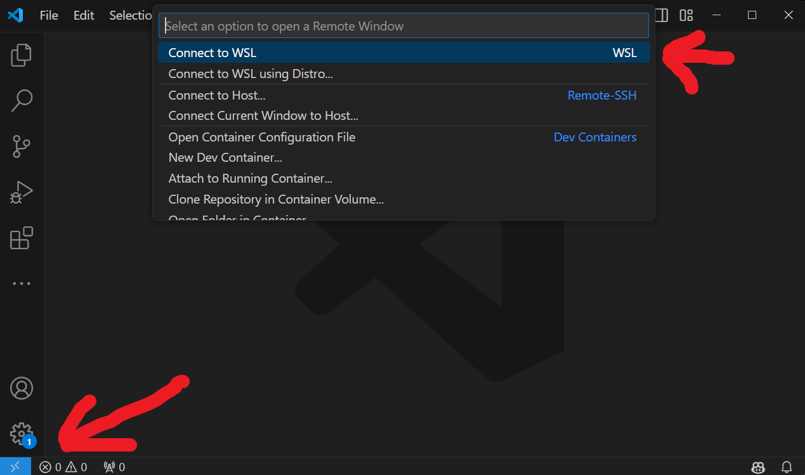
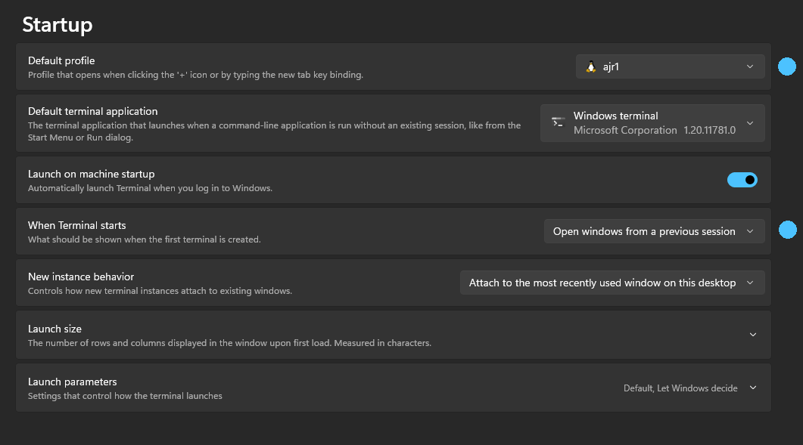
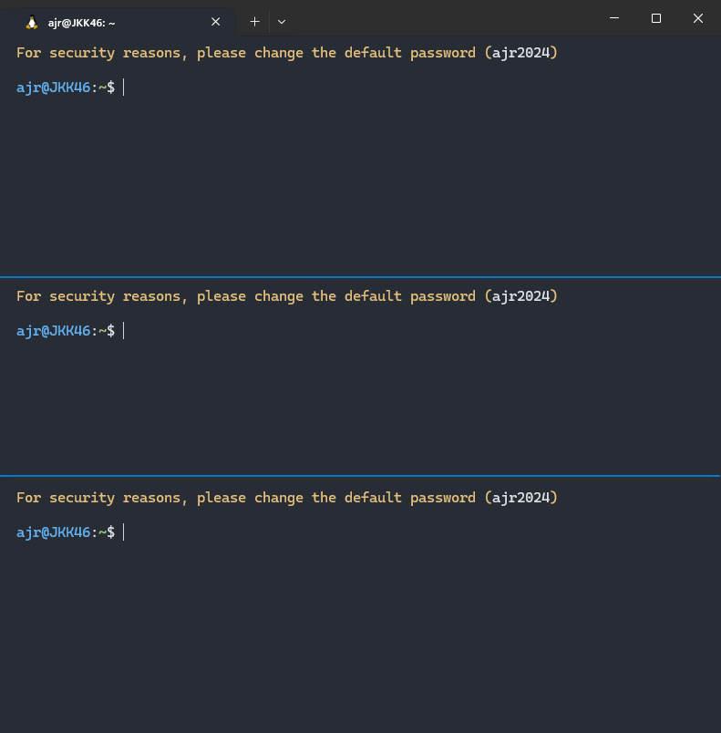

# Windows WSL2

{ align=right width="200" }

The **Windows Subsystem for Linux** is a compatibility layer for running Linux-based elements natively on Windows 10 or Windows 11 systems. It is worth choosing to use WSL if you do not want to install native Ubuntu (e.g., 18.04 / 22.04) on your computers. The system used in the course can be created in several ways:

- Installing WSL and importing a Snapshot [link](#wsl-telepitese-es-snapshot-importalasa)
- Installing WSL and installing ROS using a Script [link](#wsl-telepitese-es-ros-installalasa-script-segitsegevel) 

## Installing WSL and importing a Snapshot

Video tutorial: 

<iframe width="560" height="315" src="https://www.youtube.com/embed/yBLtg2c4yA4?si=PO7NefOrQJQV0tG8" title="YouTube video player" frameborder="0" allow="accelerometer; autoplay; clipboard-write; encrypted-media; gyroscope; picture-in-picture; web-share" referrerpolicy="strict-origin-when-cross-origin" allowfullscreen></iframe>

Steps in the video:

1. WSL snapshot (backup file) download:: [WSL snapshot letöltése :material-download: ~2.5 GB](https://laesze-my.sharepoint.com/:u:/g/personal/herno_o365_sze_hu/EYxEY_oJa7ZEursLIBMZeZ4BWUvT_LbkHbOIsPToBgRxbg?download=1){ .md-button}
2. Extract the snapshot `.zip` >> `.tar`
3. Powershell (Admin) enable WSL feature, then install WSL:
```powershell
Enable-WindowsOptionalFeature -Online -FeatureName Microsoft-Windows-Subsystem-Linux
```
``` powershell
wsl --install --no-distribution
```
4. Powershell, import WSL Snapshot file (tar):
 ``` powershell
wsl --import ajr1 .\ajr1\ .\ajr24a.tar
```
5. Install VS Code and WSL extension:



!!! danger The `wsl -l -v` command lists the installed WSL versions. The `VERSION` column must be 2, otherwise, an outdated version of WSL has been installed. Example of correct output: ``` bash
    NAME            STATE           VERSION
    Ubuntu          Stopped         2
    Ubuntu-22.04    Stopped         2
    Ubuntu-24.04    Running         2
    ajr1            Stopped         2
    ``` 
    If the VERSION column shows `1`, you can update the version with the `wsl --update` command. ```

### Additional recommended settings

In the Windows Terminal program, it is recommended to set the `Default Profile` to `ajr1` so that the program always starts with this profile. Additionally, the `Open windows from previous session` setting can be useful to start the program in the last state (e.g., with multiple panels).



You can then create panels with the `Alt`+`Shift`+`minus` or `Alt`+`Shift`+`plus` key combinations. This splits the terminal window (`Split pane`) into multiple sections vertically or horizontally.

    

## Installing WSL and installing ROS using a Script

Video tutorial for installing WSL on Windows 11 (Windows 10 version below, but with largely similar content):

<iframe width="560" height="315" src="https://www.youtube.com/embed/DIYktkx3XLM?si=-cjaTd6PbhuFkXfY" title="YouTube video player" frameborder="0" allow="accelerometer; autoplay; clipboard-write; encrypted-media; gyroscope; picture-in-picture; web-share" referrerpolicy="strict-origin-when-cross-origin" allowfullscreen></iframe>

Steps in the video:

- Open a PowerShell window as an administrator.
- Copy and paste the following command to enable WSL:
```bash
Enable-WindowsOptionalFeature -Online -FeatureName Microsoft-Windows-Subsystem-Linux
```
- Restart the computer by typing `Y`. *(optional)*
- Open the Microsoft Store and search for Windows Subsystem for Linux Preview. Install it.
- Also, in the Microsoft Store, search for Ubuntu 22.04 and install it, **or** PowerShell (Admin):
```bash
wsl --install -d Ubuntu-22.04
```
- For easier management, it is recommended to install the Windows Terminal program. Search for Windows Terminal in the Microsoft Store and install it.
- Start the Windows Terminal program and open the settings with the Ctrl+, (Control and comma) key combination. From the drop-down list in the Default Profile setting, select Ubuntu 22.04.
- Restart the Windows Terminal. On the first start, provide a username and password of your choice.
- We recommend using the VS Code editor for developing the solution. Install it from here: [code.visualstudio.com/download](https://code.visualstudio.com/download)
- Finally, install the VS Code Remote Development extension to make it accessible using WSL: [marketplace.visualstudio.com/items?itemName=ms-vscode-remote.vscode-remote-extensionpack](https://marketplace.visualstudio.com/items?itemName=ms-vscode-remote.vscode-remote-extensionpack)

The video tutorial for installing WSL on Windows 10 is available [here](https://youtu.be/S1U-f5pzO7s):

<iframe width="560" height="315" src="https://www.youtube.com/embed/S1U-f5pzO7s?rel=0" title="YouTube video player" frameborder="0" allow="accelerometer; autoplay; clipboard-write; encrypted-media; gyroscope; picture-in-picture" allowfullscreen></iframe>

You can find a guide for installing VS Code [here](https://youtu.be/fAkpQ4Q3S2g):

<iframe width="560" height="315" src="https://www.youtube.com/embed/fAkpQ4Q3S2g?rel=0" title="YouTube video player" frameborder="0" allow="accelerometer; autoplay; clipboard-write; encrypted-media; gyroscope; picture-in-picture" allowfullscreen></iframe>