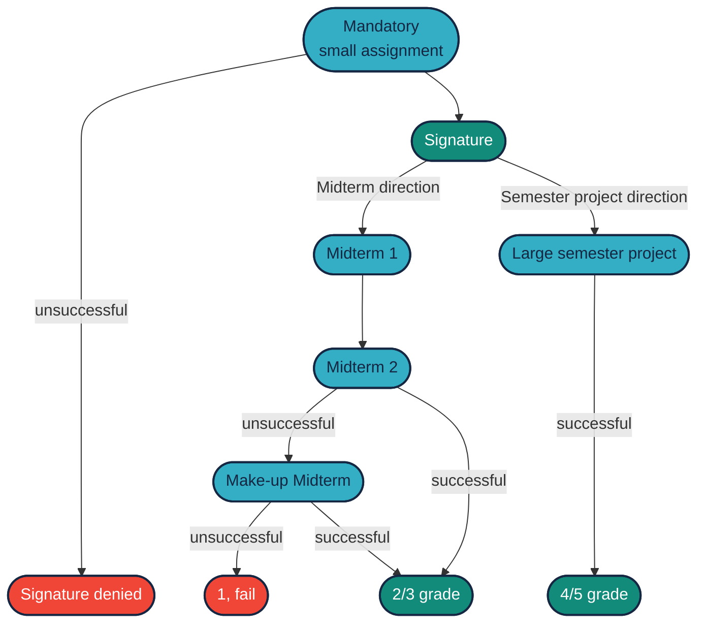
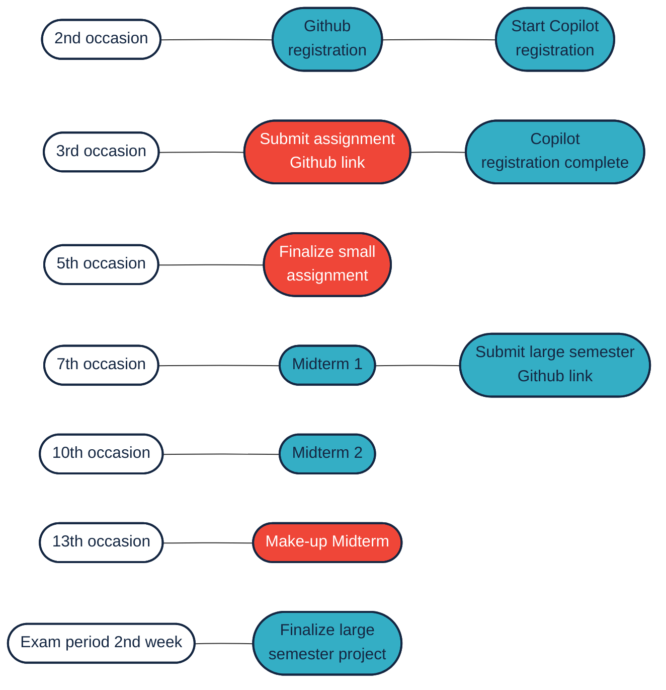

# Small Assignment and Large Semester Project

The purpose of the small assignment is to provide students with practical experience in ROS 2 and GitHub alongside the basic theoretical knowledge acquired in class. The small assignment can be completed in a **relatively short time**: an instructor can finish it in a few hours, and an average student can complete it in a few afternoons. Its length can be short, typically 30-100 lines of code per node.

In contrast, the large semester project takes a bit more time but allows for more interesting tasks and provides ample time to complete them. Moreover, good and excellent grades can only be achieved through this project.

Another way to earn grades is through midterm exams, but only modest grades can be obtained this way.

## Deadlines and Semester Schedule

It's important to know that the small assignment is a **prerequisite for the signature**. Failure to register on GitHub or submit the assignment link early in the semester can result in an unsuccessful term. These are small tasks, but their completion is strictly monitored.

