# Mermaid Practice

Mermaid can be a useful addition to our markdown files (e.g., `README.md`). It allows us to create various charts and flowcharts relatively easily.

## VS Code Extension

Click on the Extensions icon on the left or press `Ctrl` + `Shift` + `X` and type "mermaid" to find the Markdown Preview extension. Install it with one click, and you can use it. After that, you can see the preview in Markdown (`Ctrl` + `Shift` + `V` or the top icon).

<figure markdown="span">
  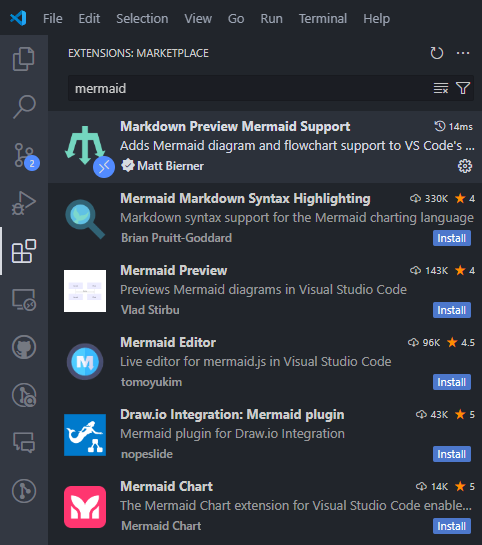{ width="80%" }
  <figcaption>Mermaid, VS Code extension</figcaption>
</figure>

<figure markdown="span">
  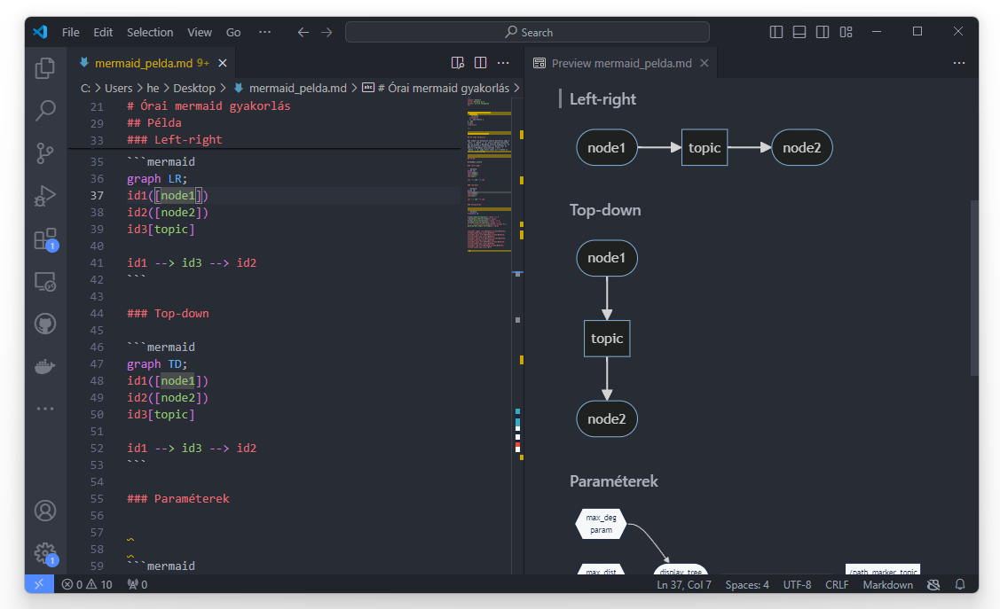{ width="90%" }
  <figcaption>Mermaid, VS Code</figcaption>
</figure>

It is also recommended to use the *Mermaid Markdown Syntax Highlighting* and *Color Highlight* extensions. This way, the graph code will appear as follows:

<figure markdown="span">
  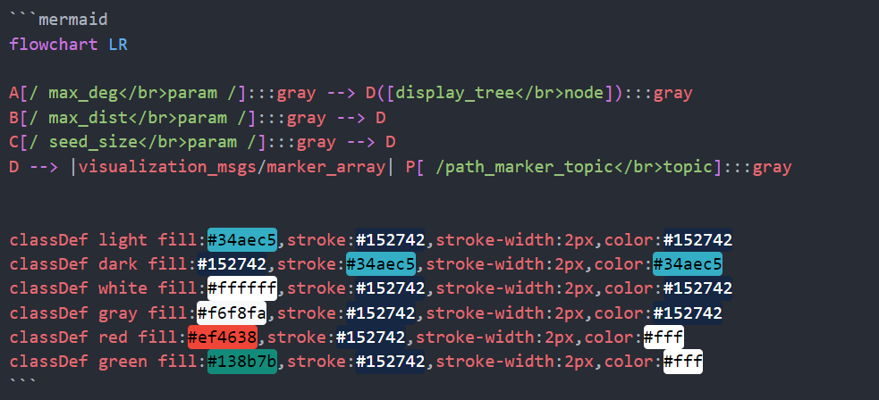{ width="90%" }
  <figcaption>Mermaid, VS Code highlight</figcaption>
</figure>

# Examples

## Simple Example

One of the simplest flowchart codes consists of the following 2 lines:

```ruby
graph LR;
node1 --> topic --> node2
```

The first line defines the graph type, and the second (or subsequent) lines define the connections with arrows `-->`.

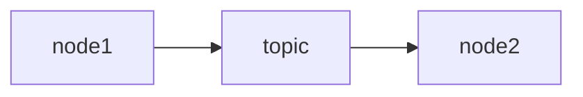

## Shapes Instead of Rectangles

The `LR` stands for left-right. Shapes can be rounded `([ ])`, square `[ ]`, hexagons `{ }`, parallelograms `[/ /]`, and [more](https://mermaid.js.org/syntax/flowchart.html#node-shapes). In ROS, we learned that **nodes** are rounded, while **topics** are square. Identifiers like `id1`, `id2`, `id3` can be placed before the brackets. Connections can be defined either on separate lines (as here) or on a single line (later example).

```ruby
graph LR;
id1([node1])
id2([node2])
id3[topic]

id1 --> id3 --> id2
```

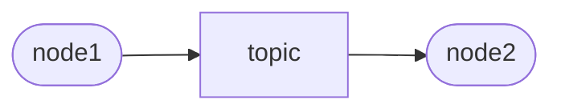

## Top-Down Instead of Left-Right

The `TD` stands for top-down:

```ruby
graph TD;
id1([node1])
id2([node2])
id3[topic]

id1 --> id3 --> id2
```

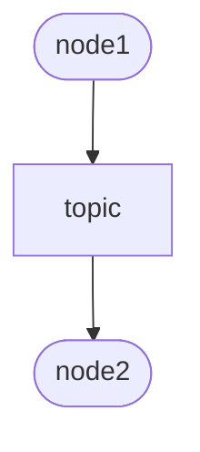

## Using Colors

With `classDef`, we can define colors, lines, and then assign them to the appropriate class with `:::` after three colons:

```ruby
graph TD;
id1([node1]):::red
id2([node2]):::red
id3[topic]:::light

id1 --> id3 --> id2

classDef light fill:#34aec5,stroke:#152742,stroke-width:2px,color:#152742  
classDef dark fill:#152742,stroke:#34aec5,stroke-width:2px,color:#34aec5
classDef white fill:#ffffff,stroke:#152742,stroke-width:2px,color:#152742
classDef red fill:#ef4638,stroke:#152742,stroke-width:2px,color:#fff
```

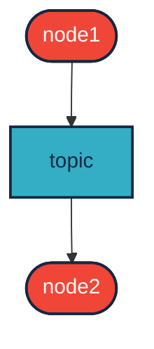

## More Nodes and Topics

An example with more nodes and topics:

```ruby
graph LR;

gen([ /gen_node]) --> sine
gen --> rand[ /rand<br/>std_msgs/Float32]
sine[ /sine<br/>std_msgs/Float32] --> sum([ /sum_node])
sum --> out[ /out<br/>std_msgs/Float32]
rand --> sum
in[ /in<br/>std_msgs/Float32] --> sum
```

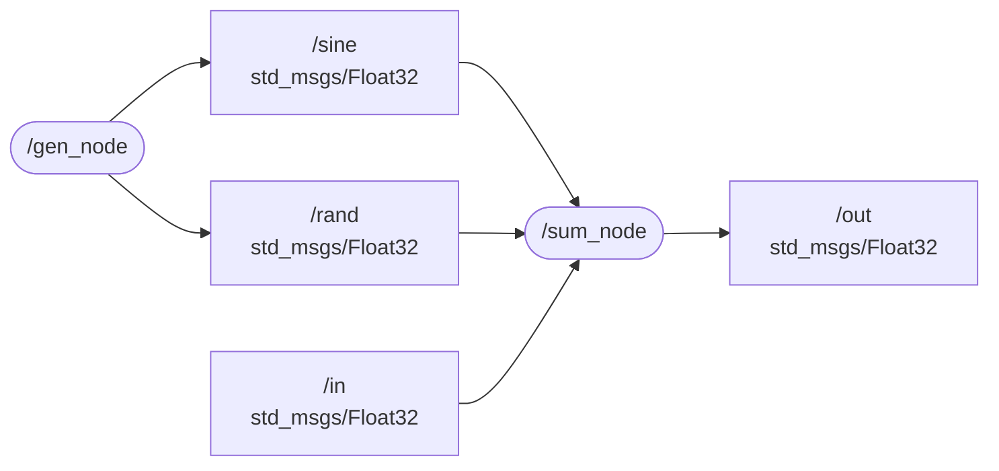

## The Previous Example with Colors

```ruby
graph LR

gen([ /gen_node]):::red --> sine
gen --> rand[ /rand<br/>std_msgs/Float32]:::light 
sine[ /sine<br/>std_msgs/Float32]:::light --> sum([ /sum_node]):::red
sum --> out[ /out<br/>std_msgs/Float32]:::light 
rand --> sum
in[ /in<br/>std_msgs/Float32]:::light --> sum

classDef light fill:#34aec5,stroke:#152742,stroke-width:2px,color:#152742  
classDef dark fill:#152742,stroke:#34aec5,stroke-width:2px,color:#34aec5
classDef white fill:#ffffff,stroke:#152742,stroke-width:2px,color:#152742
classDef red fill:#ef4638,stroke:#152742,stroke-width:2px,color:#fff
```


## Alternative Version Using `class`

Instead of three colons `:::`, we can simply list the classes after the `class` keyword:

```python
graph LR

gen([ /gen_node]) --> sine
gen --> rand[ /rand<br/>std_msgs/Float32] 
sine[ /sine<br/>std_msgs/Float32] --> sum([ /sum_node])
sum --> out[ /out<br/>std_msgs/Float32]
rand --> sum
in[ /in<br/>std_msgs/Float32] --> sum

classDef light fill:#34aec5,stroke:#152742,stroke-width:2px,color:#152742  
classDef dark fill:#152742,stroke:#34aec5,stroke-width:2px,color:#34aec5
classDef white fill:#ffffff,stroke:#152742,stroke-width:2px,color:#152742
classDef red fill:#ef4638,stroke:#152742,stroke-width:2px,color:#fff

class gen,sum red
class rand,sine,in,out light
```

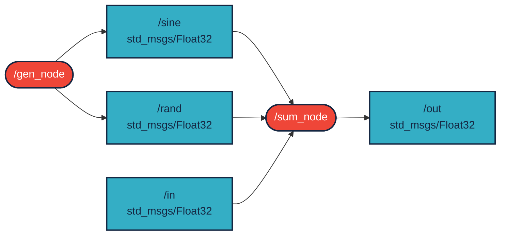

```ruby
flowchart LR

A[/ max_deg</br>param /]:::gray --> D([display_tree</br>node]):::gray
B[/ max_dist</br>param /]:::gray --> D
C[/ seed_size</br>param /]:::gray --> D
D --> |visualization_msgs/marker_array| P[ /path_marker_topic</br>topic]:::gray

classDef light fill:#34aec5,stroke:#152742,stroke-width:2px,color:#152742  
classDef dark fill:#152742,stroke:#34aec5,stroke-width:2px,color:#34aec5
classDef white fill:#ffffff,stroke:#152742,stroke-width:2px,color:#152742
classDef gray fill:#f6f8fa,stroke:#152742,stroke-width:2px,color:#152742
classDef red fill:#ef4638,stroke:#152742,stroke-width:2px,color:#fff
```

## Parameters

It is often useful to visualize defined parameters. Currently, there is no standard notation for this, but hexagons `{ }` or parallelograms `[/ /]` can be options.

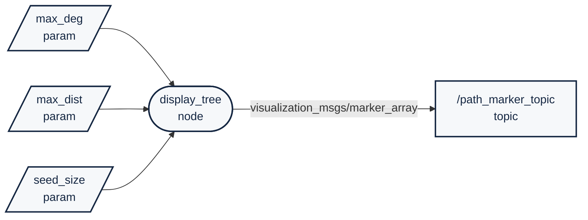

## System Design

```python
flowchart TD
    S[State Machine <br>/plan_state_machine] -.->|/plan_state*| LS[LIDAR segmentation<br>/prcp_ground_obstacle_segm_lidar]
    S -.-> CS[Cone detection camera<br> and de-projection]
    S -.-> O[Object fusion]
    CS -->|/prcp_obj_list_camera| O
    LS -->|/prcp_obj_list_lidar| O
    O -->|/prcp_obj_list_fused| T[Trajectory planner<br>/plan_trajectory_planner]
    T --> C[Control<br>/ctrl_vehicle_control]
    S -.-> T
    S -.-> C
    O --> M[Map Creation<br>/prc_slam]
    M -->|/prcp_map| T
    L[Localization<br>/prcp_odometry_kf_prediction] --> T
    C --> CAN[To CAN]

    classDef light fill:#34aec5,stroke:#152742,stroke-width:2px,color:#152742  
    classDef dark fill:#152742,stroke:#34aec5,stroke-width:2px,color:#34aec5
    classDef white fill:#ffffff,stroke:#152742,stroke-width:2px,color:#15274
    classDef dash fill:#ffffff,stroke:#152742,stroke-width:2px,color:#15274, stroke-dasharray: 5 5
    classDef red fill:#ef4638,stroke:#152742,stroke-width:2px,color:#fff
    classDef green fill:#138b7b,stroke:#152742,stroke-width:2px,color:#fff
    class CS,LS,L,T,M,C white
    class O light
    class S dash
    class CAN red
```

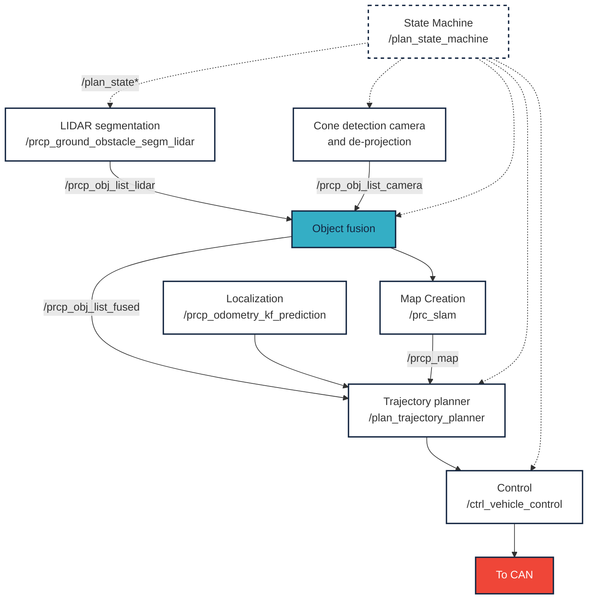

## Pie Chart

Based on [metrics.ros.org/rosdistro_rosdistro.html](https://metrics.ros.org/rosdistro_rosdistro.html), a pie chart:

```python
pie title ROS distros used
    "Melodic (ROS 1)" : 0.0010
    "Noetic (ROS 1)" : 0.0951
    "Humble" : 0.3333
    "Iron" : 0.1905
    "Rolling" : 0.1904
```

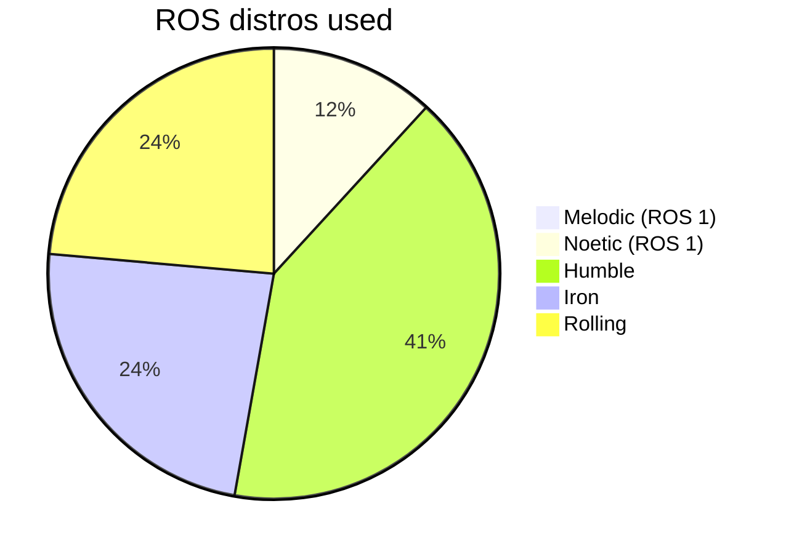

# Links
- [Mermaid flowchart](https://mermaid.js.org/syntax/flowchart.html)
- [Mermaid pie chart](https://mermaid.js.org/syntax/pie.html)
- [Mermaid intro](https://mermaid.js.org/intro/)