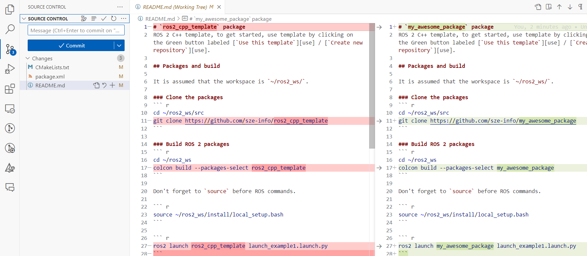

# Git Basics

## Some Commands

- `git clone`: Clone a git repository
- `git config --global user.name "Sanyika"`: Set username
- `git config --global user.email "sanyika@gggmail.com"`: Set email
- `git init`: Initialize a local repository
- `git add <file>`: Add a file
- `git status`: Check current status
- `git commit -m "My beautiful commit"`: Commit with a message
- `git push`: Push changes
- `git pull`: Pull changes, update local repository
- `git branch <new_branch_name>`: Create a new branch
- `git checkout <branch_name>`: Switch to a branch
- `git checkout -- .`: Discard all unstaged changes locally. In newer git versions, `git restore .` works similarly.
- `git merge <branch_name>`: Merge a branch into the current branch

<center></center>

*Source*: [link](https://www.linkedin.com/posts/chaima-haj-taher-1093881ba_git-softwaredevelopment-workflow-activity-7177685446787751936-atW_)

## Terminology

- **Local repository**: The local working repository, e.g., `~/ros2_ws/src/my_repo`
- **Remote repository**: Usually an online remote backup repository, e.g., `github.com/my_name/my_repo`

# Preparations

If you haven't done so already, register on [GitHub](https://github.com/signup).

# Using the Template

Navigate to [https://github.com/sze-info/ros2_cpp_template](https://github.com/sze-info/ros2_cpp_template).

Here, use the green button to create a package named `my_awesome_package` with your user:


Then you will see this page, where you need to fill in the repository name and click the green button to create the repository:


# Clone Your Package with `git clone`

If your GitHub username is `mycoolusername` and the repository (and package) name is `my_awesome_package`, you can do it like this:

```bash
cd ~/ros2_ws/src
```
```bash
git clone https://github.com/mycoolusername/my_awesome_package
```
```bash
git clone https://github.com/horverno/my_awesome_package
```

# Replace Everything in VS Code

```bash
cd ~/ros2_ws/src/my_awesome_package
```
```bash
code .
```

1. Replace `ros2_cpp_template` with `my_awesome_package`
2. Replace `sze-info` with `mycoolusername`
3. Replace `todo` as appropriate


# Build

The package can now be built:

```bash
cd ~/ros2_ws/
```
```bash
colcon build --packages-select my_awesome_package
```
The terminal will return a message confirming that the `my_awesome_package` package has been built.

# Run

Run in the usual way:

```bash
source ~/ros2_ws/install/local_setup.bash
``` 
```bash
ros2 launch my_awesome_package launch_example1.launch.py
``` 

# Track Changes with `git status`

When we replaced the package name, several files were modified:

```bash
cd ~/ros2_ws/src/my_awesome_package
``` 
```bash
git status
``` 

<figure markdown="span">
  { width="100%" }
  <figcaption>Git status</figcaption>
</figure>

The same in VS Code looks like this:

<figure markdown="span">
  { width="100%" }
  <figcaption>Git status in VS Code</figcaption>
</figure>

# Update Remote Repository with `git push`

We want to add all changes to the commit:

```bash
git add .
```

Fill in the commit message:

```bash
git commit -m "Initial commit of my_awesome_package"
```

Actually push the changes to GitHub servers:

```bash
git push
```

<figure markdown="span">
  { width="100%" }
  <figcaption>Git status after add</figcaption>
</figure>

In VS Code, this is simpler: __Commit__, then __Sync Changes__:

<figure markdown="span">
  { width="100%" }
  <figcaption>Git status Sync (push)</figcaption>
</figure>

# Update Local Repository with `git pull`

In case the local version is not the latest, the remote stored on GitHub can be updated:

<figure markdown="span">
  { width="100%" }
  <figcaption>Git status (pull)</figcaption>
</figure>

# Sources
- [docs.ros.org/en/humble/Tutorials/Beginner-Client-Libraries/Creating-Your-First-ROS2-Package.html](https://docs.ros.org/en/humble/Tutorials/Beginner-Client-Libraries/Creating-Your-First-ROS2-Package.html)
- [docs.ros.org/en/humble/Tutorials/Beginner-Client-Libraries/Writing-A-Simple-Cpp-Publisher-And-Subscriber.html](https://docs.ros.org/en/humble/Tutorials/Beginner-Client-Libraries/Writing-A-Simple-Cpp-Publisher-And-Subscriber.html)
- [docs.ros.org/en/humble/Tutorials/Beginner-Client-Libraries/Writing-A-Simple-Py-Publisher-And-Subscriber.html](https://docs.ros.org/en/humble/Tutorials/Beginner-Client-Libraries/Writing-A-Simple-Py-Publisher-And-Subscriber.html)
