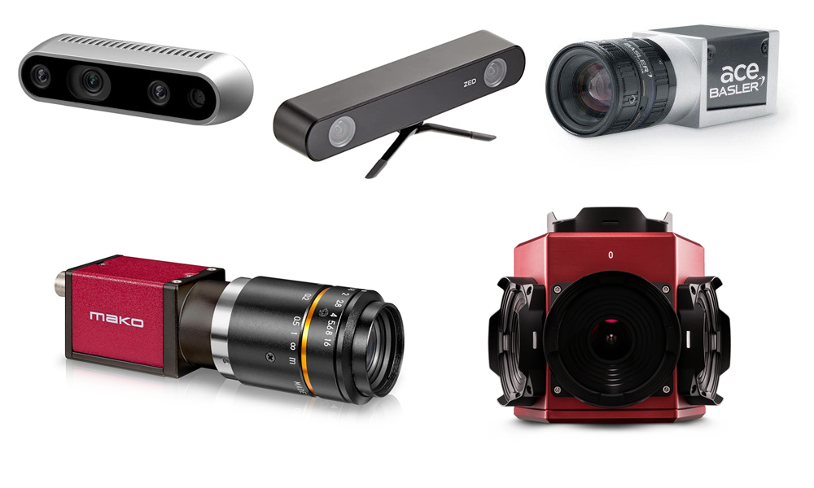
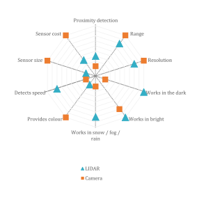
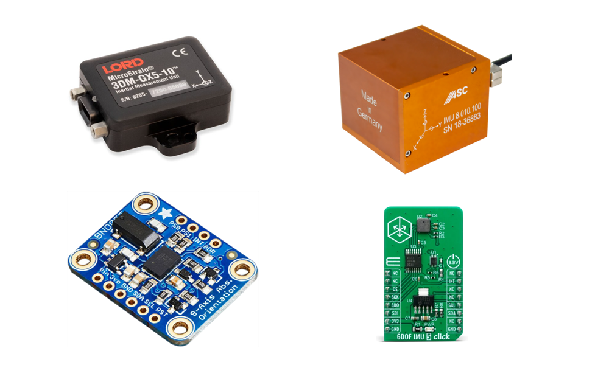
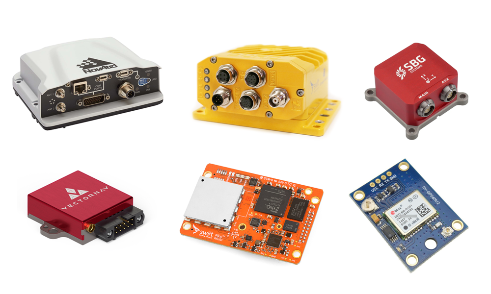

# Sensing

Sensing refers to the reading of raw data.


In the case of sensing, it is important to note that this does not yet mean high-level data processing. Sensors can include cameras, microphones, LIDARs, etc. As the figure shows, in the material, we discuss sensing together with actuation.

!!! note
    In Hungarian, it is easy to confuse the terms sensing (sensing) and perception (perception). Sensing deals with the simple driver-level production of raw data.

## Camera

A camera converts the light arriving at its sensor (e.g., CCD CMOS sensor) into an electronic signal, digitally. We can distinguish between mono, stereo, or depth-sensing cameras.

- *Typical manufacturers:* Allied Vision, Basler, Stereolabs, Orbbec, Intel
- *Typical interface:* GigE, USB3
- *Typical `ROS 2` topic types:* [`sensor_msgs/msg/Image`](https://github.com/ros2/common_interfaces/blob/humble/sensor_msgs/msg/Image.msg), [`sensor_msgs/msg/CameraInfo`](https://github.com/ros2/common_interfaces/blob/humble/sensor_msgs/msg/CameraInfo.msg)



## LIDAR

A LIDAR (Light Detection and Ranging) sensor is a device that can determine distances using laser pulses and their reflection times. Its principle is similar to that of a laser rangefinder, but its measurement frequency and rate are much higher. For example, consider a rotating 64-channel LIDAR. It typically measures at `10` or `20` Hz, meaning it completes `10` or `20` full `360°` rotations per second. The `64` channels mean that `64` sensors are sensing simultaneously at any given moment. One full rotation typically means `512` / `1024` / `2048` measurements per channel. From this, the number of measurements per second can be calculated: e.g., `20*64*1024 = 1,310,720`. Thus, the device typically measures more than a million 3D points per second, with intensity, ambient, and reflective properties.

- *Typical manufacturers:* Velodyne, Ouster, Livox, SICK, Hokuy, Pioneer, Luminar, Hesai, Robosense, Ibeo, Innoviz, Quanenergy, Cepton, Blickfeld, Aeva
- *Typical interface:* GigE
- *Typical `ROS 2` topic types:* [`sensor_msgs/msg/PointCloud2`](https://github.com/ros2/common_interfaces/blob/humble/sensor_msgs/msg/PointCloud2.msg), [`sensor_msgs/msg/LaserScan`](https://github.com/ros2/common_interfaces/blob/humble/sensor_msgs/msg/LaserScan.msg)

A collection of LIDAR manufacturers, datasets, and algorithms: [github.com/szenergy/awesome-lidar](https://github.com/szenergy/awesome-lidar).


<iframe width="560" height="315" src="https://www.youtube.com/embed/1IWXO0vvmO8?rel=0" title="YouTube video player" frameborder="0" allow="accelerometer; autoplay; clipboard-write; encrypted-media; gyroscope; picture-in-picture; web-share" allowfullscreen></iframe>

## Radar
- *Typical manufacturers:* Aptiv, Bosch, Continental, Denso
- *Typical interface:* CAN bus
- *Typical `ROS 2` topic types:* [`radar_msgs/msg/RadarTrack`](https://github.com/ros-perception/radar_msgs/blob/ros2/msg/RadarTrack.msg)



Comparison of LIDAR and camera characteristics

## IMU

An IMU (Inertial Measurement Unit) is a sensor containing small electromechanical gyroscopes and accelerometers, as well as signal processing processors. They are often combined with other sensors, such as barometric altimeters, magnetometers, and compasses. Some GPS (GNSS) systems also include them.

- *Typical manufacturers:* Lord MicroStrain, Bosch, XSens
- *Typical interface:* Serial, Ethernet, USB, CAN bus
- *Typical `ROS 2` topic types:* [`sensor_msgs/msg/Imu`](https://github.com/ros2/common_interfaces/blob/humble/sensor_msgs/msg/Imu.msg), [`sensor_msgs/msg/MagneticField`](https://github.com/ros2/common_interfaces/blob/humble/sensor_msgs/msg/MagneticField.msg)



## GNSS (GPS)

[GNSS](https://en.wikipedia.org/wiki/Satellite_navigation) (Global Navigation Satellite System) refers to a global satellite-based navigation system, commonly known as GPS. To be precise, GPS is just the first such technology; there are also GLONASS, BeiDou, Galileo, and QZSS systems, operated by different countries/alliances.

- *Typical manufacturers:* SwiftNavigation, VectorNav, Ublox, NovaTel
- *Typical interface:* GigE, CAN bus
- *Typical `ROS 2` topic types:* [`sensor_msgs/msg/NavSatFix`](https://github.com/ros2/common_interfaces/blob/humble/sensor_msgs/msg/NavSatFix.msg), [`geometry_msgs/msg/PoseStamped`](https://github.com/ros2/common_interfaces/blob/humble/geometry_msgs/msg/PoseStamped.msg)



A short but good description of GNSS accuracy: [www.sbg-systems.com/news/mastering-accurac-gnss-and-its-errors-sources/](https://www.sbg-systems.com/news/mastering-accurac-gnss-and-its-errors-sources/)

## CAN bus

The CAN bus (Controller Area Network) is a typically automotive standard that allows microcontrollers and devices to communicate with each other without a central unit (host). Compared to Ethernet communication, it is simpler to implement, has lower bandwidth, and is more robust.

- Speed data query, reference signal
- Steering angle data query, reference signal
- *Typical `ROS 2` topic types:* [`can_msgs/msg/Frame`](http://docs.ros.org/en/noetic/api/can_msgs/html/msg/Frame.html), [`geometry_msgs/msg/Twist`](https://github.com/ros2/common_interfaces/blob/humble/geometry_msgs/msg/Twist.msg)


# `ROS 2` Time Management

`ROS` uses Unix time or POSIX time for time management. This represents the number of seconds and nanoseconds elapsed since 00:00:00 UTC (Greenwich Mean Time) on January 1, 1970 (`int32 sec`, `int32 nsec`). This takes up relatively little space in memory and makes it easy to calculate the elapsed time between two points by simple subtraction.

[ros2time.ipynb :simple-python:](https://github.com/sze-info/arj/blob/main/docs/erzekeles/ros2time.ipynb){: .md-button } 

The disadvantage is that it is not very intuitive and not human-readable. For example, Foxglove Studio often converts it to a more readable format.


Seconds and nanoseconds can be imagined as follows:

```py
import rclpy
current_time = node.get_clock().now()
print(current_time.to_msg())

Output: 
sec=1694595162, nanosec=945886859
```
The timestamp plays a role in several places:

``` r
ros2 topic echo --once /lexus3/gps/duro/current_pose

header:
  stamp:
    sec: 1694595162
    nanosec: 945886859
  frame_id: map
pose:
  position:
    x: 640142.9676535318
    y: 5193606.439717201
    z: 1.7999999523162842
  orientation:
    x: 0.008532664424537166
    y: 0.0018914791588597107
    z: 0.44068499630505714
    w: 0.8976192678279703
```
If you want to convert seconds and nanoseconds, you can do it as follows:

``` py
from datetime import datetime
current_time_float = current_time.to_msg().sec + current_time.to_msg().nanosec / 1e9 # 1e9 is 1,000,000,000: nanosec to sec
print("As a float:\t%.5f" % (current_time_float))
print("ISO format:", end="\t")
print(datetime.utcfromtimestamp(current_time_float).isoformat())


Output:
As a float:	1694595162.94589
ISO format:	2023-09-13T08:52:42.945887
```

# Sources

- [Sensors in ROS](https://docs.google.com/presentation/d/e/2PACX-1vQbXSe4cb-aYgWNNiUF1PHJBZrwl0keWantbFjTe94zm1A9cVGqmWKC4lHCSUr4y7vfq1PrJ2mP8XqP/pub?start=false&loop=false&delayms=3000) _(online google presentation in Hungarian)_
- [Understanding-ROS2-Topics](https://docs.ros.org/en/humble/Tutorials/Beginner-CLI-Tools/Understanding-ROS2-Topics/Understanding-ROS2-Topics.html)