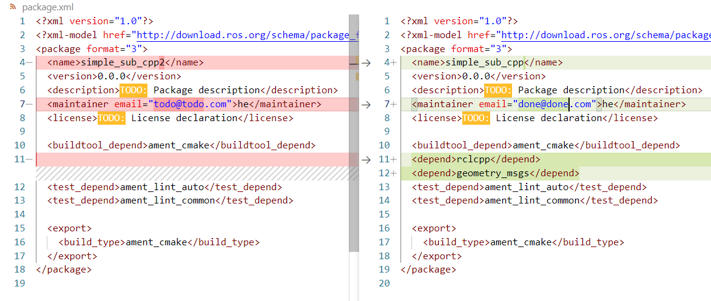
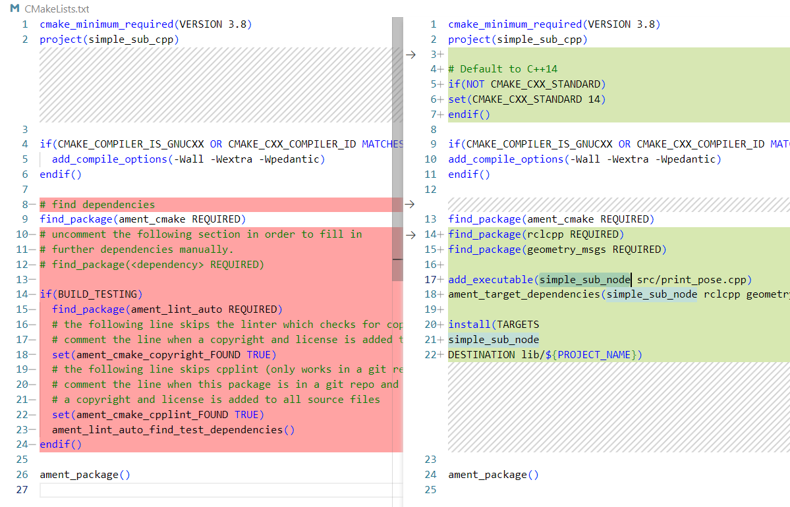

# Practice

The practice works with Ubuntu 22.04 `ROS humble`, Windows 10/11 WSL `humble`. The description of the installation of different versions can be found [here](https://sze-info.github.io/ajr/telepites/).

!!! success "Preliminary Check"
    It is worth checking on your home computer before the practice to ensure that the appropriate `ROS 2` software packages are installed.

``` r
sudo apt install ros-humble-rosbag2 ros-humble-rosbag2-storage-mcap
```
In the lab, we also check with `check_all.sh`:
``` r
cd /mnt/kozos/script
./bag_mcap.sh
./check_all.sh
```

## Preparations

In the previous practice, we got acquainted with the following rosbag (in ROS 2, the format is already `.mcap`):


As a preparation, let's check if the `C:\temp` directory exists

``` c
test -d "/mnt/c/temp" && echo Letezik || echo Nem letezik
```
or simply:
``` c
ls /mnt/c/temp
```

- If it does not exist (No such file or directory), create it: `mkdir /mnt/c/temp`
- If it exists, there is nothing to do, proceed to the next step, and copy the `.mcap` files here
In the classroom, the copying should be done with **one** of the following commands:
``` r 
rsync -avzh --progress /mnt/kozos/measurement_files/lexus3sample01.mcap  /mnt/c/temp/
rsync -avzh --progress /mnt/kozos/measurement_files/lexus3sample02.mcap  /mnt/c/temp/
rsync -avzh --progress /mnt/kozos/measurement_files/lexus3sample03.mcap  /mnt/c/temp/
rsync -avzh --progress /mnt/kozos/measurement_files/lexus3sample04.mcap  /mnt/c/temp/
rsync -avzh --progress /mnt/kozos/measurement_files/lexus3sample05.mcap  /mnt/c/temp/
```
At home, you can download from the following link (green button) or as a command with `wget`:
```r 
wget  -O lexus3sample02.mcap https://laesze-my.sharepoint.com/:u:/g/personal/herno_o365_sze_hu/EakTOhcjblNInqjRMfaGVmsB0diDv0SWpXw9rwo0MD7f3w?download=1
```

[MCAP example :material-download: 553 MB](https://laesze-my.sharepoint.com/:u:/g/personal/herno_o365_sze_hu/Eclwzn42FS9GunGay5LPq-EBA6U1dZseBFNDrr6P0MwB2w?download=1){ .md-button }

[Download MCAP   :material-download: 300 MB](https://laesze-my.sharepoint.com/:u:/g/personal/herno_o365_sze_hu/EakTOhcjblNInqjRMfaGVmsB0diDv0SWpXw9rwo0MD7f3w?download=1){: .md-button }

List the **appropriate** copied `.mcap` file's basic information, similarly:

``` r
ros2 bag info /mnt/c/temp/lexus3sample06.mcap

closing.

Files:             /mnt/c/temp/lexus3sample06.mcap
Bag size:          286.7 MiB
Storage id:        mcap
Duration:          3.367s
Start:             Jul 18 2023 15:37:09.211 (1689687429.211)
End:               Jul 18 2023 15:38:03.314 (1689687483.314)
Messages:          29598
Topic information: 
  Topic: /lexus3/zed2i/zed_node/right_raw/image_raw_color/compressed | Type: sensor_msgs/msg/CompressedImage
  Topic: /lexus3/os_left/points | Type: sensor_msgs/msg/PointCloud2
  Topic: /lexus3/os_right/points | Type: sensor_msgs/msg/PointCloud2
  Topic: /lexus3/os_center/imu | Type: sensor_msgs/msg/Imu
  Topic: /tf_static | Type: tf2_msgs/msg/TFMessage
  Topic: /lexus3/os_center/points | Type: sensor_msgs/msg/PointCloud2
  Topic: /tf | Type: tf2_msgs/msg/TFMessage
  Topic: /lexus3/gps/duro/mag | Type: sensor_msgs/msg/MagneticField
  Topic: /lexus3/gps/duro/imu | Type: sensor_msgs/msg/Imu
  Topic: /lexus3/gps/duro/status_string | Type: std_msgs/msg/String
  Topic: /lexus3/gps/duro/current_pose | Type: geometry_msgs/msg/PoseStamped
```

# Play back the `.mcap` file

Next, we will play back the measurement data file and check what data appears, in what type, and at what speed. The `--loop` switch is for infinite repetition, and the `--clock` switch is for advertising a `/clock` topic, which adjusts the playback.

``` r
ros2 bag play /mnt/c/temp/lexus3sample06.mcap --clock --loop
```
The same, but played back more slowly, e.g.:
``` r
ros2 bag play /mnt/c/temp/lexus3sample06.mcap --clock --loop --rate 0.2
```
The following topics appear:

``` r
ros2 topic list

/clock
/events/read_split
/lexus3/gps/duro/current_pose
/lexus3/gps/duro/imu
/lexus3/gps/duro/mag
/lexus3/gps/duro/status_string
/lexus3/os_center/imu
/lexus3/os_center/points
/lexus3/os_left/points
/lexus3/os_right/points
/lexus3/zed2i/zed_node/right_raw/image_raw_color
/parameter_events
/rosout
/tf
/tf_static
```

The `ros2 topic hz` shows the frequency of the given topic. The position in this case is ~20Hz.

``` r
ros2 topic hz /lexus3/gps/duro/current_pose
average rate: 20.133
        min: 0.002s max: 0.101s std dev: 0.03451s window: 22
```

# `ROS 2` Time Management

`ROS` uses Unix time, or POSIX time, for time management. This represents the number of seconds and nanoseconds that have elapsed since January 1, 1970, 00:00:00 UTC (Greenwich Mean Time) (`int32 sec`, `int32 nsec`). This format takes up relatively little memory and allows for easy calculation of the elapsed time between two points by simple subtraction.

[ros2time.ipynb](https://github.com/sze-info/arj/blob/main/docs/erzekeles/ros2time.ipynb){: .md-button .md-button-purple .mr-4 }

The disadvantage is that it is not very intuitive and not human-readable. For example, Foxglove Studio often converts it to a more readable format for this reason.


Seconds and nanoseconds can be imagined as follows:

```py
import rclpy
current_time = node.get_clock().now()
print(current_time.to_msg())

Output: 
sec=1694595162, nanosec=945886859
```
The timestamp plays a role in several places:

``` r
ros2 topic echo /clock --once
clock:
  sec: 1689687476
  nanosec: 770421827
``` 

``` r
ros2 topic echo --once /lexus3/gps/duro/current_pose

header:
  stamp:
    sec: 1694595162
    nanosec: 945886859
  frame_id: map
pose:
  position:
    x: 640142.9676535318
    y: 5193606.439717201
    z: 1.7999999523162842
  orientation:
    x: 0.008532664424537166
    y: 0.0018914791588597107
    z: 0.44068499630505714
    w: 0.8976192678279703
```
If we want to convert seconds and nanoseconds, we can do it as follows:


``` py
from datetime import datetime
current_time_float = current_time.to_msg().sec + current_time.to_msg().nanosec / 1e9 # 1e9 is 1,000,000,000: nanosec to sec
print("As a float:\t%.5f" % (current_time_float))
print("ISO format:", end="\t")
print(datetime.utcfromtimestamp(current_time_float).isoformat())


Output:
As a float:	1694595162.94589
ISO format:	2023-09-13T08:52:42.945887
```

**Reminder**: A nanosecond is one billionth of a second (10^-9 s).

# Global Navigation Satellite System (GNSS) / Global Positioning System (GPS)

Global Navigation Satellite System (GNSS) / Global Positioning System (GPS)
[github.com/szenergy/duro_gps_driver](https://github.com/szenergy/duro_gps_driver/tree/ros2-humble)
When the GPS is connected to the computer via Ethernet and the ROS driver is started, it will advertise the following topics:


|Topic|Type
|-|-|
`/gps/duro/current_pose` |[`[geometry_msgs/PoseStamped]`](http://docs.ros.org/en/melodic/api/geometry_msgs/html/msg/PoseStamped.html)
`/gps/duro/fix` |[`[sensor_msgs/NavSatFix]`](http://docs.ros.org/en/melodic/api/sensor_msgs/html/msg/NavSatFix.html)
`/gps/duro/imu` |[`[sensor_msgs/Imu]`](http://docs.ros.org/en/melodic/api/sensor_msgs/html/msg/Imu.html)
`/gps/duro/mag` |[`[sensor_msgs/MagneticField]`](http://docs.ros.org/en/melodic/api/sensor_msgs/html/msg/MagneticField.html)
`/gps/duro/odom ` |[`[nav_msgs/Odometry]`](http://docs.ros.org/en/melodic/api/nav_msgs/html/msg/Odometry.html)
`/gps/duro/rollpitchyaw` |[`[geometry_msgs/Vector3]`](http://docs.ros.org/en/melodic/api/geometry_msgs/html/msg/Vector3.html)
`/gps/duro/status_flag` |[`[std_msgs/UInt8]`](http://docs.ros.org/en/melodic/api/std_msgs/html/msg/UInt8.html)
`/gps/duro/status_string` |[`[std_msgs/String]`](http://docs.ros.org/en/melodic/api/std_msgs/html/msg/String.html)
`/gps/duro/time_ref` |[`[sensor_msgs/TimeReference]`](http://docs.ros.org/en/api/sensor_msgs/html/msg/TimeReference.html)


# Inertial Measurement Unit (IMU)

Typical ROS 2 topic types:
[`sensor_msgs/msg/Imu`](https://github.com/ros2/common_interfaces/blob/humble/sensor_msgs/msg/Imu.msg), [`sensor_msgs/msg/MagneticField`](https://github.com/ros2/common_interfaces/blob/humble/sensor_msgs/msg/MagneticField.msg)


``` r
ros2 topic echo --once /lexus3/gps/duro/imu

header:
  stamp:
    sec: 1695039048
    nanosec: 44466475
  frame_id: duro
orientation:
  x: 0.0
  y: 0.0
  z: 0.7071067811865475
  w: 0.7071067811865476
orientation_covariance:
  - [0.0, 0.0, 0.0, 0.0, 0.0, 0.0, 0.0, 0.0, 0.0]
angular_velocity:
  x: 0.01330030487804878
  y: 0.015893864329268294
  z: 0.037307355182926834
angular_velocity_covariance:
  - [0.0, 0.0, 0.0, 0.0, 0.0, 0.0, 0.0, 0.0, 0.0]
linear_acceleration:
  x: -0.5291185668945312
  y: 0.031124621582031248
  z: -9.610325463867188
linear_acceleration_covariance:
  - [0.0, 0.0, 0.0, 0.0, 0.0, 0.0, 0.0, 0.0, 0.0]
```

# Camera

Typical ROS 2 topic types:
[`sensor_msgs/msg/Image`](https://github.com/ros2/common_interfaces/blob/humble/sensor_msgs/msg/Image.msg), [`sensor_msgs/msg/CameraInfo`](https://github.com/ros2/common_interfaces/blob/humble/sensor_msgs/msg/CameraInfo.msg)

``` r
ros2 topic echo --once /lexus3/zed2i/zed_node/right_raw/image_raw_color

header:
  stamp:
    sec: 1695039047
    nanosec: 340698516
  frame_id: zed2i_right_camera_optical_frame
height: 720
width: 1280
encoding: bgra8
is_bigendian: 0
step: 5120
data: 21,66,93,255,21,66,94,255,25,69,94,255,14,63,90,255,31,55,80,255,19,49,75,255,26,55,76,255,24,57,80,255,35,51,72,255,30,52,74,255,57,73,88,255,55,74,90,255,64,74,93,255,52,66,86,255,56,61,76,255,25,34,48,255,25,31,52,255,16,24,43,255,14,22,41,255,19,27,46,255,13,20,38,255,23,28,45,255,31,41,65,255,36,37,59,255,23,59,82,255,45,71,91,255,51,84,116,255,70,94,122,255,57,105,141,255,42,84,117,255,42,90,126,255,36,81,116,255,..
```

# Lidar

Typical ROS 2 topic types:
[`sensor_msgs/msg/PointCloud2`](https://github.com/ros2/common_interfaces/blob/humble/sensor_msgs/msg/PointCloud2.msg), [`sensor_msgs/msg/LaserScan`](https://github.com/ros2/common_interfaces/blob/humble/sensor_msgs/msg/LaserScan.msg)


``` r
ros2 topic echo --once /lexus3/os_center/points

header:
  stamp:
    sec: 1695039048
    nanosec: 390894137
  frame_id: lexus3/os_center_a_laser_data_frame
height: 64
width: 1024
fields:
- name: x, y, z, intensity, t, reflectivity, ring, ambient, range
data: 0,0,0,0,0,0,0,0,0,0,0,0,0,0,128,63,0,0,16,65,96,211,241,2,0,0,0,0,12,3,0,0,0,0,0,0,0,0,0,0,0,0,0,0,0,0,0,0,0,0,0,0,0,0,0,0,0,0,0,0,0,0,128,63,0,0,16,65,116,145,242,2,0,0,0,0,0,3,0,0,0,0,0,0,0,0,0,0,0,0,0,0,0,0,0,0,0,0,0,0,0,0,0,0,0,0,0,0,0,0,128,63,0,0,32,65,18,92,243,2,0,0,0,0,253,2,0,0,...,
```

# Visualization

## RVIZ2

```r
ros2 run rviz2 rviz2
```

Set up a similar layout:


## Foxglove studio

``` r
ros2 launch foxglove_bridge foxglove_bridge_launch.xml port:=8765
```


Set up a similar layout:


Source: [foxglove.dev/blog/introducing-foxglove-studios-new-navigation](https://foxglove.dev/blog/introducing-foxglove-studios-new-navigation)

# Create the `simple_sub_cpp` package


Next, we will create a simple subscriber node that subscribes to `geometry_msgs/PoseStamped `messages and prints the X and Y coordinates. The practice is based on the official [ROS 2 tutorials](https://docs.ros.org/en/humble/Tutorials/Beginner-Client-Libraries/Writing-A-Simple-Cpp-Publisher-And-Subscriber.html)

Open a new terminal and source the installation so that the `ros2` commands work.

Navigate to the already created `ros2_ws` directory.

It is important to create the packages in the `src` directory, not in the root of the workspace. So navigate to the `ros2_ws/src` folder and run the package creation command:

```
cd ~/ros2_ws/src
ros2 pkg create --build-type ament_cmake simple_sub_cpp
```

The terminal will return a message confirming the creation of the `simple_sub_cpp` package and all necessary files and folders.

## Write the subscriber node (`print_pose.cpp` >> `simple_sub_node`)

Navigate to the `ros2_ws/src/simple_sub_cpp/src` folder.

``` r
cd ~/ros2_ws/src/simple_sub_cpp/src
```
This is the directory in every CMake package where the source files belong (e.g., with the `.cpp` extension).

Download the example subscriber code:

```
wget -O print_pose.cpp https://raw.githubusercontent.com/sze-info/arj_packages/main/etc/print_pose.cpp
```

This command created the `print_pose.cpp` file.

Navigate back one level to the `cd ~/ros2_ws/src/simple_sub_cpp` directory, where the `CMakeLists.txt` and `package.xml` files have already been created. Open the folder with VS Code, for example, using the `code .` command. Here, the . after `code` means the current folder. **Tip**: even if you are not in the directory, it is possible to open the entire directory, which simplifies some things later:

``` r
code ~/ros2_ws/src/simple_sub_cpp/
```


``` cpp
// ros2 topic type /lexus3/gps/duro/current_pose
// geometry_msgs/msg/PoseStamped
// ros2 interface show geometry_msgs/msg/PoseStamped

#include <memory>
#include "rclcpp/rclcpp.hpp"
#include "geometry_msgs/msg/pose_stamped.hpp"

using std::placeholders::_1;

class SimplePoseSub : public rclcpp::Node
{
public:
  SimplePoseSub() : Node("simple_pose_sub")
  {
    sub1_ = this->create_subscription<geometry_msgs::msg::PoseStamped>("/lexus3/gps/duro/current_pose", 10, std::bind(&SimplePoseSub::topic_callback, this, _1));
  }

private:
  void topic_callback(const geometry_msgs::msg::PoseStamped &msg) const
  {
    RCLCPP_INFO(this->get_logger(), "x: %.3f, y: %.3f", msg.pose.position.x, msg.pose.position.y);
  }
  rclcpp::Subscription<geometry_msgs::msg::PoseStamped>::SharedPtr sub1_;
};

int main(int argc, char *argv[])
{
  rclcpp::init(argc, argv);
  rclcpp::spin(std::make_shared<SimplePoseSub>());
  rclcpp::shutdown();
  return 0;
}
```

!!! important "Python equivalent" The [C++ code](https://github.com/sze-info/arj_packages/blob/main/etc/print_pose.cpp) also has a Python version available at [github.com/sze-info/arj_packages](https://github.com/sze-info/arj_packages/blob/main/etc/print_pose.py) címen. Érdemes összehasonlítani a C++ és a python kódokat. It is worth comparing the C++ and Python codes.

## Adding Dependencies

It is always advisable to fill in the `<description>`, `<maintainer>`, and `<license> `tags:

``` xml
<description>Examples of minimal publisher/subscriber using rclcpp</description>
<maintainer email="you@email.com">Your Name</maintainer>
<license>Apache License 2.0</license>
```

Add a new line after the `ament_cmake` build tool dependency and insert the following dependencies according to the node's include statements:


``` xml
<depend>rclcpp</depend>
<depend>geometry_msgs</depend>
``` 

This declares that the package requires `rclcpp` and `geometry_msgs` at build and runtime.

## CMakeLists.

Now open the `CMakeLists.txt` file. Add the following lines under the existing `find_package(ament_cmake REQUIRED) `dependency:

``` cmake
find_package(rclcpp REQUIRED)
find_package(geometry_msgs REQUIRED)
```
Then add the executable (which will only consist of `print_pose.cpp` for now) and name it simple_sub_node so that it can be run using `ros2 run`:

``` cmake
add_executable(simple_sub_node src/print_pose.cpp)
ament_target_dependencies(simple_sub_node rclcpp geometry_msgs)
```

Finally, add the `install(TARGETS...)` section so that `ros2` can find the executable we compiled:

``` cmake
install(TARGETS
simple_sub_node
DESTINATION lib/${PROJECT_NAME})
``` 

The `CMakeLists.txt` can be cleaned up by removing some unnecessary sections and comments, resulting in the following:

``` cmake

cmake_minimum_required(VERSION 3.8)
project(simple_sub_cpp)

# Default to C++14
if(NOT CMAKE_CXX_STANDARD)
set(CMAKE_CXX_STANDARD 14)
endif()

if(CMAKE_COMPILER_IS_GNUCXX OR CMAKE_CXX_COMPILER_ID MATCHES "Clang")
add_compile_options(-Wall -Wextra -Wpedantic)
endif()

find_package(ament_cmake REQUIRED)
find_package(rclcpp REQUIRED)
find_package(geometry_msgs REQUIRED)

add_executable(simple_sub_node src/print_pose.cpp)
ament_target_dependencies(simple_sub_node rclcpp geometry_msgs)

install(TARGETS
simple_sub_node
DESTINATION lib/${PROJECT_NAME})

ament_package()
```

In summary, we made the following changes:





## Build and Run

!!! success The package can now be built:

``` r 
cd ~/ros2_ws/
colcon build --packages-select simple_sub_cpp
```

Run it as usual:

``` r
source ~/ros2_ws/install/setup.bash
ros2 run simple_sub_cpp simple_sub_node
```

Outputs:
``` r
[simple_pose_sub]: x: 697201.725, y: 5285679.845
[simple_pose_sub]: x: 697201.796, y: 5285679.548
[simple_pose_sub]: x: 697201.838, y: 5285679.251
[simple_pose_sub]: x: 697201.886, y: 5285678.949
```

# Sources

- [docs.ros.org/en/humble/Tutorials/Beginner-Client-Libraries/Creating-Your-First-ROS2-Package.html](https://docs.ros.org/en/humble/Tutorials/Beginner-Client-Libraries/Creating-Your-First-ROS2-Package.html)
- [docs.ros.org/en/humble/Tutorials/Beginner-Client-Libraries/Writing-A-Simple-Cpp-Publisher-And-Subscriber.html](https://docs.ros.org/en/humble/Tutorials/Beginner-Client-Libraries/Writing-A-Simple-Cpp-Publisher-And-Subscriber.html)
- [docs.ros.org/en/humble/Tutorials/Beginner-Client-Libraries/Writing-A-Simple-Py-Publisher-And-Subscriber.html](https://docs.ros.org/en/humble/Tutorials/Beginner-Client-Libraries/Writing-A-Simple-Py-Publisher-And-Subscriber.html)