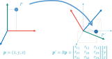
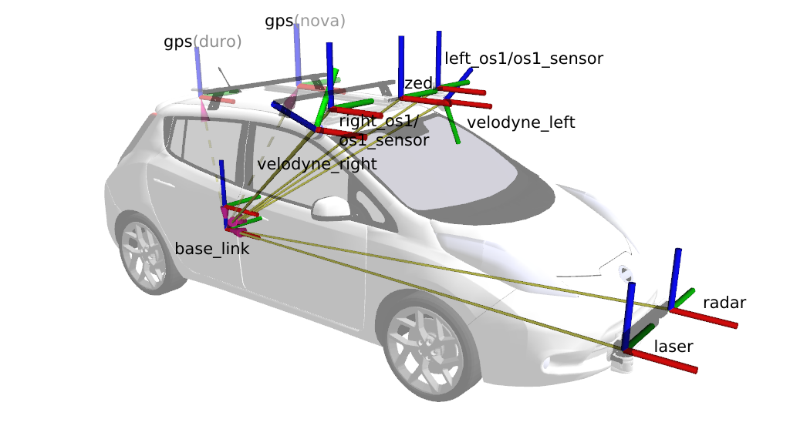
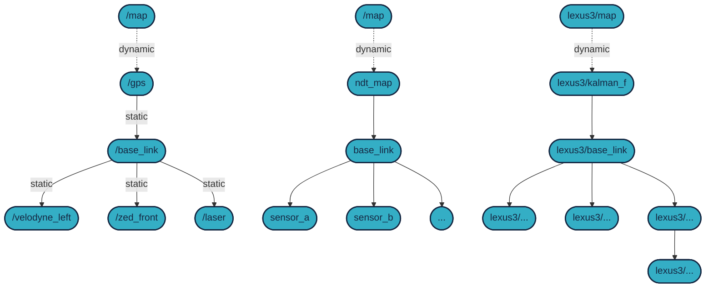
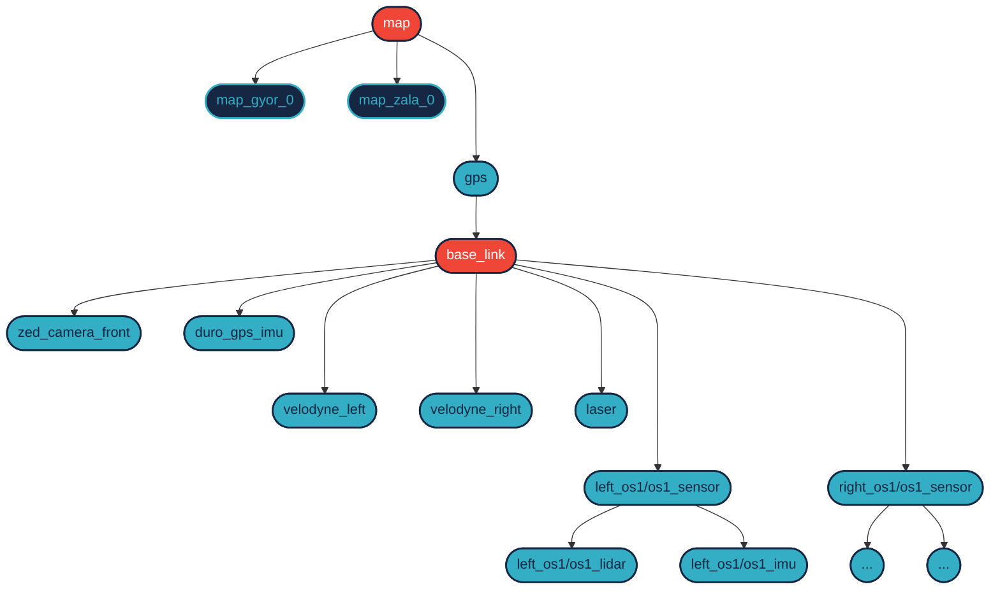
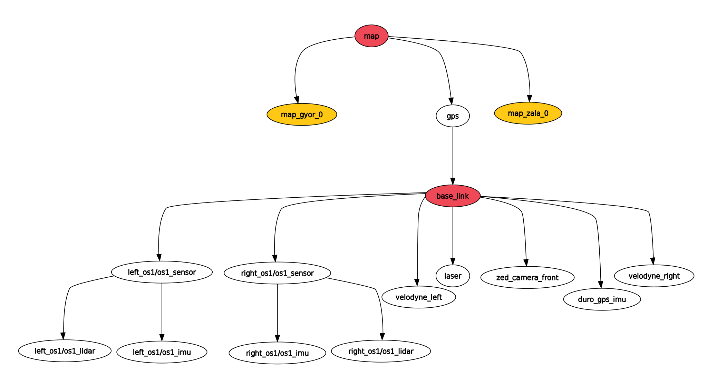
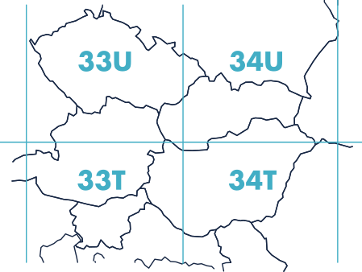

# Introduction

In ROS (and generally in robotics), transforms determine where things are located relative to a given reference point (frame). Multiple transforms can describe, for example, the movement of a robotic arm or the position of a vehicle and its sensors in space.

# Rigid Body Motion

A body is considered rigid if the distances between its points do not change during motion, meaning the distance between any two points remains constant over time.

- The shape and volume of a rigid body are constant.
- The spatial position of a rigid body can be specified by the positions of any 3 non-collinear points.
- The **position** of the body can be more intuitively specified by the 3 coordinates of an arbitrary point (_position_) and the _orientation_ of the body.
- The motions of rigid bodies consist of two elementary types of motion: **translational motion (translation)** and **rotation around an axis (rotation)**
    - During **translational motion**, every point of the body follows parallel, congruent paths, and the orientation of the body does not change.
    - During **rotation**, the positions of the points on the rotation axis do not change, while the other points of the body move in circular paths in planes perpendicular to the rotation axis.



*Illustration of rotation [Source: University of Illinois](http://motion.cs.illinois.edu/RoboticSystems/CoordinateTransformations.html)*

Below is a short (~9 minutes) but useful video on the topic:

<iframe width="560" height="315" src="https://www.youtube.com/embed/NGPn9nvLPmg?si=nd182aJPvKvUjxhk" title="YouTube video player" frameborder="0" allow="accelerometer; autoplay; clipboard-write; encrypted-media; gyroscope; picture-in-picture; web-share" referrerpolicy="strict-origin-when-cross-origin" allowfullscreen></iframe>

# Transformations

A pose is the combination of position (location) and orientation (direction). When a spatial pose is transformed (moved and rotated), another pose is created. These two poses are relative to each other in two transformation frames. Such transformation frames describe the entire robotic system.

- **Position:** 3-element offset vector (`x`, `y`, and `z` in 3D).
- **Orientation:** several representations can be used:
    - 4-element quaternion _(more on this later)_
    - 3-element Euler angles: roll (ψ), pitch (θ), yaw (φ) [wolfram alpha](https://mathworld.wolfram.com/EulerAngles.html)
    - 3 x 3 rotation matrix

For example, the following important frames can be found relative to the `base_link` frame of a Nissan Leaf:


*Frames on the vehicle*

In vehicle and mobile robot environments, we often want to adhere to the convention that the global map is called the `map` frame, and the rear axle of the vehicle/robot is called the `base_link`. The correspondence between the `map` and the `base_link` can be established using GPS, NDT matching, Kalman filter, odometry, and many other methods. This is illustrated in the following example:




*Example TF tree*

When using GPS, the frames can be roughly imagined based on the following example. The `map` is the global map, but we also know the position of the `gps` relative to it. (**Note**: *In the `2020.A` sensor setup, there are 2 GPS units located in different places, measuring in parallel, but only one transform can determine the position of the `base_link`. This is indicated by the dashed arrows in Figure 1.*) From here, a further (static) transformation can be obtained for the `base_link` (the rear axle). Additional static transformations can be obtained for the sensors, as shown in the example with the `left_os1/os1_sensor`.


*The TF tree in a 2D coordinate system, visual example*

Transforms are advertised on the `tf` topic, but for example, the MPC controller uses a topic called `current_pose` for control implementation. We solved this by advertising the `base_link` frame values as the `current_pose` topic. The translation of the frame is the position of the topic, and the rotation of the frame is the orientation of the topic.

For large transforms, the RVIZ viewer does not work accurately (https://github.com/ros-visualization/rviz/issues/502). Since ROS uses SI units, including meters, it is advisable to use the UTM ([wikipedia-utm](https://en.wikipedia.org/wiki/Universal_Transverse_Mercator_coordinate_system)) coordinate system for GPS. This naturally involves large coordinate values. To resolve this contradiction, it is advisable to display smaller transforms. For example, a fixed static transform can be advertised for Győr (`map_gyor_0`) and Zala (`map_zala_0`), relative to which the RVIZ viewer works well. The following diagram illustrates this and shows a slightly more detailed sensor system.




*TF tree displayed by `rqt_tf_tree`*

In the diagram, only the `map` `gps` transform is variable, the others are static. To advertise a static transform in a launch file, for example, between `/base_link` and `left_os1/os1_sensor`, it can be done as follows (see Figure 3):

=== "ROS 2"

        ``` py linenums="0"
        Node(
                package='tf2_ros',
                executable='static_transform_publisher',
                name='ouster_left_tf_publisher',
                output='screen',
                arguments=[
                        '--x',  '1.769',
                        '--y',  '0.58',
                        '--z',  '1.278',
                        '--roll', '3.1415926535', # or use math.pi
                        '--pitch', '0.0',
                        '--yaw', '0.0',
                        '--frame-id',      '/base_link',
                        '--child-frame-id','left_os1/os1_sensor'
                ],
        ),
        ```

=== "ROS 1" 

        ``` xml linenums="0"
        <node 
            args="1.769 0.58 1.278 3.1415926535 0.0 0.0 /base_link left_os1/os1_sensor 50"
            name="ouster_left_tf_publisher" 
            pkg="tf" 
            type="static_transform_publisher"
        /> 
        ```

The same commands issued from the terminal:

=== "ROS 2"

        ``` py linenums="0"
        ros2 run tf2_ros static_transform_publisher \
        --x 1.769 --y 0.58 --z 1.278 \
        --roll 0.0 --pitch 0.0 --yaw 3.1415926535 \
        --frame-id left_os1/os1_sensor --child-frame-id base_link
        ```

=== "ROS 1" 

        ``` c++ linenums="0"
        rosrun tf static_transform_publisher \
        1.769 0.58 1.278 \
        3.1415926535 0.0 0.0 \
        /base_link left_os1/os1_sensor 50  
        ```

In `ROS 1`, the last argument is 50 ms, meaning it advertised the same transformation at 20 Hz. This is not ideal; `ROS 2` has improved in this regard, where it is sufficient to advertise the same transformation once.

Example of a static transform launch file: [tf_static.launch](https://github.com/jkk-research/lexus_bringup/blob/main/launch/tf_static.launch.py)

# Matrix Multiplication

3D transformations (and 2D as well) can be described using a matrix, specifically matrix multiplication. For example, if we move an object a certain distance, it can be described using a rotation matrix. The rotation matrix in 3 dimensions is a 3x3 matrix that specifies the direction and magnitude of the rotation.

Source: [Robotic Systems, University of Illinois](http://motion.cs.illinois.edu/RoboticSystems/CoordinateTransformations.html)

[matrixmultiplication.xyz](http://matrixmultiplication.xyz/){: .md-button .md-button-blue .mr-4 }

[Python notebook](https://nbviewer.org/github/horverno/sze-academic-python/blob/master/eload/ealeshtranszformaciok.ipynb){: .md-button .md-button-blue .mr-4 }

!!! danger
        The Python notebook and matrix multiplication visualization are linked for educational purposes. In ROS 2, the `tf2` and related solutions provide many functions, so there is no need to manually write translations and rotations. Transformations can be queried between 2 frames without knowing exactly how many frames they are connected through. ROS 2 conveniently provides this. [Read more about it here](https://docs.ros.org/en/humble/Tutorials/Intermediate/Tf2/Tf2-Main.html)

# Homogeneous Coordinates

Homogeneous coordinates provide a convenient representation for rigid body transformations as an extension of linear transformations in space. They compactly represent the difference between position-dependent and direction-dependent quantities. The idea is to augment each point with an additional homogeneous coordinate, which is 1 if position-dependent and 0 if direction-dependent. This operation is denoted by the "hat" operator (`^`).

# Quaternion

An alternative to roll, pitch, yaw (Euler angles), with an extension similar to complex numbers.

Demonstration: [www.quaternions.online](https://quaternions.online/)

Advantages:
- **Numerical Stability:** Small numerical errors from floating-point representation can accumulate into significant errors with repeated Euler angle rotations. For example, a rotation with a few hundredths of a degree inaccuracy can accumulate into a significant error with thousands or tens of thousands of repetitions. Quaternions have much smaller errors due to their complex representation and normalized form.
- **Fast Computation:** Quaternions efficiently represent 3D spatial rotations and can often be faster and more stable than other representation methods, such as Euler angles.
- **Accuracy:**
- **Not Sensitive to "Gimbal Lock":** With Euler angles, there can be a situation where rotations become sensitive in certain directions, limiting the accuracy of calculations. Quaternions avoid this problem.
- **Easily Interpolated:** Quaternions allow easy interpolation between two rotations, which is important for maintaining smooth animations. They can also be used for non-linear interpolations. Quaternions enable non-linear interpolations, useful for creating animations where rotation changes non-linearly over time.

Disadvantage:
- **Not Intuitive for Humans:** They are harder to understand compared to Euler angles, which we are accustomed to for rotation around 3 axes.

$$tan(\frac{\pi}{2}) = \infty $$

In `ROS 2`, for example, roll, pitch, yaw values can be converted to quaternion as follows:

``` cpp
#include <tf2_geometry_msgs/tf2_geometry_msgs.hpp>
tf2::Quaternion tf2_quat;
tf2_quat.setRPY(roll, pitch, yaw);
```

More information on this can be found [here](https://docs.ros.org/en/humble/Tutorials/Intermediate/Tf2/Quaternion-Fundamentals.html).
<iframe width="560" height="315" src="https://www.youtube.com/embed/zjMuIxRvygQ?rel=0" title="YouTube video player" frameborder="0" allow="accelerometer; autoplay; clipboard-write; encrypted-media; gyroscope; picture-in-picture; web-share" allowfullscreen></iframe>

# Conventions


# Coordinate Systems (GPS/GNSS)
The `WGS84` or World Geodetic System 1984 is a global reference system used in cartography, geolocation, navigation, and the GPS (Global Positioning System) system. It is a standard coordinate system used to specify geographic latitude, longitude, and altitude above sea level. Latitude circles run horizontally and specify a point's location on the Earth's surface in degrees north or south of the equator (0 degrees latitude). Longitude circles run vertically and specify a point's location on the Earth's surface in degrees east or west of the prime meridian (0 degrees longitude). The prime meridian is located at 0 degrees longitude and passes through Greenwich, London. Longitude values range from -180 degrees to +180 degrees, with the 180-degree line connecting the Eastern and Western Hemispheres. The measurement data file's navsatfix topic (sensor_msgs/msg/NavSatFix) is saved in this format.

An alternative to this is the `UTM` projection system, which uses meters instead of degrees. The `UTM`, or Universal Transverse Mercator, is a map projection system used for map-making and navigation. Different zones of the world are represented on a series of specialized cylindrical maps where longitude and latitude lines are straight. As shown below, Hungary falls into 4 `UTM` zones: `33U`, `34U`, `33T`, and `34T`. The UTM zones are divided into 6-degree wide longitudinal strips, where each strip is represented on a transverse Mercator projection-based cylindrical map. The advantage of the UTM system is that it provides a simple coordinate system with minimal distortion within the zones. Therefore, it is often used in military maps, topographic maps, navigation systems, and other mapping applications. For example, in measurement data, the topic typically ending with current_pose (`geometry_msgs/msg/PoseStamped`) receives data in this format.



# Sources
- [articulatedrobotics.xyz/ready-for-ros-6-tf](https://articulatedrobotics.xyz/ready-for-ros-6-tf/)
- [Kris Hauser: Robotic Systems University of Illinois at Urbana-Champaign](http://motion.cs.illinois.edu/RoboticSystems/CoordinateTransformations.html)
- [Óbudai Egyetem ABC-iRobotics](https://abc-irobotics.github.io/ros_course_materials_hu/05_da_vinci/)
- [docs.ros.org/en/humble/Tutorials/Intermediate/Tf2/Tf2-Main.html](https://docs.ros.org/en/humble/Tutorials/Intermediate/Tf2/Tf2-Main.html)
- [docs.ros.org/en/humble/Tutorials/Intermediate/Tf2/Quaternion-Fundamentals.html](https://docs.ros.org/en/humble/Tutorials/Intermediate/Tf2/Quaternion-Fundamentals.html)
- [mathworld.wolfram.com/EulerAngles.html](https://mathworld.wolfram.com/EulerAngles.html)