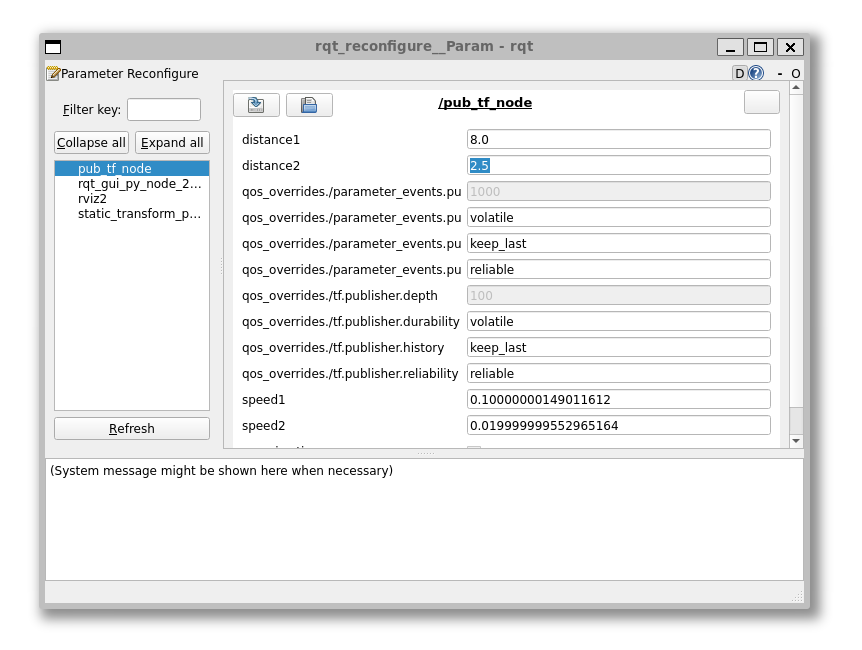

# Practice

The following practice illustrates handling transformations in ROS2 using C++.

!!! danger "Python Equivalent"
    The Python version of the C++ code is also available at [github.com/sze-info/arj_packages](https://github.com/sze-info/arj_packages/tree/main/arj_transforms_py). It is worth comparing the C++ and Python codes.

Let's update the `arj_packages` repo to the latest version. If it updates or you get the `Already up to date.` message, you don't need to clone it. If you get the `~/ros2_ws/src/arj_packages: No such file or directory` message after running `cd ~/ros2_ws/src/arj_packages`, then clone the repo.

``` bash
cd ~/ros2_ws/src/arj_packages
```
``` bash
git pull
```

If you get the `No such file or directory` message, clone it with the following commands:

!!! warning
    The following two commands are only needed if `arj_packages` does not exist:

``` bash
cd ~/ros2_ws/src
```
``` bash
git clone https://github.com/sze-info/arj_packages
```

If it already exists, just update it instead of the previous step.

``` bash
cd ~/ros2_ws/src/arj_packages/
```
``` bash
git status
```
The `git checkout -- .`: Discards all unstaged changes locally. In VS Code, this is similar to the "discard all changes" command.
``` bash
git checkout -- .
```
``` bash
git pull
```

After that, you can build:

``` bash
cd ~/ros2_ws
```
``` bash
colcon build --packages-select arj_transforms_cpp
```

It is advisable to source in a new terminal and then run:

``` bash
source ~/ros2_ws/install/setup.bash
```
``` bash
ros2 run arj_transforms_cpp pub_transforms
```

Let's examine the raw output:

``` r
ros2 topic echo /tf
``` 

The response will be similar to this:

``` r
transforms:
- header:
    stamp:
      sec: 1693475112
      nanosec: 95339579
    frame_id: orbit1
  child_frame_id: orbit2
  transform:
    translation:
      x: -2.487199068069458
      y: 0.25266680121421814
      z: 0.0
    rotation:
      x: 0.0
      y: 0.0
      z: 0.0
      w: 1.0
---
transforms:
- header:
    stamp:
      sec: 1693475112
      nanosec: 145005518
    frame_id: map
  child_frame_id: orbit1
  transform:
    translation:
      x: -4.109088897705078
      y: 2.8487515449523926
      z: 0.0
    rotation:
      x: 0.0
      y: 0.0
      z: -0.46381551598382736
      w: 0.8859318072699817
```

As we can see, the `map` frame's `child_frame_id` is `orbit1`. The `orbit1` frame's `child_frame_id` is `orbit2`. So, if we consider `map` as the grandparent, then `orbit2` is the grandchild. It is more illustrative to examine this using `rqt_tf_tree`.

``` r
ros2 run rqt_tf_tree rqt_tf_tree
```


If the above command does not work, it can be installed with `sudo apt install ros-humble-rqt-tf-tree`. This should not be necessary on lab computers.

Let's look at it using RVIZ2, it will look like this:

``` r
ros2 launch arj_transforms_cpp rviz1.launch.py
```


Let's examine the `pub_transforms.cpp` file. (For Python, the `transforms.py` file in the `_py` package.)

``` bash
cd ~/ros2_ws/src/arj_packages/arj_transforms_cpp
```

``` bash
code .
```

The most interesting part now is probably the `loop` function. According to the Pythagorean theorem, `tr1.transform.translation.x` and `y` will always lie on a circle due to the sine and cosine trigonometric functions. The `loop_count_` variable continuously increases, so it makes the circle in the direction of the clock hands according to the `speed1` value, which can be accelerated using `rqt_reconfigure` (we will look at this later). The size of the circle, the distance from the origin, can be increased using `distance1`. A similar situation applies to `tr2.transform`, which gives the `orbit1` -> `orbit2` transform. The `tr1.transform` also represents an additional rotation using a quaternion. We only rotate around the Z-axis from the roll, pitch, yaw values.

``` cpp
void loop()
{
    // Publish transforms
    tr1.header.stamp = this->get_clock()->now();
    tr1.header.frame_id = "map";
    tr1.child_frame_id = "orbit1";
    tr1.transform.translation.x = sin(loop_count_ * speed1) * distance1;
    tr1.transform.translation.y = cos(loop_count_ * speed1) * distance1;
    tf2::Quaternion quaternion1;
    quaternion1.setRPY(0.0, 0.0, loop_count_ * speed1);
    quaternion1=quaternion1.normalize();
    tr1.transform.rotation.x = quaternion1.x();
    tr1.transform.rotation.y = quaternion1.y();
    tr1.transform.rotation.z = quaternion1.z();
    tr1.transform.rotation.w = quaternion1.w();
    tf_broadcaster_->sendTransform(tr1);
    tr2.header.stamp = this->get_clock()->now();
    tr2.header.frame_id = "orbit1";
    tr2.child_frame_id = "orbit2";
    tr2.transform.translation.x = sin(loop_count_ * speed2) * distance2;
    tr2.transform.translation.y = cos(loop_count_ * speed2) * distance2;
    tf_broadcaster_->sendTransform(tr2);
    loop_count_++;
}
```

Let's add `orbit3` with a static transform:

``` r
ros2 run tf2_ros static_transform_publisher --x 1.0 --y 0.2 --z 1.4 --qx 0.0 --qy 0.0 --qz 0.0 --qw 1.0 --frame-id orbit2 --child-frame-id orbit3
```

Set the speeds and distances:

``` r
ros2 run rqt_reconfigure rqt_reconfigure
```



Advertise a marker and add it in RVIZ2. This command advertises a green cube on `orbit2`:

``` r
ros2 topic pub --rate 40 --print 40 /marker_topic2 visualization_msgs/msg/Marker '{header: {frame_id: "orbit2"}, ns: "markers2", id: 2, type: 1, action: 0, pose: {position: {x: 0.0, y: 0.0, z: 0.0}, orientation: {x: 0.0, y: 0.0, z: 0.0, w: 1.0}}, scale: {x: 1.0, y: 1.0, z: 1.0}, color: {r: 0.2, g: 0.4, b: 0.3, a: 1.0}}'
```

This command advertises a red arrow on `orbit1`:

``` r
ros2 topic pub --rate 40 --print 40 /marker_topic3 visualization_msgs/msg/Marker '{header: {frame_id: "orbit1"}, ns: "markers3", id: 3, type: 0, action: 0, pose: {position: {x: 0.0, y: 0.0, z: 0.0}, orientation: {x: 0.0, y: 0.0, z: 0.0, w: 1.0}}, scale: {x: 1.8, y: 0.4, z: 0.4}, color: {r: 0.8, g: 0.2, b: 0.2, a: 1.0}}'
```

The `Marker` message's `type` attribute specifies whether the marker is, for example, `ARROW=0` or `CUBE=1`:

``` r
ros2 interface show  visualization_msgs/msg/Marker

...
type:
int32 ARROW=0
int32 CUBE=1
int32 SPHERE=2
int32 CYLINDER=3
int32 LINE_STRIP=4
int32 LINE_LIST=5
int32 CUBE_LIST=6
int32 SPHERE_LIST=7
int32 POINTS=8
int32 TEXT_VIEW_FACING=9
int32 MESH_RESOURCE=10
int32 TRIANGLE_LIST=11

...
```

For more color examples, see below. For more on colors: [github.com/jkk-research/colors](https://github.com/jkk-research/colors).

| .  | . | . 
|---|---|---
| 0.96 0.26 0.21 <br />  |  0.53 0.05 0.31 <br /> |   0.19 0.11 0.57 <br />
| 0.73 0.87 0.98 <br />| 0.13 0.59 0.95  <br /> | 0.00 0.59 0.53  <br /> 
| 0.78 0.90 0.79 <br /> | 0.30 0.69 0.31  <br /> |  0.80 0.86 0.22  <br />
| 1.00 0.93 0.70 <br /> | 1.00 0.76 0.03  <br />  | 1.00 0.44 0.00 <br /> 
| 0.84 0.80 0.78 <br /> | 0.47 0.33 0.28  <br />  | 0.24 0.15 0.14 <br /> 
| 0.96 0.96 0.96 <br /> | 0.62 0.62 0.62  <br /> | 0.13 0.13 0.13 <br /> 

# Independent Task

As an independent task, create a package named `my_launch_pkg`, in which a `run_transforms_and_markers.launch.py` starts:

- the node that publishes the `map`, `orbit1`, and `orbit2` frames (`ros2 run arj_transforms_cpp pub_transforms`)
- the `rqt_reconfigure` (`ros2 run rqt_reconfigure rqt_reconfigure`)
- the static `orbit3` frame (`ros2 run tf2_ros static_transform_publisher --x 1.0 --y 0.2 --z 1.4 --qx 0.0 --qy 0.0 --qz 0.0 --qw 1.0 --frame-id orbit2 --child-frame-id orbit3`)
- and the launch that starts Rviz2 (`ros2 launch arj_transforms_cpp rviz1.launch.py`)

Check the correct operation in rviz2.

So, at the end of the independent task, it should be startable with the following command:

``` r
ros2 launch my_launch_pkg run_transforms_and_markers.launch.py
```

Solution: [available among the independent tasks](https://sze-info.github.io/arj/onallo/ros2launchmarker.html)

## Help for the Independent Task

The `ros2 run tf2_ros static_transform_publisher --x 1.0 --y 0.2 --z 1.4 --qx 0.0 --qy 0.0 --qz 0.0 --qw 1.0 --frame-id orbit2 --child-frame-id orbit3` can be easily assembled based on previous lessons:

``` py
Node(
    package='tf2_ros',
    executable='static_transform_publisher',
    arguments=['1.0', '0.2', '1.4','0', '0', '0', '1', 'orbit2','orbit3'],
),     
```
!!! warning
    We have a harder time with Rviz2, as we need to call a launch file, not a node.

The first, __but less elegant__ option is to copy the original launch file and extend it:

``` py
from launch import LaunchDescription
from launch_ros.actions import Node
import os
from ament_index_python.packages import get_package_share_directory

def generate_launch_description():

    pkg_name = 'arj_transforms_cpp'
    pkg_dir = get_package_share_directory(pkg_name)

    return LaunchDescription([
        Node(
            package='rviz2',
            namespace='',
            executable='rviz2',
            name='rviz2',
            arguments=['-d', [os.path.join(pkg_dir, 'rviz', 'rviz1.rviz')]]
        )
    ])
```

The second, __much more elegant__ option is to include the launch file in the launch file:

``` py
from launch import LaunchDescription
from launch_ros.actions import Node
from launch.actions import IncludeLaunchDescription
from launch.launch_description_sources import PythonLaunchDescriptionSource
from launch_ros.substitutions import FindPackageShare

def generate_launch_description():
    return LaunchDescription([
        # ros2 launch arj_transforms_cpp rviz1.launch.py
        IncludeLaunchDescription(
            PythonLaunchDescriptionSource([
                FindPackageShare("arj_transforms_cpp"), '/launch/', 'rviz1.launch.py'])
        ),
    ])
```

# Further Reading

[Python notebook transform](https://nbviewer.org/github/horverno/sze-academic-python/blob/master/eload/ealeshtranszformaciok.ipynb){: .md-button .md-button-blue .mr-4 }

[Python notebook quaternion](https://github.com/sze-info/arj/blob/main/docs/transzformaciok/gps_utm.ipynb){: .md-button .md-button-purple .mr-4 }

[gps_utm.ipynb](https://github.com/sze-info/arj/blob/main/docs/transzformaciok/quaternion.ipynb){: .md-button .md-button-purple .mr-4 } 

<iframe width="560" height="315" src="https://www.youtube.com/embed/kYB8IZa5AuE?rel=0" title="YouTube video player" frameborder="0" allow="accelerometer; autoplay; clipboard-write; encrypted-media; gyroscope; picture-in-picture; web-share" allowfullscreen></iframe>


# Reading Material
- [articulatedrobotics.xyz/ready-for-ros-6-tf](https://articulatedrobotics.xyz/ready-for-ros-6-tf/)
